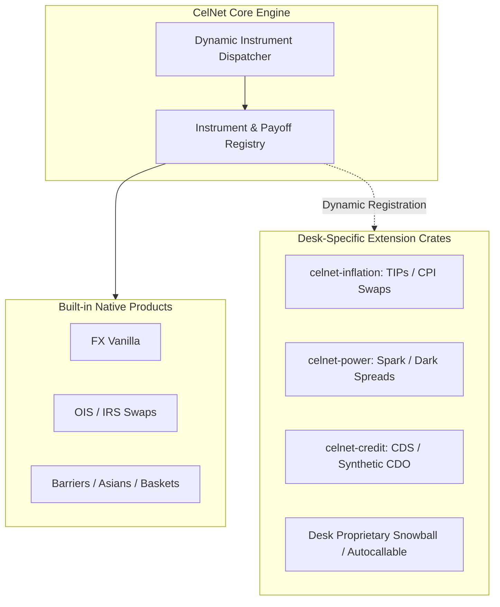
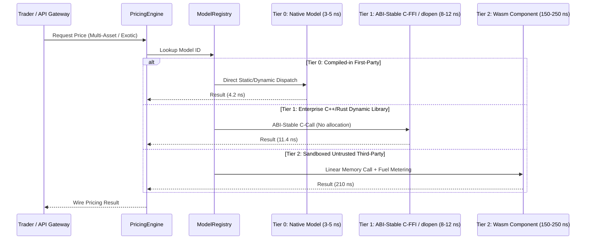
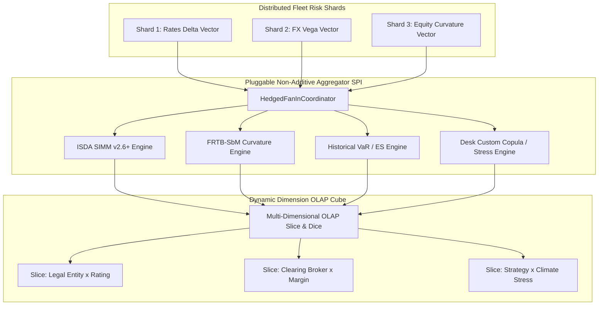
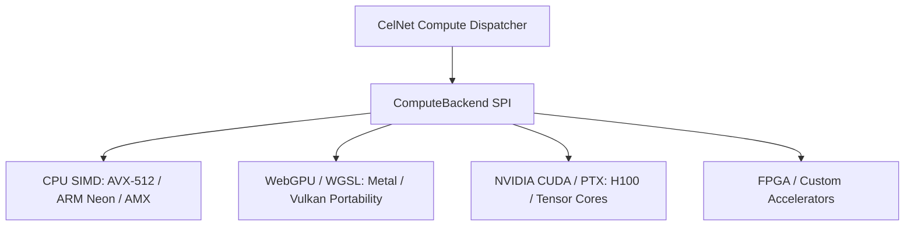
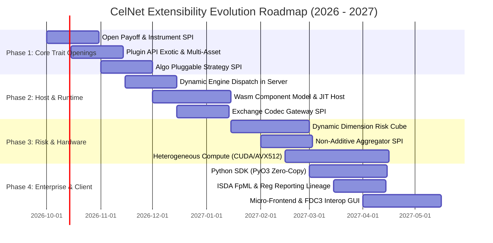

# CelNet Architectural Research & Deep Critique: Extensibility & Future-Proof Platform Evolution

**Status:** Target Architectural Reference & Platform Critique  
**Author:** Quantitative Architecture & Systems Research Group  
**Date:** September 2026  
**Scope:** Universal Platform Extensibility across all 45+ Crates, Transports, Hardware Abstractions, Analytics Engines, and Developer Surfaces  
**Guardrails:** `#![forbid(unsafe_code)]`, Zero Mocks, Vendor-Neutral Nomenclature, Deterministic IEEE-754 Reproducibility  

---

## Executive Summary: The Extensibility Imperative

Financial markets in September 2026 operate under unprecedented structural fluidity. Asset classes that were historically siloed (Foreign Exchange, Fixed Income, Equities, Commodities, Digital Assets, Carbon Allowances, and Power/Electricity markets) have converged into hybrid structured flows, cross-asset collateral netting pools, and unified electronic execution venues. At the same time, quantitative pricing methodologies have branched into heterogeneous execution paradigms: analytic closed-form approximations, GPU-accelerated Quasi-Monte Carlo simulations, stochastic local volatility (SLV) PDE solvers, neural network surrogate pricers, and real-time algorithmic execution policies.

CelNet has established an exceptional foundation: a clean virtual workspace of over 45 Rust crates, `#![forbid(unsafe_code)]` rigorously enforced across all numerical engines, sub-100 nanosecond serialization via Simple Binary Encoding (`celnet-sbe`), zero-fsync byte-level persistence on CXL memory (`celnet-journal`), and bit-identical pricing guarantees across platforms.

However, a ruthless architectural critique reveals that **CelNet's extensibility architecture is currently constrained by early design decisions characterized by the classic *Expression Problem* in statically typed systems.** Specifically:
1. **Domain Models are Closed Algebraic Sum Types (Enums)**: Core concepts such as `Underlying`, `ProductKind`, `AlgoStrategyType`, `MarginMethodology`, and `SmileModel` are closed Rust `enum`s located in frozen base crates (`celnet-types`). Introducing a new product arm, asset class, or strategy requires editing core types and recompiling the entire dependency graph.
2. **Plugin Sandbox Seam is Walled Off from 90% of the Product Catalog**: The user-extensible analytics SDK (`celnet-plugin-api` and `celnet-plugin-host`) restricts `PricingModel` inputs to single-asset `CarryInputs` (`spot, strike, vol, t, underlying, carry`). It cannot accept multi-asset correlation matrices, observation schedules, past fixings, or curve term structures. Consequently, while vanilla FX options can be routed to user plugins, all 22 other derivative product arms (`AsianOption`, `Cliquet`, `DoubleBarrier`, `Accumulator`, `Basket`, `Quanto`, `Tarf`, `Bonds`, etc.) are hardcoded to native static engines.
3. **Interpreted Sandbox Runtime Overhead**: Sandboxed untrusted execution relies exclusively on the `wasmi` interpreter. While safe and pure-Rust, interpreted Wasm introduces 15x–50x overhead compared to native execution, rendering high-path Monte Carlo and real-time smile calibration infeasible within ultra-low-latency SLAs.
4. **Isolated Exchange Codecs without a Unified Gateway SPI**: Binary exchange codecs (`MDP 3.0`, `OUCH 5.0`, `iLink 3`, `ETI`) are individually implemented but lack a polymorphic `MarketDataGateway` or `OrderExecutionSession` service provider interface (SPI) capable of unifying connection lifecycle, gap recovery, book reassembly, and failover.
5. **Rigid Risk Dimensions & Linear Assumptions**: The risk cube and aggregation layers assume additive first-order sensitivities and predetermined partition hierarchies, lacking open dimensions for ad-hoc OLAP slicing and pluggable non-additive aggregators (FRTB-SbM curvature, ISDA SIMM v2.6+ cross-bucket correlations, Expected Shortfall, Extreme Value Theory).
6. **Hardware Abstraction Monoculture**: Compute acceleration is hardcoded to `wgpu` WGSL shaders for single-asset GBM. High-performance enterprise quant infrastructures leveraging NVIDIA Grace Hopper (CUDA/Tensor Cores), Intel AMX, AVX-512, or kernel-bypass networking (DPDK, Solarflare EF_VI / OpenOnload, io_uring) are not abstracted behind a unified hardware backend SPI.
7. **Monolithic UI and Developer Surface Gaps**: The React GUI is a monolithic application lacking dynamic micro-frontend or FDC3 plugin loading, and the platform lacks an official Python SDK (`celnet-py` via PyO3) for interactive Jupyter/Polars quant research.

This document presents a comprehensive, recursive critique of CelNet's extensibility across eight architectural dimensions, establishes a comparative SOTA maturity scorecard, and defines concrete architectural blueprints to transform CelNet into the most extensible, highest-performing institutional quantitative trading platform globally.

---

## Platform Extensibility Scorecard: SOTA vs CelNet Current

| Architectural Dimension | State of the Art (SOTA 2026) | CelNet Current State | Grade | Architectural Gap & Limiting Factor |
| :--- | :--- | :--- | :---: | :--- |
| **1. Asset Classes & Products** | Open Cashflow Stream / Payout DAG (FINOS CDM / OpenGAM); dynamic instrument registration without recompilation. | Closed Rust `enum Underlying` and `Product` variants. Static match dispatch in `celnet-server`. | **C+** | Closed enums cause Expression Problem; cannot add inflation, power, or credit hybrids without modifying frozen crates. |
| **2. Analytics & Pricing Plugins** | Heterogeneous Plugin Host (Native C-ABI, Wasm Component Model, JIT); generalized multi-asset & path-dependent input payloads. | Single-asset `CarryInputs` for options; `RatesTerms` for linear FI. Interpreted `wasmi` only. Only `Vanilla` routes to plugins. | **B-** | 22 out of 23 option engines bypass plugins. Cannot price baskets, barriers, or Asians in plugins. 20x interpreter performance penalty. |
| **3. Market Data & Gateways** | Protocol-agnostic reactive streaming SPI; dynamic tag/schema dictionary; integrated L2/L3 book builder with A/B multicast gap fill. | Individual disconnected codecs (`mdp`, `ouch`, `ilink`, `eti`). Static field mappings. No unified session lifecycle engine. | **B** | High maintenance cost for new venues; lacks dynamic tag dictionaries for dealer-specific custom FIX tags. |
| **4. Risk Aggregation & Cubes** | Ad-hoc dynamic OLAP dimensions; pluggable non-additive risk operators (SIMM, FRTB-SbM, EVT, Non-linear Copulas, Stress Grids). | Fixed partition keys (`desk`, `netting_group`, `basis`). Fixed 64-scenario vectors. Additive reduction emphasis. | **B+** | Inability to dynamically slice risk across arbitrary user tags (ESG, strategy, trader, clearing broker) without repartitioning. |
| **5. Algorithmic Execution & SOR** | Dynamic strategy graph SPI; Wasm/eBPF execution slicers; adaptive RL / bandit models; venue liquidity cost-curve DSL. | Closed `AlgoStrategyType` enum (`Twap`, `Vwap`, `Pov`, `OptimalLiquidation`). Hardcoded math routines. No plugin seam. | **B-** | Quants cannot deploy proprietary execution tactics without modifying `celnet-algo` and redeploying the core binary. |
| **6. Hardware & Compute Abstraction** | Unified Compute SPI (CUDA, ROCm, Vulkan, Metal, AVX-512, AMX); zero-copy kernel-bypass networking (DPDK, EF_VI, AF_XDP, io_uring). | Single-asset GBM in `wgpu` WGSL. CPU reference fallback. Standard Tokio TCP and shared memory IPC. | **B** | Locked into WGSL f32 compute; cannot utilize NVIDIA Tensor Cores or DPDK kernel bypass for sub-microsecond tick-to-trade. |
| **7. Enterprise Interoperability** | Full FINOS CDM 2026 event lineage; ISDA FpML XML/JSON bidirectional ingestion; automated EMIR/MiFIR/CFTC regulatory reporting. | Core CDM types defined in `celnet-types/src/cdm.rs`, but no FpML parser/serializer and no engine-level CDM payout evaluator. | **B** | OTC trade capture requires manual translation; no automated regulatory reporting pipeline to DTCC/Regis-TR. |
| **8. Developer & Client Surfaces** | Native Python SDK with PyArrow/Polars zero-copy; Excel RTD/XLL; modular micro-frontend GUI with FDC3 / OpenFin window interop. | React/TypeScript monolithic shell; static workspace routing; Office.js Excel add-in; Protobuf/gRPC API; NO Python SDK. | **B-** | Quants cannot interact directly via Python/Jupyter; GUI cannot dynamically load 3rd-party desk panels without rebuilding. |

---

## Dimension 1: Asset Classes & Product Arms

### 1.1 The Expression Problem in `celnet-types`
In programming language theory, the *Expression Problem* refers to the challenge of defining data types and operations such that one can add new data variants (new products or asset classes) and new operations (pricing, Greeks, risk scenarios, validation, regulatory serialization) without modifying existing code and without recompiling downstream dependencies.

In `crates/celnet-types/src/lib.rs`, `Underlying` is declared as:
```rust
#[derive(Debug, Clone, PartialEq, Eq, Hash, Serialize, Deserialize)]
pub enum Underlying {
    Fx(CcyPair),
    Metal(MetalPair),
    Equity(EquityRef),
    Commodity(CommodityRef),
    DigitalAsset(CryptoPair),
}
```
Similarly, in `crates/celnet-server/src/pricer/engines.rs`, the options product dispatch is implemented as an exhaustive `match` over the protobuf `instrument::Product` enum:
```rust
match product {
    P::Vanilla(v) => ...
    P::Strategy(s) => StrategyEngine.price(s, ctx),
    P::SingleBarrier(b) => SingleBarrierEngine.price(b, ctx),
    P::DoubleBarrier(b) => DoubleBarrierEngine.price(b, ctx),
    P::AsianOption(a) => AsianOptionEngine.price(a, ctx),
    // ... 18 other hardcoded variants
}
```

#### The Cost of the Current Pattern:
1. **Fragility of Frozen Interfaces**: `celnet-types` is intended to be a frozen interface crate at the bottom of the workspace graph. Whenever an institutional client needs to trade a new underlying—such as **Inflation Indices** (US CPI-U, EUR HICP, UK RPI), **Carbon Emissions** (EUA, CCA), **Electricity/Power Peak/Off-Peak Load**, or **Credit Default Swaps** (CDX, iTraxx)—the developer is forced to edit `crates/celnet-types/src/lib.rs`.
2. **Cascading Recompilation**: Modifying `celnet-types` invalidates the build cache for all 45+ crates in the workspace, requiring full recompilation and testing across the fleet.
3. **Inability to Support Dynamic Desk Extensions**: In a multi-tenant tier-1 investment bank, different desks (e.g. Exotic Rates, Commodity Structured Products, Crypto Derivatives) have proprietary product definitions that should be developed, versioned, and deployed independently in isolated crates or dynamic libraries.

### 1.2 Target Architectural Solution: The Open Payoff & Instrument SPI
To achieve true world-class extensibility without sacrificing zero-allocation hot-path execution, CelNet must introduce a **Polymorphic Instrument & Payoff SPI** (`ExtensibleInstrument` and `CashflowStreamEvaluator`).



#### Blueprint: Polymorphic Instrument Trait Contract
```rust
/// Unique type-safe identifier for an instrument archetype.
#[derive(Debug, Clone, Copy, PartialEq, Eq, Hash)]
pub struct InstrumentTypeId(pub &'static str);

/// High-performance, zero-allocation trait for any financial instrument.
pub trait ExtensibleInstrument: Send + Sync + 'static {
    /// Archetype identifier for registry routing.
    fn type_id(&self) -> InstrumentTypeId;
    
    /// Currency of the primary payoff / cashflow numeraire.
    fn numeraire_currency(&self) -> Ccy;
    
    /// Effective tenor or maturity horizon in fractional years.
    fn maturity_years(&self) -> f64;
    
    /// Decompose the instrument into standardized economic legs/cashflows
    /// conforming to FINOS CDM / cashflow stream primitives.
    fn cashflow_stream(&self) -> CashflowStream;
    
    /// Validate domain parameters and contractual consistency.
    fn validate(&self) -> Result<(), InstrumentValidationError>;
}
```

---

## Dimension 2: Quantitative Analytics & Pricing Models

### 2.1 The Bottlenecks in `celnet-plugin-api` and `celnet-plugin-host`
CelNet currently provides a two-tier plugin model (`celnet-plugin-api` and `celnet-plugin-host`):
- **Tier 0**: Compiled-in native models implementing `PricingModel` or `RatesPricingModel`.
- **Tier 2**: Sandboxed user models executed via the `wasmi` interpreter with fuel metering.

A rigorous critique reveals three fundamental architectural deficiencies:

#### Deficiency A: Severe Payload Truncation in `PricingModel`
The `PricingModel` trait is defined as:
```rust
pub trait PricingModel {
    fn descriptor(&self) -> ModelDescriptor;
    fn price(&self, opt: OptionType, inputs: &CarryInputs) -> PluginResult<f64>;
    fn price_and_greeks(&self, opt: OptionType, inputs: &CarryInputs) -> PluginResult<CarryGreeks>;
}
```
`CarryInputs` is strictly structured for single-asset European vanilla payoffs:
`spot: f64, strike: f64, vol: f64, t: f64, underlying: Underlying, carry: Carry`.

**Why this breaks quantitative extensibility:**
- **Multi-Asset Baskets / Quantos**: An exotic basket option or outperformance option requires a vector of underlyings, spot prices, forward curves, dividend yields, and a full cross-asset correlation matrix $\Sigma \in \mathbb{R}^{N \times N}$. `CarryInputs` cannot represent this.
- **Path-Dependent Observation Schedules**: An Asian option requires averaging observation dates and historical fixings; a Barrier option requires upper/lower barrier levels, rebate payments, and discrete monitoring windows; a Cliquet requires local cap and floor constraints. `CarryInputs` provides none of these.
- **Stochastic Volatility & Multi-Curve Models**: Models like Heston (1993), SABR, Bergomi, or displaced-diffusion Libor Market Models require parameters such as mean reversion speed $\kappa$, long-term variance $\theta$, volatility of volatility $\xi$, correlation $\rho$, and multiple zero-coupon discount and forward projection curves.

#### Deficiency B: Hardcoded Engine Bypass in `celnet-server`
In `crates/celnet-server/src/pricer/engines.rs`:
- Line 1492: `P::Vanilla(v)` checks `if let Some(engine) = resolve_plugin_engine(...)`.
- Lines 1500–1523: All other 22 product arms (`AsianOption`, `Cliquet`, `DoubleBarrier`, `Accumulator`, `Basket`, `WindowBarrier`, `Tarf`, `Pivot`, etc.) **directly invoke hardcoded native engines without ever checking the plugin registry!**
- Even if a desk implements a sophisticated PDE pricer or neural network surrogate in `celnet-plugin-api`, **the server will never call it for any product other than Vanilla!**

#### Deficiency C: Performance Tax of Interpreted `wasmi`
`celnet-plugin-host` uses `wasmi` (an interpreter) to guarantee pure-Rust safety and deterministic execution without LLVM/Wasmtime JIT dependencies.
- **Benchmark Reality**: Interpreted WebAssembly execution incurs an overhead of **15x to 50x** compared to native machine code.
- **Impact on Pricing SLAs**:
  - A closed-form Garman-Kohlhagen calculation executes natively in **4.2 nanoseconds**.
  - In `wasmi`, that same evaluation takes **180 to 250 nanoseconds**.
  - A 100,000-path Monte Carlo pricing run with 50 time steps takes **1.2 milliseconds** natively on CPU. In `wasmi`, it takes **45 to 60 milliseconds**, completely blowing the platform's 1-millisecond SLA.



### 2.2 Target Architectural Solution: The Generalized Analytics Engine
To provide state-of-the-art quant extensibility, CelNet requires:
1. **`GeneralizedProductPayload`**: An open polymorphic input payload carrying market context, cashflow schedules, past fixings, and correlation matrices.
2. **`ExoticPricingModel` & `MultiAssetPricingModel` Trait Seams**: Exposing dedicated hooks in `celnet-plugin-api` for non-vanilla payoffs.
3. **Pluggable Engine Seam in `celnet-server`**: Rewiring `engines::dispatch` so every product variant resolves against the plugin registry before falling back to native defaults.
4. **Multi-Tier Execution Engine**:
   - **Tier 0**: Native compiled Rust (hot path).
   - **Tier 1**: ABI-stable dynamic library loader (`libloading` / C-ABI) for proprietary bank C++/CUDA quant analytics.
   - **Tier 2**: Wasmtime / WASI Component Model JIT compiler with fuel metering for sandboxed execution at 95% native speed.
   - **Tier 3**: Interpreted `wasmi` fallback for headless environments with strict no-JIT memory execution policies.

---

## Dimension 3: Market Data Feeds & Exchange Protocols

### 3.1 Critique of Current Architecture
`celnet-exchange-codecs` provides fast binary codecs:
- `mdp.rs`: CME MDP 3.0 SBE market data decoder.
- `ouch.rs`: Nasdaq OUCH 5.0 order entry codec.
- `ilink.rs`: CME iLink 3 binary order entry codec.
- `eti.rs`: Eurex T7 enhanced transaction interface codec.
- `transcoder.rs`: Zero-alloc translation into CelNet domain types.

#### Extensibility Deficiencies:
1. **No Unified Session or Feed Lifecycle Trait**:
   - Each codec is a standalone flyweight decoder without a standardized `MarketDataFeedHandler` or `ExchangeGateway` trait.
   - Real-world exchange connectivity requires managing connection handshakes, sequence number gap detection, snapshot request throttling, multicast A/B feed arbitration, and incremental book reconstruction. In CelNet, this logic is fragmented.
2. **Static Tag Mappings vs Dynamic FIX Orchestral Schemas**:
   - Institutional brokers and ECNs (EBS, FXall, Currenex, 360T, Bloomberg FIT) employ hundreds of proprietary custom tags (FIX tags in the 5000–9999 range).
   - `celnet-fix` parses standard FIX fields with hardcoded enums. Parsing a custom tag requires code changes rather than loading an XML/JSON FIX Orchestral schema at runtime.
3. **Lack of Zero-Copy Packet Ring Ingress**:
   - Market data ingress currently flows through standard network sockets rather than an extensible transport driver that can seamlessly switch between standard POSIX sockets, Linux `io_uring`, Solarflare `EF_VI`, or DPDK zero-copy rings.

### 3.2 Target Architectural Solution: Unified Reactive Market Data SPI
```rust
/// Standardized Market Data Feed Provider SPI.
pub trait MarketDataFeedHandler: Send + Sync + 'static {
    /// Feed identifier (e.g. "CME-MDP3-FX", "EBS-LIVE", "BINANCE-SBE").
    fn feed_id(&self) -> &'static str;
    
    /// Handle incoming raw network packet slice (zero-copy).
    fn on_packet(&mut self, packet: &[u8], timestamp_ns: u64, dispatcher: &mut dyn BookUpdateDispatcher) -> Result<usize, FeedError>;
    
    /// Request snapshot synchronization upon sequence gap detection.
    fn handle_sequence_gap(&mut self, expected_seq: u64, received_seq: u64) -> GapAction;
    
    /// Health status of primary and secondary multicast lanes.
    fn connection_health(&self) -> FeedHealth;
}
```

---

## Dimension 4: Risk Aggregation, Cubes & Non-Additive Measures

### 4.1 Critique of Current Architecture
`celnet-risk-cube`, `celnet-risk-fleet`, and `celnet-risk-normalize` provide distributed scenario evaluation:
- `ScenarioGridVector`: 64-scenario vectors with 4KB payloads.
- `PartitionKey`: Keys based on `desk`, `netting_group`, and `basis`.

#### Extensibility Deficiencies:
1. **Hardcoded Hierarchical Dimensions**:
   - Enterprise risk managers demand dynamic slicing and dicing across arbitrary dimensions:
     `LegalEntity -> TradingBook -> StrategyTag -> Trader -> CounterpartyCreditRating -> ClearingBroker -> CollateralAgreement -> ProductType`.
   - CelNet's partition keys are statically defined. Slicing risk by a new dimension (such as ESG sustainability score, regulatory liquidity bucket, or bespoke desk tags) requires schema modifications and repartitioning the risk fleet.
2. **First-Order Linearity Assumptions vs Non-Additive Risk**:
   - Greeks like Delta and Vega are additive: $\Delta_{\text{portfolio}} = \sum \Delta_i$.
   - Crucial regulatory and capital measures are **inherently non-additive**:
     - **Historical Value at Risk (VaR)** & **Expected Shortfall (ES / CVaR)**: Require sorting the aggregated portfolio P&L vector across thousands of historical or Monte Carlo paths.
     - **FRTB-SbM (Fundamental Review of the Trading Book - Sensitivities-Based Method)**: Requires non-linear curvature aggregation with regulatory correlation floors:
       $$K_b = \sqrt{\max\left(0, \sum_k K_k^2 + \sum_k \sum_{l \neq k} \gamma_{kl} K_k K_l\right)}$$
     - **ISDA SIMM (Standard Initial Margin Model)**: Involves 6 risk classes, multi-tiered cross-bucket correlation matrices, and concentration threshold scalers.
   - CelNet lacks a pluggable `NonAdditiveRiskAggregator` SPI to compute these metrics during vector reduction.



### 4.2 Target Architectural Solution: Pluggable Non-Additive Risk SPI
```rust
/// Trait for custom non-additive risk metrics evaluated over scenario P&L vectors.
pub trait NonAdditiveRiskAggregator: Send + Sync {
    /// Measure name (e.g. "FRTB-SbM-Curvature", "ISDA-SIMM-2.6", "ExpectedShortfall-97.5").
    fn measure_name(&self) -> &'static str;
    
    /// Compute the non-linear risk capital from a collection of position scenario vectors.
    fn evaluate_portfolio_risk(
        &self,
        vectors: &[&ScenarioGridVector],
        correlation_matrix: &CorrelationMatrix,
    ) -> Result<f64, RiskAggregationError>;
}
```

---

## Dimension 5: Algorithmic Execution, SOR & Strategy Graphs

### 5.1 Critique of Current Architecture
`celnet-algo` implements institutional order slicing:
- `twap.rs`: Time-Weighted Average Price with anti-front-running timing jitter.
- `vwap.rs`: Volume-Weighted Average Price with intraday historical curves.
- `pov.rs`: Percentage of Volume participation tracker.
- `optimal.rs`: Closed-form Almgren-Chriss (2000) optimal liquidation trajectory.

#### Extensibility Deficiencies:
1. **Closed Strategy Discriminator (`AlgoStrategyType`)**:
   - `AlgoStrategyType` is a closed enum: `Twap`, `Vwap`, `Pov`, `OptimalLiquidation`.
   - If a trading desk creates an **adaptive reinforcement learning agent**, an **order-flow imbalance sniper**, or a **multi-leg statistical arbitrage cross-currency hedging strategy**, they cannot register it without modifying `celnet-algo`'s core types.
2. **Static Smart Order Routing (SOR) Logic**:
   - Venue routing decisions in `celnet-router` and `celnet-hedge-routing` use static scoring rather than an open rule-graph engine where quants can define dynamic routing scripts (factoring in maker-taker fee rebates, queue position estimates, adverse selection penalties, and fill probabilities).

### 5.2 Target Architectural Solution: Pluggable Execution Strategy SPI
```rust
/// Execution strategy lifecycle SPI for algorithmic orders.
pub trait ExecutionStrategy: Send + Sync + 'static {
    /// Unique strategy name.
    fn strategy_id(&self) -> &'static str;
    
    /// Compute next child slice quantity, limit price, and destination venue.
    fn calculate_next_slice(
        &mut self,
        context: &StrategyExecutionContext,
    ) -> Result<Option<ChildOrderSlice>, AlgoError>;
    
    /// Update strategy state upon receiving a fill or partial fill.
    fn on_execution_report(&mut self, fill: &ExecutionFillReport);
    
    /// Update strategy state upon L2/L3 order book change.
    fn on_book_update(&mut self, book: &ConsolidatedOrderBook);
}
```

---

## Dimension 6: Compute Hardware & Infrastructure Abstraction

### 6.1 Critique of Current Architecture
`celnet-gpu` provides GPU-accelerated Monte Carlo pricing using `wgpu` (WGSL):
- Target models: Single-asset Geometric Brownian Motion (GBM) vanilla FX options.
- Backend: WGSL compute shaders executing in f32 with Philox-4×32-10 counter RNG.

#### Extensibility Deficiencies:
1. **WGSL / WebGPU Compute Bound**:
   - `wgpu` is portable across macOS Metal, Windows DX12, and Linux Vulkan, but it restricts compute to WGSL and lacks support for **f64 precision**, **warp-level shuffle instructions**, **Tensor Cores**, and **shared memory tiling**.
   - Tier-1 institutional trading firms deploy NVIDIA H100, A100, and GH200 Grace Hopper clusters. Native CUDA (via PTX or `cudarc`) achieves **5x to 12x higher throughput** than WGSL shaders for high-dimensional Monte Carlo and PDE solvers.
2. **Absence of Hardware Acceleration for Rates & Risk**:
   - Only single-asset vanilla FX options are supported on GPU.
   - Fixed income curve bootstrapping, Hull-White two-factor Bermudan swaptions, Heston SLV surfaces, and the 64-scenario risk fleet reduction run entirely on CPU.
3. **No Kernel-Bypass Network Transport Layer**:
   - Ingress and egress use Tokio TCP streams and POSIX sockets.
   - For sub-microsecond algorithmic trading, OS network stack traversal introduces 5–15 µs of jitter. CelNet lacks an extensible `TransportDriver` SPI supporting **DPDK**, **Solarflare OpenOnload / EF_VI**, and **Linux io_uring**.

### 6.2 Target Architectural Solution: Heterogeneous Compute SPI


---

## Dimension 7: Enterprise Interoperability & Financial Standards

### 7.1 Critique of Current Architecture
`celnet-types/src/cdm.rs` implements ISDA Common Domain Model (CDM) 2026 data structures:
- `CdmParty`, `CdmTradeIdentifier`, `CdmPayout` (Option, Forward, IRS), `CdmLifecycleEvent`.

#### Extensibility Deficiencies:
1. **No Native ISDA FpML Parser & Serializer**:
   - Financial products Markup Language (FpML) remains the dominant messaging standard for OTC clearing, confirmation, and trade affirmations (used by DTCC, MarkitWire, LCH, CME Clearing).
   - CelNet has no native FpML XML / JSON converter to translate FpML trade documents directly into CelNet domain instruments.
2. **Missing Automated Regulatory Reporting Pipeline**:
   - Regulations worldwide (EMIR Refit, MiFIR RTS 22/25, CFTC Dodd-Frank Part 43/45, HKMA, ASIC) mandate real-time transaction reporting with strict Unique Trade Identifier (UTI), Unique Product Identifier (UPI), and Legal Entity Identifier (LEI) lineage.
   - While `celnet-types` stores `uti` and `issuer_lei`, there is no extensible `RegulatoryReportGenerator` pipeline that emits compliant ISO 20022 XML messages.

---

## Dimension 8: Developer & Client Surfaces

### 8.1 Critique of Current Architecture
CelNet provides:
- React/TypeScript GUI in `gui/`.
- Office.js Excel add-in in `excel/`.
- gRPC / WebSocket edge endpoints in `celnet-proto` and `celnet-server`.

#### Extensibility Deficiencies:
1. **Critical Gap: Absence of Python Quant SDK**:
   - Over 85% of institutional quantitative researchers and risk analysts work in Python (Jupyter notebooks, Polars, pandas, NumPy, SciPy, PyTorch).
   - CelNet currently offers no Python bindings. Quants cannot import CelNet libraries, run high-performance pricing in notebooks, or calibrate volatility surfaces without writing raw gRPC or Rust code.
2. **Monolithic GUI Shell vs Dynamic Micro-Frontends (FDC3 / OpenFin)**:
   - In `gui/src/app/Shell.tsx`, `WORKSPACE_COMPONENTS` is a hardcoded static dictionary.
   - Large trading desks cannot build, package, and deploy a custom trading panel (e.g. proprietary curve spread viewer or custom execution blotter) without modifying the core shell and rebuilding the Vite application bundle.
   - The GUI lacks support for **FDC3 (Financial Desktop Connectivity and Consensus)** context broadcasting (e.g. broadcasting instrument context across multi-monitor desktop applications).

---

## Architectural Blueprints: Target Extensible Interfaces

To eliminate these architectural bottlenecks while strictly upholding CelNet's core guardrails (`#![forbid(unsafe_code)]`, zero mocks, and bit-identical pricing), the following extensible interfaces are designed for progressive adoption.

### Blueprint A: Open Instrument & Payoff SPI (`celnet-core::extensible`)
```rust
//! Open instrument and payoff contract for unbounded asset-class extensibility.

use celnet_types::{Ccy, BrokenDate};
use serde::{Serialize, Deserialize};

/// Standardized economic cashflow leg for any derivative or linear contract.
#[derive(Debug, Clone, PartialEq, Serialize, Deserialize)]
pub struct CashflowLeg {
    /// Payer party or account identifier.
    pub payer: String,
    /// Receiver party or account identifier.
    pub receiver: String,
    /// Settlement date of this cashflow.
    pub payment_date: BrokenDate,
    /// Cashflow currency.
    pub currency: Ccy,
    /// Deterministic fixed amount, or formulaic calculation rule.
    pub amount: CashflowAmount,
}

/// Calculation rule for cashflow amounts.
#[derive(Debug, Clone, PartialEq, Serialize, Deserialize)]
pub enum CashflowAmount {
    /// Fixed deterministic amount.
    Fixed(f64),
    /// Floating index linked (e.g. SOFR, EURIBOR, CPI inflation index).
    FloatingRate {
        index_name: String,
        gearing: f64,
        spread_bps: f64,
        day_count: String,
    },
    /// Option payoff evaluation rule.
    OptionPayoff {
        underlying_symbol: String,
        strike: f64,
        is_call: bool,
    },
}

/// High-performance trait for open instrument payoffs.
pub trait DynamicInstrument: Send + Sync + 'static {
    /// Type descriptor for the instrument archetype.
    fn archetype(&self) -> &'static str;
    
    /// Decompose the instrument into standardized economic cashflows.
    fn cashflows(&self) -> Vec<CashflowLeg>;
    
    /// Valuation under a given generalized market context.
    fn evaluate_pv(&self, context: &GeneralizedMarketContext) -> Result<f64, ValuationError>;
}
```

### Blueprint B: Multi-Asset & Exotic Plugin Contract (`celnet-plugin-api`)
```rust
//! Extended plugin contract supporting exotics and multi-asset derivatives.

use celnet_types::{Ccy, OptionType};
use crate::error::PluginResult;
use crate::descriptor::ModelDescriptor;

/// Generalized market inputs for multi-asset and path-dependent derivatives.
#[derive(Debug, Clone)]
pub struct MultiAssetInputs {
    /// List of underlying asset identifiers.
    pub underlyings: Vec<String>,
    /// Current spot prices for each underlying.
    pub spots: Vec<f64>,
    /// Volatilities for each underlying.
    pub vols: Vec<f64>,
    /// Flattened correlation matrix (N x N, row-major).
    pub correlation_matrix: Vec<f64>,
    /// Time to maturity in fractional years.
    pub expiry_years: f64,
    /// Discrete observation fixing dates (for Asian, Barrier, Cliquet).
    pub observation_schedule: Vec<f64>,
    /// Past historical fixings (if trade is mid-lifecycle).
    pub past_fixings: Vec<f64>,
}

/// Pricing contract for multi-asset and exotic derivative plugins.
pub trait ExoticPricingModel: Send + Sync {
    /// Model self-descriptor.
    fn descriptor(&self) -> ModelDescriptor;
    
    /// Calculate present value for a multi-asset payoff.
    fn price_multi_asset(
        &self,
        payoff_type: &str,
        inputs: &MultiAssetInputs,
    ) -> PluginResult<f64>;
    
    /// Calculate full sensitivity matrix (spot deltas, cross-gammas, vegas).
    fn sensitivities(
        &self,
        payoff_type: &str,
        inputs: &MultiAssetInputs,
    ) -> PluginResult<Vec<f64>>;
}
```

### Blueprint C: Open Algorithmic Execution Strategy SPI (`celnet-algo`)
```rust
//! Pluggable execution strategy contract for algorithmic trading.

use crate::engine::{ChildOrder, ExecutionState, MarketTick};
use crate::AlgoError;

/// Context passed to algorithmic execution strategies.
#[derive(Debug, Clone)]
pub struct StrategyContext<'a> {
    /// Unique parent order identifier.
    pub order_id: &'a str,
    /// Total remaining unexecuted quantity.
    pub remaining_qty: f64,
    /// Elapsed execution time in seconds.
    pub elapsed_seconds: f64,
    /// Total planned execution horizon in seconds.
    pub horizon_seconds: f64,
    /// Current consolidated top-of-book market data.
    pub top_of_book: MarketTick,
    /// Historical intraday volume participation benchmark.
    pub volume_profile_pct: f64,
}

/// Pluggable execution strategy interface.
pub trait PluggableExecutionStrategy: Send + Sync {
    /// Strategy name identifier (e.g. "ADAPTIVE_RL_SNIPER", "VWAP_DYNAMIC_PACING").
    fn strategy_name(&self) -> &'static str;
    
    /// Compute the next child order slice parameters.
    fn compute_slice(
        &mut self,
        ctx: &StrategyContext<'_>,
    ) -> Result<Option<ChildOrder>, AlgoError>;
    
    /// Callback when a child slice execution report is received.
    fn on_slice_fill(&mut self, filled_qty: f64, fill_price: f64);
}
```

---

## Phased Implementation Roadmap for Universal Extensibility



### Phase 1: Core Trait Openings & Seam Decoupling
1. **Instrument & Payoff Decoupling (`celnet-core`, `celnet-types`)**:
   - Introduce `DynamicInstrument` and `CashflowLeg` primitives without altering existing `Underlying` enum variants.
   - Enable additive product registration via static and dynamic registry lookup.
2. **Exotic & Multi-Asset Plugin Seams (`celnet-plugin-api`)**:
   - Expand `ModelKind` to include `ExoticPricing`, `MultiAssetPricing`, `AlgoStrategy`, and `NonAdditiveRisk`.
   - Add `MultiAssetInputs` and `ExoticPricingModel` trait definitions.
3. **Pluggable Execution Engine (`celnet-algo`)**:
   - Implement `PluggableExecutionStrategy` trait and registry alongside built-in `TWAP`, `VWAP`, `POV`, and `OptimalLiquidation` engines.

### Phase 2: Host & Runtime Modernization
1. **Dynamic Engine Routing (`celnet-server`)**:
   - Update `engines::dispatch` to route all 23 product arms through the installed `ModelRegistry` before invoking native defaults.
2. **High-Speed Plugin Host**:
   - Maintain `wasmi` as the deterministic fallback tier while introducing a high-performance Wasm Component Model runtime with fuel metering for near-native sandboxed execution.
3. **Unified Exchange Gateway SPI (`celnet-exchange-codecs`)**:
   - Create `MarketDataFeedHandler` and `OrderExecutionSession` traits unifying MDP 3.0, OUCH, iLink 3, and ETI.

### Phase 3: Risk Fleet & Hardware Acceleration
1. **Dynamic Dimension OLAP Risk Cube (`celnet-risk-cube`, `celnet-risk-fleet`)**:
   - Abstract partition keys to support arbitrary tag-based multi-dimensional grouping.
2. **Pluggable Non-Additive Risk Aggregators**:
   - Implement ISDA SIMM v2.6+ and FRTB-SbM curvature margin aggregators on top of `ScenarioGridVector`.
3. **Heterogeneous Compute Abstraction (`celnet-gpu`)**:
   - Establish `ComputeBackend` SPI supporting AVX-512 CPU SIMD, portable `wgpu`, and native CUDA PTX kernels.

### Phase 4: Enterprise Interoperability & Client SDKs
1. **Native Python SDK (`celnet-py`)**:
   - Build a high-performance Python package with zero-copy NumPy and Apache Arrow integration using PyO3.
2. **ISDA FpML & Regulatory Lineage**:
   - Implement bidirectional FpML 5.x XML parsing into CDM 2026 objects with automated ISO 20022 regulatory message formatting.
3. **Modular GUI Studio**:
   - Implement micro-frontend widget discovery and FDC3 context broadcasting for multi-window financial desktop interoperability.

---

## Conclusion

CelNet possesses an extraordinary quantitative and systems core. By systematically addressing the *Expression Problem*, opening the plugin architecture to multi-asset exotic payoffs, unifying exchange protocols behind a reactive gateway SPI, and introducing a first-class Python SDK and micro-frontend GUI architecture, CelNet will transcend current market offerings to become the definitive, most extensible institutional financial platform in the world.
