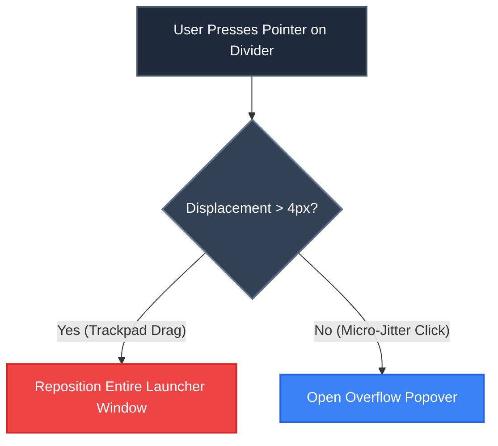
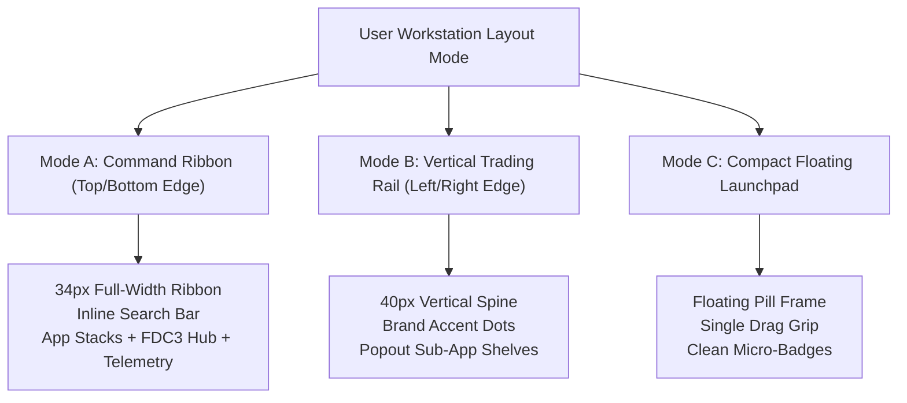

# DeskModal Toolbar & Launcher — Comprehensive Ergonomic Critique & Target Architecture Evolution

**Document Version:** 1.0.0  
**Status:** Canonical Design Specification & Architectural Critique  
**Audience:** DeskModal Core Platform Architects, UI/UX Leads, Trading Systems Engineers  
**Target Platform:** DeskModal Desktop Agent (Rust / Tauri 2.0 / React 19)  

---

## 1. Executive Summary

The DeskModal launcher toolbar is the primary operational anchor and window navigator of the entire DeskModal enterprise desktop ecosystem. It is responsible for orchestrating multi-window layouts, launching sovereign micro-apps (such as CelNet's derivatives trading desks and TradeSurface's charting tools), managing workspaces, and anchoring FDC3 interop.

However, a deep forensic review of the current implementation reveals a fundamental architectural and ergonomic tension: **the toolbar is caught between being an imitation of the consumer macOS Dock (floating glass pill, icon magnification, bouncing feedback, drag-to-spawn) and an institutional trading station control bar (Bloomberg Launchpad, OpenFin Workspace, Refinitiv Eikon).**

In a mission-critical trading workstation:
1. **Screen real estate is scarce and zero-sum**: Every vertical and horizontal pixel must earn its right to exist against price charts, order books, and risk matrices.
2. **Motor memory and Fitts's Law dominate**: Unpredictable moving targets (magnification scaling) and ambiguous drag zones cause physical mis-clicks during volatile market conditions.
3. **Information density must be semantic, not decorative**: Monochromatic icon walls force "mystery meat" navigation, while identical glyphs (e.g. Spaces, Market, and Analytics all using 4-square grid icons) create cognitive friction.
4. **Desktop context must be universally observable**: The toolbar currently lacks any visual indication of FDC3 desktop channels, active symbol underliers, microservice health, or IPC latency.

This document delivers an exhaustive critique of the current DeskModal toolbar and formulates the **Sovereign Trading Command Bar** target architecture — a modular, high-density, multi-modal control ribbon that unifies FDC3 orchestration, system telemetry, plugin grouping, and instantaneous keyboard-driven navigation.

---

## 2. Anatomical Deconstruction of the Current Implementation

The current DeskModal toolbar is implemented across `LaunchBarShell.tsx` and `Dock.tsx` in `platform/apps/deskmodal-agent/src/components/`.

```
┌──────────────────────────────────────────────────────────────────────────────────────────────────────────────────┐
│ [:::] [DM Logo] │ [App 1] [App 2] [App 3] ... [App N] │ [+] │ [⋮⋮⋮ +N] │ [Spaces] [Market Ⓝ] │ [14:32:05 UTC] │
└──────────────────────────────────────────────────────────────────────────────────────────────────────────────────┘
   (1)     (2)                     (3)                    (4)    (5)            (6)                  (7)
```

### Component Breakdown
1. **Leading Drag Grip (`.dragHandle`)**: An 18px wide capsule containing 6 dots (`:::`) providing the primary handle for moving the window across screen edges.
2. **DeskModal Brand Logo (`DockHeaderLogo`)**: The DeskModal brand icon (`dm_mark_128.png`). Left-click triggers the "About DeskModal" modal window; right-click triggers a transient context menu with a single item: "Settings...".
3. **Apps Cluster (`.appsCluster`)**: A variable-width flex row containing installed applications whose manifests provide inline SVG data URIs. Includes running indicator dots, active halos, and pending update badges.
4. **Add Button (`.addButton`)**: A button with a plus icon (`+`) that opens the `CommandPalette` (`Cmd+K` Spotlight modal).
5. **Overloaded Drag Divider (`.dockDivider`)**: A 3-dot grip acting simultaneously as a visual separator, a secondary window drag handle, and an overflow menu trigger showing `+{N}` hidden apps.
6. **System Cluster (`.systemButtonsSlot`)**:
   - **Spaces Button**: 4-square grid icon toggling the Workspace Manager.
   - **Market Button**: 4-square grid icon opening the App Market (with update count pill).
7. **Footer Clock (`DockClock`)**: Local time readout (12h/24h) with weekday, date, and IANA timezone in the hover tooltip.

---

## 3. Forensic Critique & Ergonomic Flaws

### 3.1. Mystery Meat Navigation & The "Monochromatic Icon Wall"
When more than 6–8 applications are pinned (especially in vertical edge-docked orientation), the toolbar degrades into a wall of monochromatic 24px line glyphs:

```
Evidence: Vertical Dock Capture (48px Width)
┌──────┐
│ :::  │ <- Drag Handle
│ (🌐) │ <- DeskModal Logo (Confused with an app)
│  📈  │ <- CelNet Markets
│  🌐  │ <- CelNet RFQ (Duplicate globe silhouette)
│  ⇄   │ <- CelNet Blotter
│  🛡  │ <- CelNet Risk
│  ⊞   │ <- CelNet Analytics (4-Square Grid)
│  ∿   │ <- TradeSurface Feeds
│ </ > │ <- OptiScript Editor
│  📊  │ <- Chart Tool
│  ≡   │ <- Market Depth
│  🗎   │ <- Trade Log
│  🎴  │ <- Blotter Ticket
│  ▽   │ <- Screener
│  ☵   │ <- Custom Filter
│  ⋯   │ <- Overflow (+3)
│  ⊞   │ <- Spaces (IDENTICAL 4-Square Grid!)
│  ⊞   │ <- Market (IDENTICAL 4-Square Grid!)
│23:51 │ <- Clock
└──────┘
```

#### Key Deficiencies:
- **Severe Shape Collision**: CelNet Analytics, Spaces, and Market all utilize virtually identical 4-square grid SVG icons. Spaces and Market sit directly adjacent to each other with zero visual differentiation.
- **Zero Label Visibility in Vertical Mode**: In vertical orientation (`dockVertical`), text labels are unconditionally stripped (`showLabels = !isVerticalDock`). A trader is forced to hover over every single icon sequentially to identify an application.
- **Silhouette Ambiguity**: Fine-line SVGs without brand color anchors blur together on high-resolution displays. A globe with a chart, a globe with a meridian, and a standalone line chart require conscious cognitive decoding rather than instantaneous recognition.

---

### 3.2. Motor Control Conflict & Semantic Overloading of the Drag Divider
In `Dock.tsx` lines 1801–1827, the `.dockDivider` component is forced into three mutually conflicting roles:
1. **Visual Separator**: Defines the boundary between user applications and platform controls.
2. **Window Move Handle**: Pointer-down followed by drag > 4px initiates `useLauncherDragController` to reposition the OS window.
3. **Overflow Menu Trigger**: A click with < 4px pointer displacement opens `DockOverflowMenu` to display truncated applications.



#### The Usability Failure:
- **Fitts's Law & Motor Incoherence**: In high-pressure trading scenarios, rapid mouse clicks frequently carry 3–6 pixels of natural pointer drift. When trying to click the overflow badge `+3`, the system misinterprets the gesture as a window drag, moving the toolbar across the desktop instead of showing the menu. Conversely, attempting to drag from the divider often accidentally triggers the overflow menu.
- **Redundancy of Grips**: Having both an 18px leading drag grip (`:::`) and an internal 3-dot divider grip (`⋮`) clutters the visual rhythm of the bar and creates hesitation about which handle should be used.

---

### 3.3. Brand Logo Interaction Anti-Pattern
In `DockHeaderLogo.tsx`:
- **Left-Click Action**: Opens `AboutDialog` (company copyright, version number, credits).
- **Right-Click Action**: Opens a floating menu with "Settings...".

#### The Usability Failure:
- In macOS (Apple menu), Windows (Start menu), Bloomberg (Menu button), and VS Code (Activity bar gear), clicking the top-left root mark opens the **master platform command menu**.
- Left-clicking to show an "About" dialog is an amateur desktop pattern; users open "About" once every six months, but access Preferences, Settings, Documentation, and Workspace controls daily.
- Hiding the primary "Settings" entry point behind an undocumented right-click on the logo causes severe user confusion (violating Nielsen Norman's Heuristic on Recognition over Recall).

---

### 3.4. Semantic Incongruity of the "+" Button
- The button at the end of the apps cluster renders a `+` (plus) SVG icon.
- Its tooltip displays: `"Search apps"`.
- Clicking it opens the `CommandPalette` (`Cmd+K`).

#### The Usability Failure:
- In GUI conventions, `+` unequivocally signifies **creation or addition** (e.g. "Add Tile", "New Workspace", "Install App").
- Searching or launching existing applications is universally symbolized by a magnifying glass (`🔍`) or a command prompt pill (`⌘K Search / Command...`).
- A trader wanting to search for an active symbol or open an existing chart does not intuitively click a plus sign.

---

### 3.5. The "App Wall" Scalability Bottleneck (Absence of Stacks/Drawers)
DeskModal currently loads every visible plugin application as a flat, peer icon in `useAppDirectory`:
```typescript
const barEntries = visible.map(app => ({ appId: app.appId, title: app.title, icon: app.icons?.[0]?.src }));
```

#### The Real-World Breakdown:
- **CelNet Studio** provides 6 autonomous institutional desks: Pricing, Markets, RFQ, Risk, Blotter, Analytics.
- **TradeSurface** provides 8 tools: Chart, Watchlist, Depth, Feeds, News, Earnings, Screener, Alerts.
- **Platform Apps**: Settings, Spaces, App Market, DevTools, Admin.
- Total count: **19+ individual icons**.
- On a 1080p vertical monitor (1080px available height), a 48px icon footprint with margins consumes > 900px, completely filling the screen edge and triggering aggressive overflow truncation.
- Traders cannot organize tools by asset class or desk function.

---

### 3.6. FDC3 Context Mesh Blindness
DeskModal positions itself as an **enterprise FDC3 2.2 desktop mesh container**.
However:
- The toolbar displays **zero information regarding active FDC3 channels**.
- The trader has no global indicator of what channel (e.g. Red, Green, Blue, Global) newly spawned windows will inherit.
- An extensive, color-blind accessible `ChannelSelector.tsx` component (764 LOC) was authored in the codebase but remains completely disconnected and orphaned from the production toolbar.

---

### 3.7. Microservice Health & Latency Invisibility
- DeskModal relies on high-performance local microservices: SBE SHM pricing engines (<16ns), WebSocket multiplexers, and gRPC order routing daemons.
- The current toolbar provides zero operational telemetry. If the pricing engine daemon crashes or the market data feed drops, the toolbar continues to display a peaceful clock, leaving the trader unaware that prices are stale.

---

### 3.8. Magnification Friction in a Fixed Frame
- In `Dock.tsx`, hover magnification is configured with `maxScale: 1.18` and half-cosine falloff.
- In `Dock.module.css`, `.dockFill` enforces `overflow: hidden` on the 56px window container.
- When an icon magnifies to 1.18x within a clipped container, the upper and lower edges clip, causing visual buzzing.
- Furthermore, magnification causes adjacent icons to shift position under the cursor, violating Fitts's Law and making rapid sequential clicking frustrating.

---

## 4. Competitive Workstation Benchmarking

| Feature Dimension | DeskModal (Current) | Bloomberg Launchpad | OpenFin Workspace / OS | Apple macOS Sequoia Dock |
|---|---|---|---|---|
| **Primary Orientation** | Floating / 4-Edge Snap | Top/Bottom Ribbon | Anchored Top Header | Bottom Screen Edge |
| **Height / Thickness** | 56px (H) / 48px (V) | 32–36px Dense Strip | 38–42px Bar | 64–96px Large Pill |
| **Command / Search** | `+` Button -> Modal | Integrated `<GO>` Bar | Global Search Field | Separate Spotlight (`⌘Space`) |
| **FDC3 Channel Linking** | ❌ None on toolbar | Group Color Indicators | Native Channel Pill | ❌ None |
| **App Organization** | Flat icon list | Grouped Component Menus | Categories / App Store | Stacks / Folders / Dock Pins |
| **System Telemetry** | Clock only | Live Ticker / News Bar | Network / Status Pills | Clock / Battery / Control Center |
| **Hover Physics** | 1.18x Magnification | Zero motion (instant) | Subtle background highlight | 1.0x–2.0x Magnification |
| **Multi-Instance Spawn** | Context menu only | Drag / Double-click | Instant tearout / clone | Option+Click / Dock Menu |

---

## 5. Target Architecture: The Sovereign Trading Command Bar

To resolve these defects, DeskModal's toolbar should evolve into a modular, multi-mode **Trading Command Bar**.

```
┌───────────────────────────────────────────────────────────────────────────────────────────────────────────────────────────────────────────────────┐
│ [⌘ DeskModal ▼] │ [FX Options Desk ▼] │ [🔍 Search apps, tickers, commands... ⌘K] │ [CelNet (6) ▼] [TradeSurface (8) ▼] │ [● Red: EURUSD] │ [12µs SHM ●] │ [🔔 2] │ 14:32:05 │
└───────────────────────────────────────────────────────────────────────────────────────────────────────────────────────────────────────────────────┘
       (A)                 (B)                            (C)                                    (D)                         (E)             (F)          (G)       (H)
```

### 5.1. The 8 Functional Clusters

#### (A) Sovereign Brand Menu Anchor (`DockSystemMenu`)
- **Left-Click**: Opens a unified, professional platform menu:
  - `Workspaces & Layouts >`
  - `App Market (Updates: 2) >`
  - `Global Preferences... (⌘,)`
  - `System Diagnostics & Latency Monitor`
  - `Restart Core Services (SBE/SHM)`
  - `Documentation & Keyboard Shortcuts (?)`
  - `About DeskModal`
  - `Quit DeskModal (⌘Q)`
- Eliminates the undiscoverable right-click on the logo and cleans up redundant system buttons.

#### (B) Active Workspace Switcher (`DockWorkspaceSelector`)
- Compact dropdown pill displaying the active workspace name (e.g. `[FX Vol Desk ▼]`).
- Clicking opens a fast popover to switch between saved layouts or create a new workspace without opening a full-screen window.

#### (C) Integrated Mnemonic Command & Ticker Bar (`DockCommandPill`)
- Replaces the ambiguous `+` button with an inline command trigger.
- Shows: `[🔍 Search apps, tickers, commands... ⌘K]`.
- Pressing `Cmd+K` or clicking focuses the input. Typing a ticker (e.g. `EURUSD <Enter>`) broadcasts an FDC3 context to all linked windows immediately.

#### (D) Categorized App Stacks & Flyouts (`DockAppGroup`)
- Applications are organized into **App Stacks** based on plugin namespaces or user categories:
  - **CelNet Derivatives Stack**: Shows primary icon with a small badge `(6)`. Hovering or clicking opens a vertical flyout displaying the 6 sovereign desks (Pricing, Markets, RFQ, Risk, Blotter, Analytics).
  - **TradeSurface Market Data Stack**: Shows chart icon with badge `(8)`. Flyout displays Chart, Depth, Feeds, Watchlist, News, etc.
- Prevents the toolbar from turning into a 20-icon wall, keeping the bar ultra-compact and instantly navigable.

#### (E) FDC3 Desktop Channel Hub (`DockFdc3Widget`)
- Displays the active desktop-wide FDC3 user channel with its geometric shape and color dot (e.g. `● Red: EURUSD`).
- Clicking opens the 8-color FDC3 channel selector with color-blind shapes (Circle, Square, Triangle, Diamond, Hexagon, Star, Plus, Cross).
- Provides an instant visual guarantee of inter-window synchrony.

#### (F) Microservice Health & Latency Telemetry (`DockTelemetry`)
- Compact status pill monitoring local daemons:
  - `12µs SHM ●` (green when SBE SHM pricing daemon is active, red if unreachable).
  - `WS 0.8ms` (WebSocket multiplexer latency).
- Clicking opens the real-time latency waterfall chart.

#### (G) Notification Center Badge (`DockNotificationCenter`)
- Bell icon with unread high-priority badge count (e.g. order fills, margin alerts, plugin updates).
- Clicking toggles the slide-out Notification Center drawer.

#### (H) Precision World Clock (`DockClock`)
- Streamlined 24h / UTC / Local clock with subtle market session indicators (e.g. `LDN ● NY ● TKO ○`).

---

## 6. Layout Adaptability & Form Factor Presets

The evolved toolbar must support 3 distinct workstation form factors:



### Form Factor Specifications

| Parameter | Mode A: Command Ribbon (Recommended) | Mode B: Vertical Trading Rail | Mode C: Floating Launchpad |
|---|---|---|---|
| **Height / Width** | 34px fixed height, 100% width | 40px fixed width, 100% height | 44px height, content-sized pill |
| **Screen Anchor** | Top or Bottom display edge | Left or Right display edge | Free-floating or edge-pinned |
| **Search Presentation** | Inline input pill (`⌘K`) | Icon trigger (`🔍`) | Icon pill (`🔍 ⌘K`) |
| **App Presentation** | App Stacks with horizontal grouping | Vertical icon stack with popout flyouts | Minimalist icon dock |
| **FDC3 Channel** | Full pill: `[● Red: EURUSD]` | Color dot + shape pill `[●]` | Compact color pip |
| **Telemetry** | Full metric: `[12µs SHM ●]` | Micro status dot `[●]` | Tooltip only |
| **Magnification** | None (Disabled) | None (Disabled) | Optional subtle lift (1.06x) |

---

## 7. Concrete Technical Refactoring Roadmap

To implement this target architecture cleanly without architectural regression, the following refactoring roadmap is defined for the `platform/apps/deskmodal-agent` repository:

### Phase 1: Interaction Cleanup & Semantic Decoupling (Immediate)
1. **Disentangle the Drag Divider (`.dockDivider`)**:
   - Strip window dragging and click popovers from the separator line. The divider must be a pure `role="separator"` with zero click/drag listeners.
   - Replace the overloaded `+{N}` divider trigger with a dedicated `DockOverflowButton` (`»`) that clearly conveys "Show hidden apps".
   - Consolidate all window dragging onto the single leading `.dragHandle`.
2. **Standardize the Brand Logo (`DockHeaderLogo`)**:
   - Replace the left-click `About` dialog trigger with `DockSystemMenu`, offering immediate access to Settings, Workspaces, Market, and Diagnostics.
3. **Re-align Search (`.addButton`)**:
   - Replace the `+` glyph with a magnifying glass search icon (`SearchIcon`) or compact search pill (`[🔍 ⌘K]`).
4. **Disable Clipping Magnification**:
   - In `Dock.tsx`, default `magnify.enabled` to `false` in `.dockFill` mode. Replace magnification with an instantaneous 2px border accent and subtle background illumination (`--deskmodal-hover-overlay`), preserving spatial stability.

### Phase 2: FDC3 & Telemetry Integration (Core Platform)
1. **Integrate `DockFdc3Widget`**:
   - Mount the existing, proven `ChannelSelector` logic into `LaunchBarShell.tsx` as a primary toolbar widget.
   - Sync the toolbar's channel state with Tauri IPC `fdc3_get_current_channel` and `fdc3_join_user_channel`.
2. **Implement `DockTelemetry`**:
   - Connect a lightweight IPC heartbeat polling the SBE SHM socket `/tmp/deskmodal-service-celnet-pricing-service.sock` and core WebSocket connection.
   - Display a high-contrast micro-dot (green/amber/red) with roundtrip latency.

### Phase 3: App Stacks & Sub-App Grouping (Plugin Ecosystem)
1. **Extend `plugin.toml` Manifest Schema**:
   - Allow plugins to declare app groupings and stack titles:
     ```toml
     [plugin.toolbar]
     group = "celnet.derivatives"
     group_title = "CelNet Derivatives"
     group_icon = "icons/celnet-suite.svg"
     badge_style = "count" # displays (6)
     ```
2. **Implement `DockAppStack`**:
   - In `useAppDirectory.ts`, group apps sharing a common `group` identifier.
   - In `Dock.tsx`, render a single stack icon that opens an accessible dropdown/flyout shelf containing the member micro-apps.

---

## 8. The DeskModal Duality: Modal HUDs vs. Split-Tree Tiling & Zero Desk Space Obfuscation

The very name **DeskModal** reflects a foundational architectural philosophy: **Windows are either Modal or Tileable, and the desktop container must NEVER obfuscate desk space**.

On tier-1 institutional trading desks, desktop real estate is sacred. Multiple high-resolution displays are filled with real-time financial telemetry: live order books, volatility smiles, pricing ladders, execution blotters, and news feeds. A bulky application frame or floating consumer dock that obscures charts, induces window overlap, or forces traders into "z-order occlusion hell" is immediately discarded.

DeskModal eliminates desk space obfuscation through three architectural pillars:

### 1. The Dual Window Modality Matrix
```
                            ┌───────────────────────────────┐
                            │      DeskModal Container      │
                            └───────┬───────────────┬───────┘
                                    │               │
                 Ephemeral / Transient             Persistent Cockpit
                                    │               │
                                    ▼               ▼
                 ┌──────────────────────┐    ┌────────────────────────┐
                 │   Modal Action HUD   │    │ Binary Split-Tree Tile │
                 │  (Order Ticket, RFQ) │    │  (Pricing, L2, Blotter)│
                 └──────────┬───────────┘    └───────────┬────────────┘
                            │                            │
             • Pops under cursor / ⌘K      • Snaps in BSP binary tree
             • Executes via SBE/SHM        • 0px / 2px gutters
             • Dismisses on Esc/Submit     • Proportional splitter math
             • Zero taskbar clutter        • Never hides behind windows
```

- **Persona A: Ephemeral Modal HUDs (`deskmodal-window-manager::popup.rs`)**:
  - *Purpose*: Focused, rapid execution actions: Quick RFQ Order Tickets, Greeks Sensitivity Sliders, FDC3 Intent Resolvers, Workspace Switchers (`⌘W`), Command Palettes (`⌘K`).
  - *Ergonomics*: Floats centered or anchored to the parent tile with soft background dimming (`backdrop-filter: blur(6px)`).
  - *Lifecycle*: Appears instantly, executes via SBE/SHM microsecond IPC, and dismisses on `Esc`, submit, or outside click. Leaves zero lingering footprint.
- **Persona B: Persistent Split-Tree Tiles (`deskmodal-window-manager::split_tree.rs`)**:
  - *Purpose*: Persistent observational and analytical engines: CelNet Options Volatility Smile, TradeSurface L2 Consolidated Depth, Live Deals Blotter, Risk Cube VaR.
  - *Ergonomics*: Managed by a binary space partitioning (BSP) tree. Tiles snap edge-to-edge with 0px or 2px gutters.
  - *Zero Occlusion Guarantee*: Windows never overlap, stack, or hide behind one another. Dragging a splitter (`splitter.rs`) resizes adjacent tiles proportionally with zero rendering lag.

### 2. Zero Desk Space Obfuscation ("The Phantom Host")
- **34px Dead-Margin Docking**: Docks flush against the screen's dead boundaries (adjacent to the macOS camera notch, flush above the Windows Taskbar, or pinned to the Wayland screen edge).
- **Proximity Auto-Hide & Edge Reveal**: For full-screen analytical focus, the command bar tucks away completely, fading into an unobtrusive 3px edge glow strip. Hovering the edge or pressing `⌘K` smoothly drops the bar down for rapid navigation.
- **OS Work-Area Reservation**: DeskModal sets the host OS work area via Win32 `SPI_SETWORKAREA`, macOS Cocoa `NSScreen.visibleFrame`, and Linux `wlr-layer-shell-unstable-v1`. Third-party applications naturally snap and maximize *around* DeskModal rather than colliding with it.

### 3. Native Third-Party Window Adoption (`deskmodal-snap::adoption.rs`)
Traders cannot abandon Bloomberg Terminal, Microsoft Excel, or Symphony. Instead of fighting these applications:
- **Handle Capture**: `deskmodal-snap` captures foreign OS window handles (`HWND`, `CGWindowID`, X11 window IDs) via title and process glob matching.
- **Tiled Co-Movement**: Foreign windows are adopted into DeskModal's split-tree grid, moving, resizing, and minimizing as first-class members of the trading cockpit.
- **Win32 Subclass Intercepts**: Subclass hooks (`WM_MOVING`, `WM_SIZING`) ensure adopted Bloomberg/Excel windows track DeskModal splitters without tearing or visual stutter.

---

## 9. Conclusion

The DeskModal toolbar is the operational heartbeat of the trading desktop. By divesting from consumer macOS Dock aesthetics (magnification, ambiguous drag dividers, and monochromatic icon walls) and embracing the **Sovereign Trading Command Bar** architecture with **Modal HUDs, Split-Tree Tiling, and Zero Desk Space Obfuscation**, DeskModal achieves:
- **Zero Wasted Space**: 34px dense command ribbon with auto-hide capability, giving 100% of the display to active financial instruments.
- **Flawless Modality**: Fast, ephemeral modal action HUDs that execute and dismiss without disturbing background tiling layouts.
- **Tiled Precision**: Binary split-tree layout engine ensuring zero window overlap and first-class adoption of Bloomberg and Excel.
- **Enterprise Situational Awareness**: Real-time FDC3 channel coordination and microsecond IPC latency telemetry visible at a glance.
- **Infinite Scalability**: Multi-app plugin suites (like CelNet's 6 desks and TradeSurface's 8 tools) organize into elegant, instantaneous app stacks.
