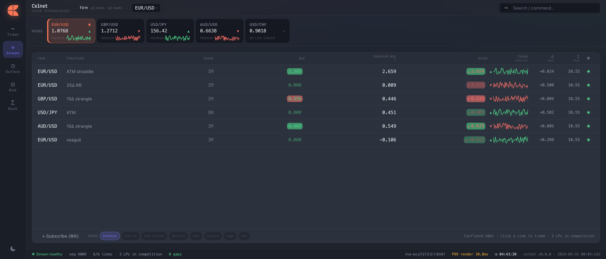
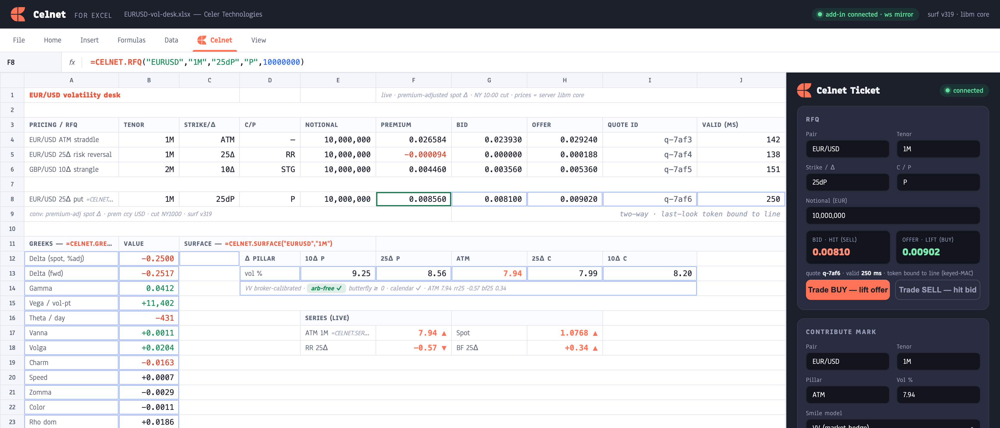

**[Celnet Capabilities](../CELNET-CAPABILITIES.md)** › Capability Map — What Celnet Does

# 2. Capability Map — What Celnet Does

Celnet is a complete FX-options pricing and risk platform: a single, current contract served from a pinned, in-core engine, with the GUI, the Excel add-in, the Rust SDK, and the admin CLI all consuming that same contract. This section is the scannable inventory — what the platform does, grouped by capability cluster. Every later section expands a row here.

*Figure 12 — The capability landscape: pricing & analytics, engine & performance, GPU, risk, extensibility, edge & API, clients, and Celer integration, unified by a single API-first contract.*

### 2.1 Pricing & analytics

Celnet prices the FX-options book a desk actually trades — vanilla through first-generation exotics — and returns the full Greek set in one pass. Vanilla pricing is Garman-Kohlhagen off the outright forward with separate domestic and foreign discount factors. The smile and surface engine carries the market's standard parametrisations and calibrates them from broker quotes, behind arbitrage gates. Anything beyond the built-in catalogue is reachable through the Open Quant SDK.

| Capability | What it delivers |
|---|---|
| Vanilla pricing | Garman-Kohlhagen on the outright forward, separate domestic/foreign discounting |
| Full FX Greek set | Price, spot- & forward-delta, gamma, vega, theta, rho-domestic & rho-foreign, vanna, volga, charm, speed, zomma, color — one pass, finite-difference cross-validated |
| Delta conventions | Spot / forward × unadjusted / premium-adjusted, with a branch-aware strike↔delta solver |
| At-the-money rules | At-the-money-forward and delta-neutral straddle, sign-correct per convention |
| Smile / surface models | Vanna-Volga, SABR, raw-SVI, SSVI, with a model selector to mark and recalibrate |
| Calibration | Broker-strangle → smile-strangle fixed-point fit from market quotes |
| Arbitrage discipline | Butterfly density, calendar total-variance monotonicity, and vertical gates; arb-free term structure in total variance |
| First-generation exotics | Digitals, one-touch / no-touch, double-no-touch / double-touch, single & double barriers (knock-in / knock-out) |
| Exotics methods | Analytic reflection, Crank-Nicolson PDE with a Rannacher start-up, Philox Monte-Carlo, survival-weighted Vanna-Volga overlay — cross-validated and checked to machine precision against an independent reference library |
| Market plumbing | Dual-calendar date engine and a per-(currency-pair, tenor) convention registry |

### 2.2 Engine, performance, GPU & durability

The core is so fast that network framing, not arithmetic, is the latency floor. An async edge meets pinned, allocation-free hot cores over wait-free rings; state is published lock-free and handed over without downtime; and the journal makes the book durable across a crash.

| Capability | What it delivers |
|---|---|
| Two-tier architecture | Async edge (gRPC / WebSocket mirror / FIX) joined to pinned, zero-allocation hot cores by wait-free single-producer/single-consumer rings |
| Lock-free state | Atomically-swapped market-state snapshot, single-writer seqlock top-of-book, cache-padded counters |
| Hot upgrades | Blue-green, zero-downtime state handoff |
| Durability | Checksummed, append-only journal with clean crash recovery |
| Zero-cost observability | Tail-percentile latency histograms, coordinated-omission aware, over a bounded drop-on-full telemetry ring — the hot core stays log/lock/allocation-free |
| GPU backend | Pricing-backend abstraction over the cross-platform GPU stack (Metal / Vulkan / DX12) with a high-precision CPU oracle |
| Deterministic RNG | Counter-based RNG bit-identical between CPU and GPU; GPU results reconciled against the oracle; CPU SIMD fallback |

### 2.3 Risk

Risk has two complementary zooms of one underlying fact cube: book-shaped scenario risk for the desk in front of the screen, and a firm-wide OLAP position-fact cube for aggregation, limits, and entitlement.

| Capability | What it delivers |
|---|---|
| Scenario grid | Two-axis shock grid by real repricing, with swappable axes |
| Bucketed vega | Vega per (tenor, delta) pillar |
| Higher-order book risk | Cross-gamma stencil and theta-roll over horizons |
| Marked-surface registry | Versioned official-vs-live surfaces with pinning; an unknown version is rejected, never silently re-derived live |
| Position-fact cube | Convention-canonicalized common-numeraire netting over eight dimensions (Trader / Book / Desk / CurrencyPair / Location / Entity / ValueDate / Session) |
| Roll-up semantics | Additive incremental roll-up, plus non-additive per-node re-derivation (e.g. VaR / ES, curvature) |
| Limit tree | Cascading board → entity → desk → book → trader limits with pre/post-trade checks |
| Entitlement | Server-side, entitlement-aware pre-aggregation pruning |
| Book ↔ Risk | Drill from an aggregated book row straight to a position's scenario risk — two views of the same cube |

### 2.4 Extensibility & plugins

Desks run their own private-IP models inside the engine without forking Celnet. The Open Quant SDK is a frozen, runtime-agnostic contract; the host runs models across tiers — from native speed to a fully sandboxed WebAssembly guest with no ambient OS access.

| Capability | What it delivers |
|---|---|
| Open Quant SDK | Frozen PricingModel / SmileModel / Calibration traits, a self-describing model registry, and a WIT interface mirror |
| Native tier | Native-speed in-engine models |
| WebAssembly sandbox | Compute-budgeted, capability-scoped — only the core math primitives (exp / ln / sqrt / norm_pdf / norm_cdf) cross into the guest; boundary NaN-canonicalization; strict marshalling ABI |
| Determinism & safety | Bit-identical replay; a per-call compute budget so an errant model fails typed, never hangs |
| Hardened tiers | Signed shared-object and OS-sandbox (Landlock / seccomp) tiers in the same model |
| Self-check | Built-in butterfly no-arbitrage check |

### 2.5 Edge, API & wire

One clean, unversioned contract carries everything. The streaming session multiplexes many subscriptions over a single channel, and click-to-trade is bound to the streamed line with an unguessable token and last-look.

| Capability | What it delivers |
|---|---|
| Service families | Pricing, Quote, a multiplex StreamSession, and Surface (with a Pin resolver) |
| Unified instrument | A single Instrument type with surface-version pinning |
| Streaming | One bidirectional channel, many subscriptions: Subscribe → Snapshot → Update(seq) → Heartbeat, gap → Resync, in-place Modify re-baseline |
| Click-to-trade | Unguessable keyed-MAC tradable token (sell-at-bid / buy-at-offer) bound to the line, with last-look validity and idempotent execution — stale / forged / already-consumed are rejected |
| WebSocket mirror | Byte-identical WebSocket JSON mirror of the contract |
| Clients on the wire | Typed Rust client SDK (reconnect-liveness, typed errors) and an admin CLI |
| FIX | Real FIX 4.4 engine (acceptor + initiator) with an FX-options dialect |
| Market-data layer | Vendor-feed normalisation / blend / divergence and a conflating egress governor (token-bucket + counted drops) |
| Fleet sharding | Intra-fleet highest-random-weight partition map for horizontal scale-out |
| Series & attribution | A market-series feed (ATM / SPOT / RR / BF / FORWARD observables) for live trends, a smile-model selector, and a book/owner attribution dimension |

**API-first parity.** Every capability lives in the one contract. The GUI, the Rust SDK, the CLI, and the Excel add-in all consume that same contract — the front-end has no privileged path — so a value is bit-identical across every surface.

### 2.6 Clients — GUI, Excel, SDK, CLI

| Client | What it delivers |
|---|---|
| GUI (React + WebGPU) | Live-WebSocket-by-default, single-window five-workspace shell — Ticket / Stream / Surface / Risk / Book (Cmd-1..5) — on the Celer Technologies brand, with a Firm/desk/book scope breadcrumb, a pair navigator (watchlist + dropdown), a Cmd-K command palette, light/dark, and trend modes (Premium / ATM vol / RR / BF / Spot / Forward / Vega / P&L) |
| Excel add-in (Office.js) | CELNET.PRICE, CELNET.GREEKS (full Greek vector + convention footer), CELNET.SURFACE, CELNET.MARKSURFACE, CELNET.RFQ, CELNET.SUBSCRIBE, CELNET.SERIES, CELNET.MARK — no pricing in the cell; every number is the server's value, bit-identical to the GUI, with per-cell convention/surface-version transparency and typed #CELNET_* errors |
| Rust SDK | Typed client with reconnect-liveness and typed errors |
| Admin CLI | Operational control over the same contract |

*Screenshot 1 — The Stream workspace: live multiplex RFS blotter with click-to-trade and the trend selector.*

*Screenshot 10 — The Excel add-in: a CELNET.RFQ formula bar, RFQ and full GREEKS spills, a SURFACE smile spill, and live SERIES cells — every value the server's, bit-identical to the GUI.*

### 2.7 Celer integration

Celnet is the FX-options pricing system-of-record inside the Celer trade lifecycle. It injects option price, Greeks, and surface into the price path and option risk into the risk and position path, and runs in three deployment modes that are reached by swapping adapters on the seam traits — never by a rewrite.

| Capability | What it delivers |
|---|---|
| Price path | Injects FX-option price / Greeks / surface into venues → FIX-in → market-data → market-merchant → distributor → WebSocket → Celer Trader |
| Risk / position path | Injects option risk into order-routing → risk → destination → clearing → position-manager |
| Deployment modes | Standalone, Hybrid, and CelerIntegrated — reversible adapter swaps on market-data-source / price-sink / order-and-exec seams |
| Adaptability | The same market-data seam ingests external products and feeds — for example Fenics, Bloomberg, Refinitiv, EBS |

### 2.8 Positioning

Celnet's parity claims are executable: a parity matrix renders each capability as a gated integration test, so "meets or beats" is continuously proven rather than asserted. Comparisons use vendor-neutral archetypes — a closed terminal, a front-to-back platform, a data venue, a modern library. The platform is supply-chain-clean (open-source, permissively-licensed software only) and cross-platform deterministic, and it out-functions, out-intuits, and out-performs across the board.

| Capability | What it delivers |
|---|---|
| Executable parity | Capability claims gated as integration tests, proven continuously |
| Supply-chain clean | Open-source, permissive-licence dependencies only |
| Determinism | Cross-platform, bit-identical results |
| Archetype framing | Vendor-neutral comparison archetypes; external products named only as integration targets |

---
[← Executive Summary](01-executive-summary.md)  ·  **[Contents](../CELNET-CAPABILITIES.md)**  ·  [System Architecture →](03-system-architecture.md)
