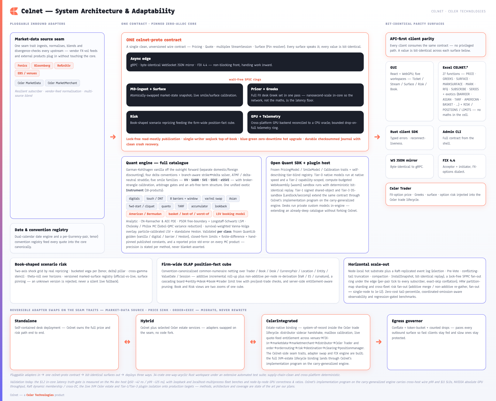

[← Prev: Capability Map](02-capability-map.md) · [Index](../CELNET-CAPABILITIES.md) · [Next: Quant & Pricing Methodology Coverage →](04-quant-coverage.md) · [Showcase ↗](../celnet-capabilities.html)

# 3. System Architecture

Celnet's architecture starts from a single design conviction: **adapt to the desk, never the other way around.** The same engine runs self-contained on a quant's laptop, beside a regional risk hub, or wired straight into the Celer trade lifecycle as the firm's FX-options pricing system-of-record — and it moves between those shapes through deliberate, reversible adapter swaps on a small set of seam traits, not a rewrite. Every market-data source, price sink, and order/execution path is a pluggable adapter, so a venue feed, a distributor, or a counterparty channel changes without touching the pricing core. That adaptability is not bolted on; it is the consequence of a strict two-tier split, one-way crate dependencies, and a distributed-correctness substrate that all share the same wait-free discipline.

*Figure 3.1 ([index](../CELNET-CAPABILITIES.md#figure-index)) — One engine, three deployment shapes. Pricing, risk, and surface logic sit behind seam traits; market-data, price-sink, and order/execution adapters swap underneath them, so the same binary serves Standalone, Hybrid, and Celer-Integrated desks without forking the core.*

### 3.1 Two tiers: a hot core, an async edge

Celnet is built as two cleanly separated tiers joined by a wait-free seam.

The **async edge** is where the outside world meets Celnet: gRPC across five services, a byte-identical WebSocket JSON mirror of the same contract, and a real FIX 4.4 engine all terminate here, alongside vendor-feed normalization, the conflating egress governor, and the per-pair price-tick fan-out hub. The edge is asynchronous, elastic, and free to do everything a networked service must — accept connections, fan out streams, coalesce updates, speak many protocols at once.

The **hot core** is the opposite discipline. Pricing runs on pinned, zero-allocation cores that never log, never lock, and never allocate on the hot path. All the work that would jitter a tail latency — memory management, telemetry, I/O — is kept off the core entirely. The result is in-core pricing fast enough that **network framing, not the mathematics, is the only meaningful latency**: the wire is the floor, and the maths sits comfortably beneath it. (The in-core figure is measured and gated; the absolute wire number is deploy-gated — see the honest boundary at the end of this chapter and Chapter 7.)

The two tiers are bridged by **wait-free single-producer/single-consumer rings**. Requests cross from edge to core, and results cross back, without locks and without blocking either side — the edge stays responsive under load while the core runs uninterrupted.

| Tier | Responsibility | Discipline |
|------|----------------|------------|
| Async edge | Protocol termination (gRPC × 5 services / WebSocket mirror / FIX 4.4), streaming, conflation, per-pair fan-out, feed normalization, telemetry offload | Asynchronous, elastic, protocol-rich |
| SPSC rings | Edge↔core handoff of requests and results | Wait-free, lock-free, non-blocking |
| Hot core | Vanilla, Greek, surface, exotic, and early-exercise pricing | Pinned, zero-allocation, log/lock/alloc-free |

### 3.2 Lock-free state publication

The core prices against shared market state without ever stalling on a lock. State is **published**, not contended: the live market-state snapshot is swapped atomically so readers always observe a complete, consistent view; top-of-book is maintained through a single-writer seqlock that lets readers stream prices without blocking the writer; and hot counters are cache-padded to keep cores from contending on shared cache lines. Reads dominate, writes are rare and clean, and no pricing thread waits on another.

*Figure 3.2 ([index](../CELNET-CAPABILITIES.md#figure-index)) — The read-mostly publication model: edge producers hand work across wait-free SPSC rings into pinned hot cores, which price against an atomically-swapped market-state snapshot and a single-writer seqlock top-of-book, while cache-padded counters and a bounded telemetry ring keep the hot path free of locks and allocation.*

### 3.3 A disciplined multi-crate workspace

Celnet is a **34-crate Rust workspace** with strictly **one-way, acyclic dependencies**. Foundational vocabulary and the single wire contract sit at the base (`celnet-types`, `celnet-core`, `celnet-proto`, `celnet-plugin-api`); conventions and the calendar, vanilla pricing, the surface engine, the full exotics catalogue (including early exercise and correlated multi-asset baskets), the standalone Heston engine, the Sobol/QMC layer, the GPU backend, the hot engine, the plugin host, the risk stack (normalize → cube → limits → entitlements → fleet), XVA, integration, the distributed substrate, and the edge build upward on top of them — never sideways into each other.

The crate boundaries *are* the architecture: a change rebuilds and re-tests only its own subtree, dependencies always point in one direction, and the design stays legible as it grows. The split is deliberately fine-grained so a modification touches a minimal subtree — incremental gates verify only the changed crate(s), and the full-workspace gate runs as the cross-crate integration check before a milestone. An extensive automated test suite, ~26 independent-oracle parity rows, and regression-gated benchmarks ride along every boundary, so structure and behaviour are verified together rather than asserted.

### 3.4 Zero-downtime upgrades and durable recovery

Because the platform is mission-critical, it is designed to be upgraded and to survive a crash without losing a tick.

**Blue-green hot upgrade.** A new engine generation is brought up alongside the running one and the live state is handed off between them, so a version change happens without a pricing outage and without a mixed-version window — one clean contract, deployed uniformly.

**Durable journal with compaction.** Every state-changing event is written to a checksummed (CRC-32), append-only journal. On restart, Celnet replays the journal to reconstruct book and market state exactly, with clean crash recovery: a torn final write left by an abrupt kill heals to the last good record, while genuine interior corruption is surfaced rather than silently masked. The journal now also **compacts**: at a watermark it writes a snapshot and retains only the residual tail, and the gate is that replay from the compacted log rebuilds the **bit-identical** state that replay from the full, never-compacted log produces (`replay_from_compacted_equals_replay_from_full_bit_identical`). Recovery is therefore both deterministic replay and a standalone, self-pruning write-ahead log — and it stays strictly off the hot path, so durability never taxes pricing latency.

### 3.5 A distributed-correctness substrate

The same two-tier model is the unit of horizontal scale, and three purpose-built crates make scale-out *correct*, not merely possible.

**Leader-replicated event log with full Raft.** `celnet-replog` is a Raft consensus layer over the durable journal: randomized-timeout **leader election** with a **Pre-Vote** straw poll (Ongaro thesis §9.6) that stops a flaky or partitioned node from disrupting a stable leader, **conflicting-tail truncation** so a recovered follower converges to the leader's log, **local snapshot compaction**, and the **InstallSnapshot RPC** (Raft §7) that reseeds a far-behind or freshly-restarted follower from a snapshot plus its residual tail. The committed log replays to a `f64::to_bits`-identical applied state across nodes — bit-identity, not approximate agreement, is the consensus oracle. The multi-node proof runs logical nodes over **real `127.0.0.1` loopback TCP sockets on ephemeral ports** (genuine OS sockets, AppendEntries / RequestVote + replies), so quorum, framing, election safety, truncation, and snapshot catch-up are all exercised end-to-end.

**Lock-free SPMC broadcast fan-out under the edge.** `celnet-fanout` is a single-producer/multi-consumer broadcast ring, and `celnet-server/services/pricefanout.rs` wires it directly beneath the streaming edge: for each live currency pair a **single producer** advances the deterministic per-pair spot path once per cadence tick and **publishes** one small `PriceTick` POD; every subscribed session holds an **independent consumer cursor** and observes every tick in order. The per-pair compute happens **once** and is broadcast to all subscribers — not recomputed per session. Publication is zero-allocation and lock-free via a true two-phase per-slot **seqlock** (an in-progress marker straddling the payload store, so no consumer ever reads a torn slot); a consumer lagging beyond the ring depth has the oldest ticks **conflated** away with **exact skip accounting** (`received + skipped == produced`), so overflow is bounded and audited rather than silently lossy.

**Cross-fleet risk fan-out.** An intra-fleet partition map shards the instrument universe across nodes by highest-random-weight (HRW) assignment, so adding capacity rebalances minimally and predictably. `celnet-risk-fleet` then reconciles distributed risk against the single-node aggregate: additive measures merge associatively (exact), non-additive measures (VaR/ES, curvature) are re-gathered at firm level and re-derived once, and the fan-out is proven equal to the single-node aggregate to 1e-12.

From a single laptop to a Raft-replicated, fan-out-fronted, risk-sharded fleet, the architecture is the same — only how many of it you run changes.

> **Honest boundary.** The distributed proofs in this repository run on **localhost multi-process / real loopback sockets** and prove **correctness, quorum, and framing** only. **Cross-host wire p99, cross-DC transport, real network partitions, and Raft §6 dynamic membership (joint-consensus) are deploy-gated and never claimed in-repo;** so too are the §11 absolute wire-latency SLOs (in-repo proves the §1.2 in-core truth-gate + loopback benches only). Physical cross-node risk transport is the deploy-time drop-in behind the now-built HRW + fan-out seam.

**See also:** [§8 Scalability & Scale-Out](08-scalability-scaleout.md) builds on the distributed-correctness substrate introduced here; [§14 Engineering Rigor](14-engineering-rigor.md) covers the determinism and replay guarantees of this concurrency model; [§12 Celer Integration](12-celer-integration.md) shows the adapter seams that bind the same engine into the estate.

---
[← Prev: Capability Map](02-capability-map.md) · [Index](../CELNET-CAPABILITIES.md) · [Next: Quant & Pricing Methodology Coverage →](04-quant-coverage.md) · [Showcase ↗](../celnet-capabilities.html)
