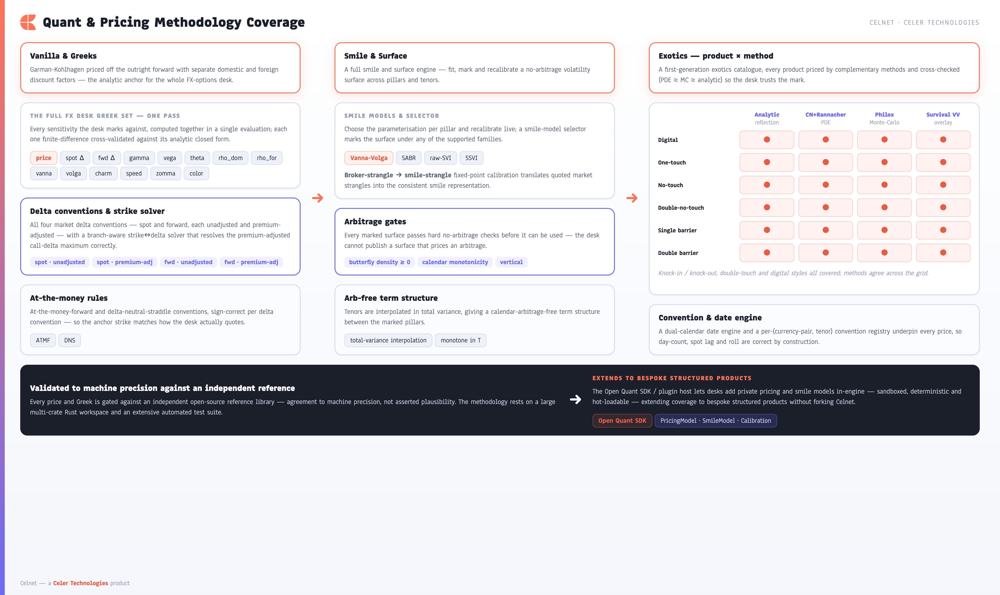
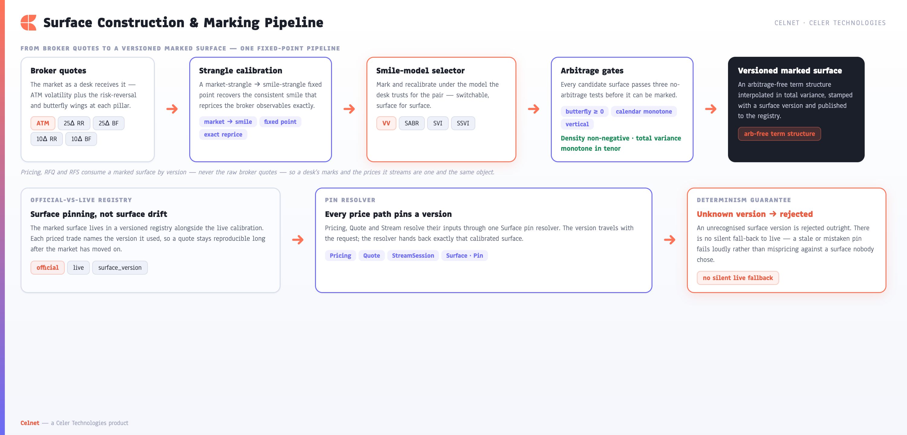
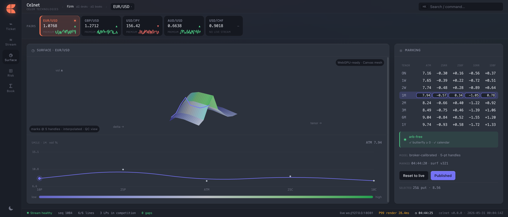
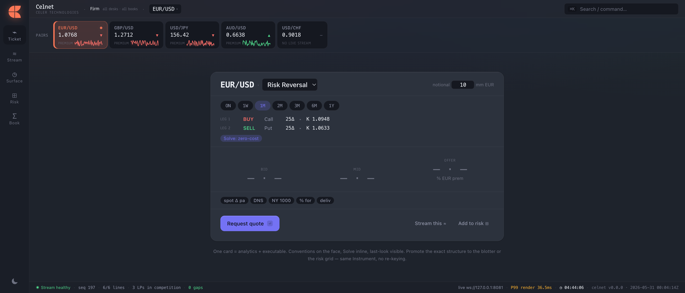

**[Celnet Capabilities](../CELNET-CAPABILITIES.md)** › Quant & Pricing Methodology Coverage

# 4. Quant & Pricing Methodology Coverage

Celnet is built on a complete, desk-grade FX-options quant library. Every price, every Greek, every smile and every exotic is computed by the same in-core engine that powers the live pricing edge — so the number a trader sees in the ticket, the number that streams over the wire, and the number a quant pulls into a spreadsheet are one and the same. This section maps the analytics surface end to end: from a single vanilla through the full Greek set, the four delta conventions, the smile/surface engine, and the first-generation exotics catalogue, to the SDK seam that extends Celnet to bespoke structured products.

*Figure 3 — The Celnet quant coverage map: a single in-core library spanning vanilla pricing, the full FX desk Greek set, the four delta conventions, the smile/surface engine, and the first-generation exotics catalogue, with the Open Quant SDK as the extension seam to structured products.*

### 4.1 Vanilla pricing and the full FX desk Greek set in one pass

Vanilla European options are priced with the Garman–Kohlhagen model, struck off the outright forward and discounted with **separate domestic and foreign discount factors** — the correct FX construction, not an equity model bent into shape. From that single valuation Celnet returns the **entire FX desk Greek set in one pass**: price, spot-delta and forward-delta, gamma, vega, theta, both rhos (domestic `rho_dom` and foreign `rho_for`), and the full second- and third-order book — vanna, volga, charm, speed, zomma and color. A desk gets every sensitivity it risks against from a single call, with no second pricing round-trip to chase a cross-Greek.

Every one of these sensitivities is **cross-validated by finite differences** against the analytic closed form, so the analytic Greeks the desk trades on are continuously checked against an independent numerical bump of the same model. Correctness is a property of the build, not a hope.

| Greek family | Sensitivities delivered in the single pass |
|---|---|
| Value | Price (off the outright forward, dual discount factors) |
| First order | Spot-delta, forward-delta, vega, theta, `rho_dom`, `rho_for` |
| Second order | Gamma, vanna, volga, charm |
| Third order | Speed, zomma, color |

### 4.2 Delta conventions and the branch-aware strike↔delta solver

FX desks quote in delta, not strike, and the mapping between them depends on convention. Celnet implements all **four delta conventions** — spot and forward, each in unadjusted and premium-adjusted form — and a **branch-aware strike↔delta solver** that inverts the relationship robustly. Crucially, the solver is aware of the **premium-adjusted call-delta maximum**: where the premium-adjusted delta function turns over and a naive root-finder would pick the wrong branch, Celnet selects the correct one. Both at-the-money rules are built in and applied **sign-correctly per convention**: at-the-money-forward (ATMF) and the delta-neutral straddle (DNS). A trader can pin a wing by 25-delta or 10-delta, anchor the smile at ATMF or DNS, and trust that the strike Celnet returns is the strike the market means.

### 4.3 The smile and surface engine

Celnet marks volatility with a full smile-and-surface engine rather than a single fixed parameterisation. Four smile models are available — **Vanna-Volga, SABR, raw-SVI and SSVI** — and a **smile-model selector** lets a desk mark or recalibrate a smile under any of them and compare. Market quotes enter the engine the way they are actually traded: a **broker-strangle → smile-strangle fixed-point calibration** resolves the market (broker) strangle into a consistent smile strangle, so the calibrated smile reproduces the prices a desk was shown.

No-arbitrage is enforced, not assumed. **Arbitrage gates** check butterfly density non-negativity (no negative implied densities), vertical-spread monotonicity, and calendar total-variance monotonicity across tenors. The term structure is assembled **arbitrage-free, interpolated in total variance**, so volatility between pillar tenors is consistent and free of calendar arbitrage by construction.

*Figure 4 — The surface pipeline: broker (market) strangle quotes enter a smile-strangle fixed-point calibration, pass butterfly / vertical / calendar arbitrage gates, are marked under a selectable smile model (VV / SABR / SVI / SSVI), and are woven into an arbitrage-free term structure interpolated in total variance.*

| Stage | What the engine does |
|---|---|
| Quote intake | Broker (market) strangle → smile-strangle fixed-point calibration |
| Smile models | Vanna-Volga, SABR, raw-SVI, SSVI — chosen via the model selector |
| Arbitrage gates | Butterfly density non-negative, vertical monotonic, calendar total-variance monotonic |
| Term structure | Arbitrage-free, interpolated in total variance |
| Marking | Mark / recalibrate / publish under any model with surface versioning |

The marking workflow is exercised live from the GUI's Surface workspace — a smile chart alongside the ATM / 25RR / 25BF / 10RR / 10BF marking grid, the arbitrage-free gate, the broker-calibrated smile, and an explicit surface version with reset and publish controls.

*Screenshot 3 — The Surface workspace in the live GUI: smile chart, the ATM / 25RR / 25BF / 10RR / 10BF marking grid, the arbitrage-free gate, broker-calibrated smile, surface version, and Reset / Publish.*

### 4.4 First-generation exotics catalogue

On top of vanilla and the smile engine, Celnet ships a first-generation FX exotics catalogue — **digitals, one-touch and no-touch, double-no-touch and double-touch, and single and double barriers** (knock-in and knock-out). What sets the catalogue apart is **method triangulation**: each product is reachable by multiple independent methods, and the methods are **cross-validated against one another** so PDE, Monte-Carlo and analytic results agree before a price is trusted.

- **Analytic** — closed-form barrier valuation via the reflection-principle construction.
- **Crank-Nicolson PDE** — a finite-difference solver with a **Rannacher start-up** that damps the oscillations barriers and digital payoffs would otherwise induce near the boundary.
- **Philox Monte-Carlo** — a counter-based simulation path, bit-reproducible across runs and across CPU and GPU.
- **Survival-weighted Vanna-Volga overlay** — a market overlay that re-introduces smile risk into the touch / barrier price, weighted by survival probability.

| Product | Analytic | Crank-Nicolson / Rannacher PDE | Philox Monte-Carlo | Survival-weighted VV overlay |
|---|---|---|---|---|
| Digitals | ✓ | ✓ | ✓ | ✓ |
| One-touch / No-touch | ✓ | ✓ | ✓ | ✓ |
| Double-no-touch / Double-touch | ✓ | ✓ | ✓ | ✓ |
| Single barriers (KI / KO) | ✓ | ✓ | ✓ | ✓ |
| Double barriers (KI / KO) | ✓ | ✓ | ✓ | ✓ |

Across the catalogue, **PDE ≈ MC ≈ analytic** is a continuously enforced invariant, and every method is validated to machine precision against an independent open-source reference library (QuantLib) used purely as a golden oracle.

### 4.5 Calendars, conventions, and reference-validated correctness

Pricing is only as good as the dates and conventions underneath it. Celnet runs a **dual-calendar date engine** — resolving spot, expiry, delivery and roll across the two settlement calendars an FX pair actually depends on — and a **per-(currency-pair, tenor) convention registry** that carries the right delta convention, ATM rule, day-count and premium treatment for each instrument. The result is that a tenor like `1M` on a given pair always resolves to the market's date and quotes against the market's convention.

The whole library is held to an external standard. Vanilla prices, the full Greek set, the smile/surface outputs and the exotics catalogue are **validated to machine precision against an independent reference library**, frozen as golden tables and re-checked on every build by an extensive automated test suite running across a large multi-crate Rust workspace. Plausibility is never the bar; agreement with an independent oracle is.

### 4.6 Extensible to structured products via the Open Quant SDK

The catalogue above is the shipped core, not the ceiling. The **Open Quant SDK** exposes the same `PricingModel`, `SmileModel` and `Calibration` seams the core uses, so a desk can extend Celnet to **bespoke and structured products** — accruals, target-redemption structures, quantos, baskets, and house payoffs — and run them **inside the same engine**, sandboxed, deterministic and hot-loadable, without forking Celnet. Coverage grows with the desk's book rather than waiting on a vendor release.

The Ticket workspace is where this breadth becomes a workflow: a structure selector, notional and tenor strip, the legs and strikes, a zero-cost Solve, two-way BID / MID / OFFER, the active conventions shown on the face of the ticket, and direct hand-off to Request-quote, Stream or Add-to-risk.

*Screenshot 2 — The Ticket workspace: structure selector, notional, tenor strip, two legs with strikes, zero-cost Solve, two-way BID / MID / OFFER, conventions shown on the face, and Request-quote / Stream / Add-to-risk actions.*

---
[← System Architecture](03-system-architecture.md)  ·  **[Contents](../CELNET-CAPABILITIES.md)**  ·  [Extensibility →](05-extensibility-plugins.md)
