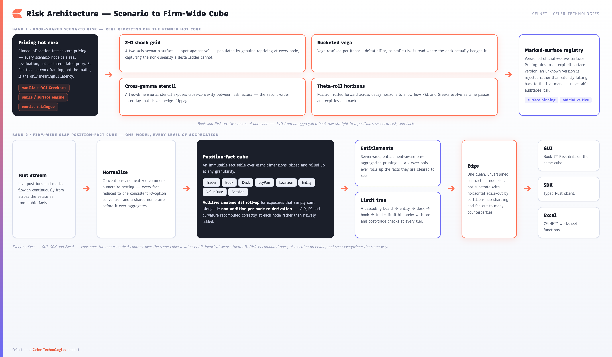

**[Celnet Capabilities](../CELNET-CAPABILITIES.md)** › Risk Management

# 6. Risk Management

Celnet treats risk as a single, integrated capability that spans two altitudes at once: the *micro* view of an individual position's behaviour under shocks, and the *macro* view of the firm's entire option book netted, rolled up, and policed against limits. Both are two zooms of one underlying truth — a position-fact cube — so a trader and a board-level risk officer are always looking at the same numbers, never a reconciliation of two systems.

*Figure 6 — Risk architecture. A versioned marked-surface registry feeds book-shaped scenario risk (the desk's working view) and a convention-canonicalized OLAP position-fact cube (the firm-wide view). Normalize → cube → limits ∥ entitlements: one fact model, drilled at every altitude.*

### 6.1 Book-shaped scenario risk

Risk at the desk is computed by real repricing, not by linear extrapolation from a single point. Every scenario number is produced by re-running the same nanosecond-scale pricing core that quotes live, so the risk surface is internally consistent with the price.

| Measure | What it gives the desk |
|---|---|
| Two-axis scenario grid | A shock matrix — typically spot × vol — where every cell is a genuine reprice. Axes are swappable, so the same grid renders P&L, delta, or vega exposure. |
| Bucketed vega ladder | Vega decomposed per `(tenor, delta)` pillar, so volatility risk is read where the desk actually marks it — short-dated vs long-dated, wings vs ATM. |
| Cross-gamma stencil | A two-dimensional curvature stencil capturing how delta moves as spot *and* vol move together, not just along a single axis. |
| Theta-roll | Time decay projected over forward horizons, rolling expiries node by node so the desk sees the carry of the book as the clock advances. |

Underpinning all of it is a **versioned marked-surface registry**. A calibrated smile is deposited under a fresh surface version and becomes the official mark; pricing and risk then *pin* against a named version. The registry holds the distinction between the official mark and the live market explicitly — official-vs-live is a first-class concept, not an overwrite. Asking for an unknown surface version is rejected outright rather than silently falling back to live data, so a risk run is always reproducible against exactly the surface it claims to use.

*Screenshot — the Risk workspace (Cmd-4): a spot × vol reprice grid with swappable axes and P&L / delta / vega tabs, the vega ladder bucketed per tenor × delta, plus cross-gamma and theta-roll.*

### 6.2 The firm-wide position-fact cube

Above the desk view sits an OLAP **position-fact cube** that gives the firm one canonical, queryable picture of all option risk. Positions arrive in many conventions and numeraires; Celnet canonicalizes them — convention-normalized and netted into a common numeraire — before anything is aggregated, so figures across pairs, books, and entities are genuinely additive where they should be.

The cube is an immutable fact table over eight dimensions:

| Dimension | Slices the firm by |
|---|---|
| Trader | the individual running the position |
| Book | the trading book |
| Desk | the desk |
| CurrencyPair | the FX-options pair |
| Location | trading location |
| Entity | legal entity |
| ValueDate | settlement / value date |
| Session | trading session |

Roll-up respects the mathematics of each measure. **Additive** measures (notional, delta, vega) accumulate incrementally up the hierarchy — fast, and exact. **Non-additive** measures (VaR, expected shortfall, curvature) are *re-derived per node* rather than summed, because a portfolio's tail risk is not the sum of its parts. The cube knows the difference and applies the correct treatment automatically at every level.

On top of the cube sits a **cascading limit tree** — board → entity → desk → book → trader — with both pre-trade and post-trade checks, so a candidate trade is tested against every limit it would touch before it is done, and the live book is policed continuously after. Finally, aggregation is **entitlement-aware**: the server prunes the cube to what a given viewer is allowed to see *before* it aggregates, so a trader sees their own slice, a desk head sees the desk, and the firm view rolls up only what the requester is entitled to — pre-aggregation pruning, not after-the-fact redaction.

### 6.3 One cube, two views — Book ↔ Risk drill

Because the desk's book view and the scenario-risk view are projections of the same fact cube, the GUI lets a trader move between altitudes in a single gesture. The **Book** workspace presents net P&L, Vega, Gamma, and Theta as headline cards with a per-pair breakdown and an aggregate vega ladder; selecting any aggregated book row **drills straight into that position's scenario risk** in the Risk workspace — same numbers, deeper zoom, no context switch and no separate tool.

*Screenshot — the Book workspace (Cmd-5): net P&L / Vega / Gamma / Theta cards, a per-pair breakdown that drills to Risk, and the aggregate vega ladder rolled up from the cube.*

The result is one risk capability with no seams: real-reprice scenario risk for the trader, a convention-canonicalized OLAP cube with limits and entitlements for the firm, a versioned marked surface as the shared source of truth, and a single drill that connects the firm-wide book to a single position's behaviour under stress.

---
[← Extensibility](05-extensibility-plugins.md)  ·  **[Contents](../CELNET-CAPABILITIES.md)**  ·  [Performance & Latency →](07-performance-latency.md)
