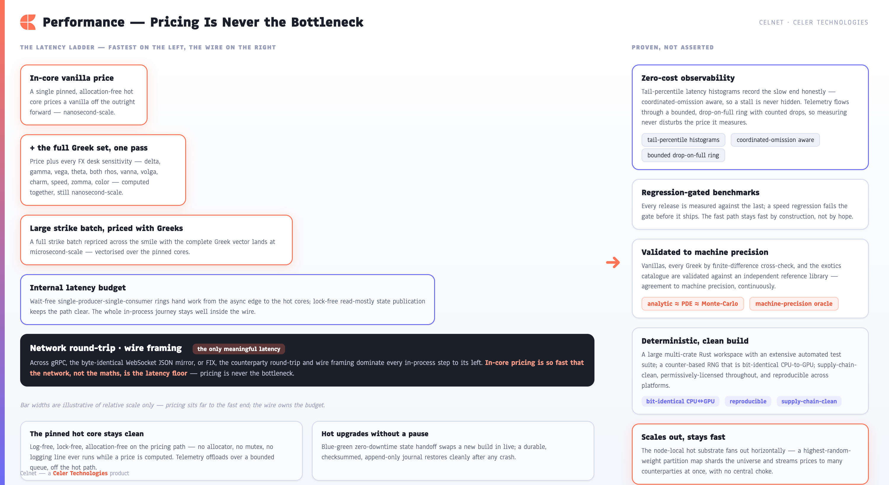

**[Celnet Capabilities](../CELNET-CAPABILITIES.md)** › Performance & Latency

# 7. Performance & Latency

Celnet is built so that **pricing is never the bottleneck**. The maths runs in nanosecond-scale pinned hot cores; by the time a quote reaches a counterparty, network framing — not computation — is the only meaningful latency. The desk experiences a platform whose response time is governed by the wire, not by the model.

*The Celnet latency ladder: a pinned, allocation-free hot core feeds a wait-free ring that bridges to the async edge — the network is the only layer left that matters.*

### Pricing as a non-event

The full FX desk Greek set is computed in a single pass over the pinned hot core, with no locks, no allocations, and no logging on the critical path. Because in-core valuation completes in nanosecond-scale time, batch revaluation across many instruments and tenors stays comfortably ahead of the streaming cadence a desk demands. A price request never waits on the maths — it waits, briefly, on the network that carries it.

### Architecture that keeps the core hot

| Layer | What it does for latency |
|-------|--------------------------|
| Pinned hot cores | Zero-allocation, lock-free, log-free valuation — the critical path does nothing but compute |
| Wait-free SPSC rings | Single-producer/single-consumer handoff bridges the async edge to the cores without contention |
| Read-mostly state publication | Atomically-swapped market-state snapshots and a single-writer seqlock top-of-book let readers price without blocking writers |
| Cache-padded counters | Telemetry and bookkeeping never cause false sharing against the hot path |
| Blue-green state handoff | Hot upgrades swap state with zero downtime, so performance is sustained across deploys |

The result is a clean separation: the async edge — gRPC, the byte-identical WebSocket JSON mirror, and FIX — absorbs the messy realities of connection management, while the cores stay pristine and deterministic.

### Observability that costs nothing on the hot path

Mission-critical operation demands visibility, and Celnet delivers it without taxing the very latency it measures. Latency is captured into tail-percentile histograms that are **coordinated-omission aware**, so the numbers reflect what counterparties actually experience rather than flattering averages. Telemetry leaves the hot core over a **bounded, drop-on-full ring**: under pressure the platform sheds observability data, never throughput. The pinned core remains log-, lock-, and allocation-free; everything instrumental is offloaded.

### Performance held by regression gates

Speed that erodes silently is no speed at all. Celnet's benchmarks are **regression-gated** as part of the standard checks across its large multi-crate Rust workspace and extensive automated test suite — a change that would slow the hot path is caught before it lands. Performance is therefore a property the platform continuously proves, not a one-time claim. Across CPU and the cross-platform GPU stack, results stay deterministic and reconciled, so the desk gets the same answer, fast, every time.

---
[← Risk Management](06-risk-management.md)  ·  **[Contents](../CELNET-CAPABILITIES.md)**  ·  [Scalability & Scale-Out →](08-scalability-scaleout.md)
