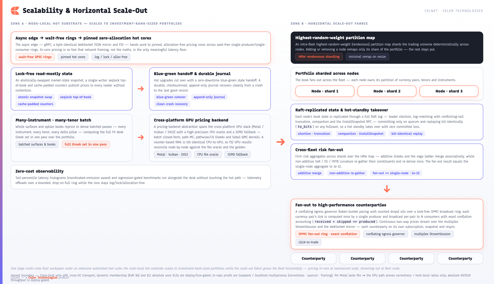

[← Prev: Performance & Latency](07-performance-latency.md) · [Index](../CELNET-CAPABILITIES.md) · [Next: API & Wire Contract + API-First Client Parity →](09-api-contract-parity.md) · [Showcase ↗](../celnet-capabilities.html)

# 8. Scalability & Scale-Out

Celnet scales along two independent axes at once: **down** into a single node, where a pinned hot core prices an investment-bank-sized book without ever leaving cache or touching the allocator; and **out** across a fleet, where a rendezvous-hashed partition fabric shards the universe, a Raft-replicated event log keeps state bit-identical across nodes, and a lock-free broadcast ring fans each pair's live tick to every subscriber. The same binary serves a one-desk standalone deployment and a firm-wide grid — you add nodes, not architecture. The scaling story is grounded in shipped, parity-gated crates, not roadmap prose.

*Fig 8 ([index](../CELNET-CAPABILITIES.md#figure-index)) — The scaling story composes from shipped substrates: the in-core hot path on each node, a cross-platform GPU backend for batch-parallel work, a Raft-replicated event log for distributed correctness, a lock-free SPMC ring fanning per-pair ticks to many subscribers, and a cross-fleet risk fan-out that reconciles to the single-node aggregate.*

## 8.1 The node-local hot substrate

Every Celnet node carries a complete pricing substrate. An async edge — gRPC, the byte-identical WebSocket JSON mirror, or FIX — hands work across wait-free single-producer-single-consumer rings into pinned, zero-allocation hot cores. Inside a core there are no locks, no logging, and no allocation on the pricing path: market state is published as an atomically-swapped snapshot, top-of-book rides a single-writer seqlock, and counters are cache-padded to avoid false sharing. Because in-core pricing runs at nanosecond scale (measured on the M4 dev host at ~42ns p50 / ~125ns p99 for price + 13 Greeks, inside the §1.2 absolute truth-gate — see ch07), a single node already absorbs an investment-bank-sized portfolio, re-pricing whole books without the maths becoming the bottleneck. The practical consequence: network framing, not computation, is the only meaningful latency floor, so scaling the system is about moving *messages* efficiently rather than buying compute headroom for the *maths*.

State handoff is built for continuous operation. Blue-green zero-downtime handoff swaps a freshly-loaded core in for a running one without dropping a price, so capacity can be grown, drained, and hot-upgraded under live flow. A durable, checksummed, append-only journal (`celnet-journal`) gives each node clean crash recovery — a restarted node rebuilds its book and market state from the log and rejoins, rather than cold-starting blind. The journal now bounds its own growth with a built **checkpoint + compaction** cycle (`Journal::compact`, `crates/celnet-journal/src/lib.rs`): a snapshot record carries the checkpoint watermark and the live tail is rewritten crash-safely (write-fresh → fsync → rename), so recovery time stays bounded even under a long-running feed.

## 8.2 Cross-platform GPU acceleration

For the embarrassingly-parallel workloads — large strike/tenor batches, Monte-Carlo path-dependent exotics, scenario grids, pathwise Greeks — Celnet drives a pricing-backend abstraction over the cross-platform GPU stack (Metal, Vulkan, DX12, via `wgpu`), backed by a high-precision CPU oracle and a CPU-SIMD fallback. A counter-based RNG is bit-identical between CPU and GPU, and every GPU result is reconciled against the f64 CPU oracle node-by-node within a *derived* (never fitted) bound, so acceleration never costs determinism. Four kernels are shipped in `celnet-gpu`:

- **Batch closed-form revaluation** (`batch.wgsl` / `batch.rs`) — one dispatch prices an `O(10⁴–10⁶)`-point (pair, tenor, strike) grid of Garman-Kohlhagen vanillas analytically, one thread per instrument. No RNG, no Monte-Carlo noise; only f32 round-off vs the f64 oracle (measured max rel-err ~3.1e-7, inside the per-node bound). This is GPU-at-scale Workload A.
- **Multi-step QMC path kernel** (`path.wgsl` / `path.rs`) — evolves a large batch of multi-step Brownian-bridge paths under *shared* Sobol' draws and prices a path-dependent arithmetic-average Asian. The Sobol' integers are bit-identical `u32` gray-code XOR on both sides; the only divergence is the f32 inverse-normal/`exp` chain, bounded node-by-node.
- **Pathwise / likelihood-ratio Greeks** (`greeks.wgsl` / `pathwise.rs`) — one dispatch produces per-path delta/vega estimators (pathwise for the smooth call, likelihood-ratio for the discontinuous digital), reconciled three-way GPU-f32 ≈ CPU-f64 ≈ analytic within MC error.
- **Scenario grid** (`scenario.wgsl` / `scenario.rs`) — a whole spot×vol shock grid under common random numbers in one dispatch.

**HONEST BOUNDARY (verbatim):** M4 Metal lacks f64 ⇒ the GPU math is f32 by design. In-repo this proves **correctness** (GPU-f32 == CPU-f64 within the derived bound, both == the closed-form / golden chain within QMC error) and **RATIOS only** (M4/Lavapipe). The measured M4 dispatch-amortization curve runs 0.68×@4k → 53×@1M paths (host-local ratio). The **CUDA/NVIDIA absolute GPU throughput headline, the ≤50ms exotic, and the Workload-A/B absolute numbers are DEFERRED to the CUDA deploy-gate**; we never claim f64 on Metal.

| Scaling layer | What it provides | How a desk uses it |
|---|---|---|
| Node-local hot substrate | Pinned, zero-allocation, lock-free in-core pricing of an IB-sized book at nanosecond scale (price + 13 Greeks) | One node prices a whole book and streams it; add nodes for capacity, not to relieve the maths |
| GPU backend | Cross-platform (Metal/Vulkan/DX12) batch closed-form, QMC path, pathwise/LR Greeks, scenario kernels; CPU oracle + SIMD fallback; deterministic CPU↔GPU (correctness + ratios only) | Offload large batch / Monte-Carlo / scenario work; reproducible on any silicon |
| Raft-replicated event log | Leader election (Pre-Vote), log-matching, conflicting-tail truncation, snapshot compaction + InstallSnapshot; bit-identical (`to_bits`) replay | Replicate priced-book state across nodes with proven cross-node bit-identity and hot-standby takeover |
| SPMC broadcast ring | One producer per pair → N consumers; zero-alloc lock-free publish; bounded conflation with exact skip-accounting | Fan one pair's tick to 100s–1000s of subscriber sessions without per-subscriber recompute |
| Cross-fleet risk fan-out | HRW partitioning + additive merge / non-additive re-gather; fan-out == single-node | Compute firm risk by fanning out across shards and reconciling to the single-node aggregate |
| Horizontal scale-out fabric | HRW (rendezvous) partition-map sharding of the instrument universe + governed fan-out | Grow the universe and client count by adding nodes; no central choke point |
| Conflating egress governor | Per-client conflation, token-bucket pacing, counted drops | Stream to slow and fast counterparties from one source without head-of-line stalls |

## 8.3 Horizontal scale-out fabric

When one node is not the whole firm, Celnet fans out. An intra-fleet highest-random-weight (rendezvous) partition map (`celnet-router`) assigns each currency pair / instrument deterministically to a node, so the trading universe shards cleanly with minimal reshuffling when nodes join or leave — every node agrees on ownership without a coordinator on the hot path. The currency pair is the primary partition key, so *every tenor and strike of a pair is co-resident on one shard* and surface-shaped roll-up never crosses a shard. Pricing and risk for a partition live where that partition lives; clients are routed to the owning node, and capacity grows by adding nodes rather than widening a central server.

Fan-out to counterparties is governed for both fast and slow consumers, and the per-pair compute is now shared rather than duplicated. The **lock-free SPMC broadcast ring** (`celnet-fanout`) is wired under the streaming edge (`crates/celnet-server/src/services/pricefanout.rs`): for each live currency pair a *single producer* advances the deterministic per-pair spot path once per cadence tick and publishes a small `PriceTick` POD into the ring; every session subscribed to that pair holds an independent consumer and drains it with non-blocking `try_recv` inside its existing `tokio::select!` loop, formatting its own per-subscription update. This turns an *O(subscribers)* tick-generator cost into *O(pairs)*. The ring is a true broadcast (each consumer owns its cursor and re-reads the same slots — the LMAX-Disruptor multi-consumer shape), zero-allocation on the hot path, and its overflow policy is bounded conflation with *exact* skip-accounting: a slow consumer fast-forwards to the oldest live item and the invariant `received + skipped == produced` is gate-asserted, so a slow counterparty always converges on the latest price with a precisely counted number of conflated intermediates and can never stall the pricing core. On top, a conflating egress governor collapses superseded updates per subscriber, paces with a token bucket, and counts what it drops; the multiplex StreamSession carries many subscriptions over one bidirectional channel with per-subscription sequencing and gap-driven resync.

## 8.4 Distributed correctness — Raft-replicated log + cross-fleet risk

Sharding alone is not a firm-grade distributed system; the state has to stay *correct* across nodes through failures. Celnet's distributed-correctness backbone is `celnet-replog`: a real Raft consensus module (election with **Pre-Vote** to stop a flaky node disrupting a healthy leader, log-matching with **conflicting-tail truncation**, the §5.4.2 commitment rule, durable `current_term`/`voted_for`, step-down on a higher term) layered on the dependency-free durable WAL. It runs over **real `std::net` TCP loopback sockets** — length-prefixed framing, not a shared-memory fake — with the hard rule that the core mutex is never held across a blocking socket call, so no node can hang and every test is deadline-bounded. Unbounded log growth is bounded by built **snapshot compaction** (the applied `BookState` captured at a committed boundary, with durable log-prefix discard) and the **InstallSnapshot RPC** (`wire::Message::InstallSnapshot`, `election.rs`) that catches up a follower whose needed prefix has already been discarded. The load-bearing safety invariant — proven by the parity rows `raft_election` / `raft_snapshot` / `raft_compaction` — is that any two nodes that have committed index *i* hold byte-identical `log[0..=i]` and **`to_bits`-identical** applied `BookState`; at most one leader exists per term, and a stale leader's divergent tail is reconciled by truncation. Hot-standby takeover loses zero committed entries.

Firm-level risk fans out and back in over the same partition fabric (`celnet-risk-fleet`). Each logical shard rolls up its own facts in its own cube; the firm reducer then combines **additive** measures (per-ccy net Greeks, the tenor×delta vega ladder) by associative/commutative merge — exactly the single-node sum, bit-equal under the pinned deterministic shard order — and re-derives **non-additive** measures (VaR / ES, FRTB-SbM curvature, correlation-weighted vega) by *gathering the union of every shard's constituent positions and re-deriving once over the whole set*. Summing shard VaRs would be wrong — VaR is a non-linear functional of the joint P&L distribution; offsetting positions on different shards diversify (sub-additivity), so adding standalone tails double-counts and ignores cross-shard diversification. Because the firm reducer sees the identical constituent multiset the single-node cube would, the result is exact by construction: the parity rows reconcile **fan-out == single-node `firm_aggregate` to 1e-12** across the full net-Greek set and the vega ladder, and the non-additive VaR/ES/curvature to 1e-12 relative.

> **HONEST BOUNDARY (verbatim).** The distributed proofs are **localhost multi-process / in-process loopback** and establish correctness only: quorum/commit safety, log-matching, conflicting-tail truncation, snapshot compaction + InstallSnapshot catch-up, bit-identical (`to_bits`) replay, ring conflation accounting, and fan-out == single-node risk. They are an *upper* bound on compute and a *lower* bound on cross-host wire. **Absolute cross-host wire p99, kernel-bypass NIC latency, cross-DC transport, real network partitions, Raft §6 dynamic membership, physical cross-node risk transport, and the §11 ABSOLUTE wire-latency SLOs are deploy/live-gated and are never claimed in-repo.**

## 8.5 One scaling model, no rewrite

The crucial property is that these layers compose without changing the contract. The identical unversioned API, the identical hot-core pricing, and bit-identical values hold whether Celnet runs as a single self-contained node on a trader's desk or as a sharded, GPU-accelerated, Raft-replicated, fanned-out fleet inside the firm's estate. A deployment moves along the scale-out curve by swapping adapters and adding nodes — never by re-implementing the platform — and zero-cost observability (tail-percentile latency histograms, coordinated-omission aware, on a bounded drop-on-full telemetry ring) plus regression-gated benchmarks keep that scaling honest as the fleet grows.

**See also:** [§3 System Architecture](03-system-architecture.md) is the node-local two-tier substrate this scales out; [§6 Risk Management](06-risk-management.md) is the cross-fleet risk fan-out reconciled here; [§7 Performance & Latency](07-performance-latency.md) is the in-core latency floor the fabric carries.

---
[← Prev: Performance & Latency](07-performance-latency.md) · [Index](../CELNET-CAPABILITIES.md) · [Next: API & Wire Contract + API-First Client Parity →](09-api-contract-parity.md) · [Showcase ↗](../celnet-capabilities.html)
