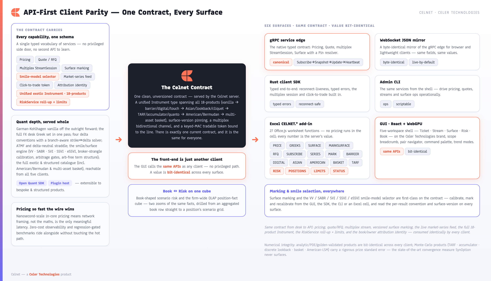
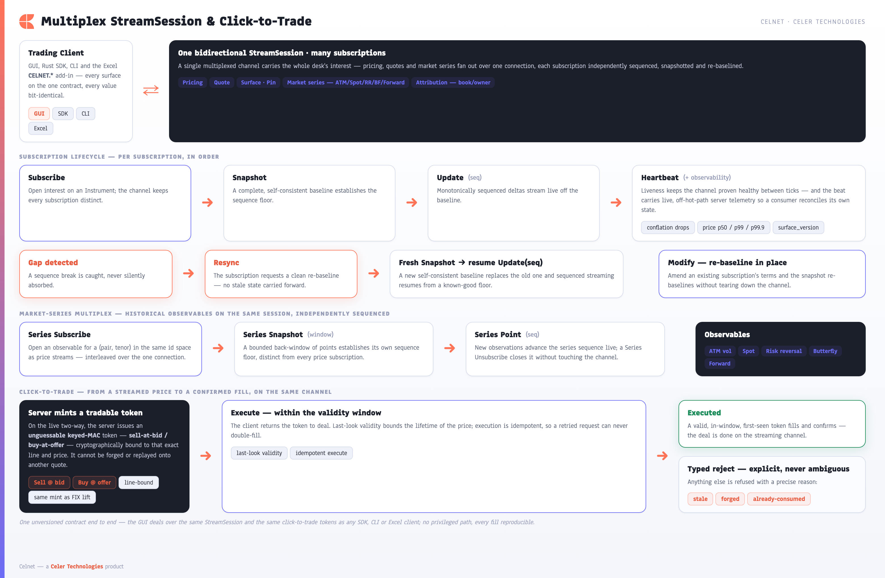

[← Prev: Scalability & Scale-Out](08-scalability-scaleout.md) · [Index](../CELNET-CAPABILITIES.md) · [Next: Excel Integration →](10-excel-integration.md) · [Showcase ↗](../celnet-capabilities.html)

# 9. API & Wire Contract + API-First Client Parity

Celnet is not a thin challenger closing gaps — it is a functionally complete, evidence-backed superset of what a derivatives desk stitches together today, proven by a runnable parity matrix against independent oracles, behind **one unversioned contract** reachable identically from five clients. There is no schema-version negotiation, no N/N-1 compatibility window, no privileged internal path — a single current contract that every surface speaks. Each capability the platform offers is reachable through that one contract, and every client — the trader GUI, the typed Rust SDK, the admin CLI, and the Excel `CELNET.*` add-in — consumes exactly the same service families. The front-end is just another client. This is the governing **API-first** rule: capability lives in the contract, never in a client, so a number you read in the GUI is bit-identical to the one the SDK returns, the CLI prints, and a spreadsheet cell spills.

What runs over that contract is the *full* product catalogue — vanilla, the complete first-generation exotics, structured and path-dependent products, American/Bermudan early exercise, correlated multi-asset baskets, and an LSV booking model — all on the one wire, reachable from all five surfaces, with bit-identical values proven by `docs/CLIENT-PARITY-MATRIX.md`.

*Figure 9.1 ([index](../CELNET-CAPABILITIES.md#figure-index)) — One contract, every surface. The GUI, Rust SDK, CLI, and Excel add-in are peers over the same five service families (Pricing / Quote / StreamSession / Risk / Surface); a value is identical wherever it is read, across both the binary gRPC edge and the byte-identical WebSocket JSON mirror.*

## 9.1 The five service families

The contract (`crates/celnet-proto/proto/celnet.proto:2447-2504`) is organised into **five gRPC services** that map directly to how a desk works: get a price, run an RFQ lifecycle, stream live markets, query firm-scale risk, and mark surfaces. One row per service, every RPC enumerated:

| Service | RPC | Request → Response | Purpose |
|---------|-----|--------------------|---------|
| **PricingService** | `Price` | `PriceRequest` → `PriceResponse` | One-shot price + the full **13-Greek** risk set for any instrument, against live or a pinned marked surface; the response carries `correlation_id`, the `surface_version` it priced on, and `price_std_error` (set only for MC products). |
| **QuoteService** | `RequestQuote` | `QuoteRequest` → `Quote` | Request a firm two-way (RFQ): bid/mid/offer with a `quote_id`, a `valid_until_nanos` last-look window, Greeks, attribution, and an MC std-error when applicable. Idempotent on the request key. |
| | `AcceptQuote` | `QuoteAccept` → `Execution` | Accept a live quote and book the resulting execution. |
| | `RejectQuote` | `QuoteReject` → `RejectAck` | Decline to trade; returns a typed acknowledgement, never an execution (a reject never books a trade). |
| **StreamService** | `StreamSession` | `stream ClientStreamMessage` → `stream ServerStreamMessage` | One bidirectional, multiplexed channel carrying many concurrent subscriptions — streaming prices, two-ways, observable series — with sequence-gap resync, in-place modify, and click-to-trade. A blotter watching hundreds of structures uses **one** session, not one stream per line. |
| **RiskService** | `ListPositions` | `ListPositionsRequest` → `ListPositionsResponse` | List the open positions the cube aggregates (scoped + entitlement-pruned), each carrying its attribution. |
| | `AggregateRisk` | `AggregateRiskRequest` → `AggregateRiskResponse` | Roll the entitled facts up over an org dimension into a node tree of netted additive + re-derived non-additive measures in a reporting numeraire. |
| | `DrillRisk` | `DrillRiskRequest` → `DrillRiskResponse` | Drill one node into its child sub-nodes and/or contributing positions (the Book → Risk drill), entitlement-pruned. |
| | `LimitStatus` | `LimitStatusRequest` → `LimitStatusResponse` | Read the limit tree + utilization / RAG status for a scope node, including the hard-breach escalation flag. |
| **SurfaceService** | `GetSmile` | `GetSmileRequest` → `Smile` | Read the calibrated smile for one (pair, tenor) on the delta axis. |
| | `MarkSurface` | `MarkSurfaceRequest` → `MarkSurfaceResponse` | Mark / recalibrate the surface for a pair from a broker quote set, under a chosen smile model, depositing it under a fresh `surface_version`. |
| | `Scenario` | `ScenarioRequest` → `ScenarioResponse` | Reprice an instrument across a spot / vol / rate shock grid. |

Aggregation, common-numeraire conversion, non-additive re-derivation, entitlement pruning, and limit RAG are all the server's job (`celnet-risk-cube` / `-normalize` / `-limits` / `-entitlements`) — a client never loops positions and sums.

### The unified `Instrument` — one vocabulary, every product

A **single `Instrument` type** runs through Pricing, Quote, Stream, and Scenario — the same instrument vocabulary describes a vanilla, a digital, a barrier, a TARF, a basket, or an American option, so the contract does not fork by product. The product payoff is a `oneof product` (`celnet.proto:1016-1062`) with **19 arms**; each Monte-Carlo-priced arm carries an honest `price_std_error` and is **never** presented as machine-precision.

| # | Field | Product | Engine / method | MC std-error? |
|---|-------|---------|-----------------|:---:|
| 7 | `vanilla` | Vanilla European | Garman-Kohlhagen closed form (analytic, or LSV via `pricing_model`) | — |
| 8 | `strategy` | Multi-leg strategy (risk reversal / strangle / straddle / seagull) | Sum of vanilla legs (analytic) | — |
| 9 | `single_barrier` | Single-barrier knock-in / knock-out | Analytic + CN-Rannacher PDE / Philox MC, VV survival overlay (or LSV) | — / yes (MC) |
| 10 | `double_barrier` | Double-barrier | Analytic / PDE / MC | — / yes (MC) |
| 11 | `digital` | Digital (cash-/asset-or-nothing) | Closed form | — |
| 12 | `touch` | One- / no- / double-no- / double-one-touch | Closed form + VV overlay | — |
| 13 | `variance_swap` | Variance swap | Log-contract static replication (Demeterfi-DKZ / Carr-Madan) | — |
| 14 | `volatility_swap` | Volatility swap | Carr-Lee convexity-adjusted fair-vol strike | — |
| 15 | `asian_option` | Fixed-strike arithmetic-average Asian | Turnbull-Wakeman / Curran (closed form) | — |
| 16 | `forward_start` | Forward-start vanilla (strike reset) | Rubinstein dual-carry closed form | — |
| 17 | `cliquet` | Cliquet / ratchet (plain or clamped) | Σ forward-start legs (closed form), or clamped Monte-Carlo | yes (clamped) |
| 18 | `quanto` | Quanto (vanilla or digital) | Settlement-currency-converted closed form | — |
| 19 | `tarf` | Target-Redemption Forward | Geared-fixing knock-out **Monte-Carlo** | yes |
| 20 | `accumulator` | Accumulator (pivot accrual + up-and-out) | **Monte-Carlo** | yes |
| 21 | `lookback` | Lookback (floating / fixed strike) | Continuous closed form, or discrete **Monte-Carlo** | yes (discrete) |
| 23 | `window_barrier` | Window knock-out (active inside a calendar window) | LSV ADI-PDE (or MC); **no closed form** | yes (MC) |
| 24 | `american` | American / Bermudan early-exercise vanilla | PSOR free-boundary FD (default), or Longstaff-Schwartz **LSM** | yes (LSM) |
| 25 | `basket` | Correlated multi-asset (weighted basket / best-of / worst-of) over N legs | Cholesky-correlated multi-asset GBM **Monte-Carlo** over scrambled-Sobol / Brownian-bridge | yes |

> Field number 22 is **not** a product arm — it is `pricing_model` (see below). The catalogue is full: it spans vanilla → the complete first-generation exotics → structured / path-dependent → American/Bermudan → correlated multi-asset basket → a particle-calibrated LSV booking model. This is not a "first-generation" subset.

#### Two first-class directives on every instrument

- **`pricing_model` (field 22, `PricingModel`)** — the booking-model selector. `PRICING_MODEL_DEFAULT` (0) routes to the product's native analytic / closed-form engine and is **byte-identical to the contract before the field existed**. `PRICING_MODEL_LOCAL_STOCH_VOL` (1) routes the supported products (vanilla, continuously-monitored single-barrier knock-out, window-barrier) through the **LSV booking engine** — a particle-calibrated leverage surface over a stochastic-variance backbone on a 2-D ADI PDE. Selecting LSV for any other product is a hard `INVALID_ARGUMENT`, never a silent fallback. The directive travels on the instrument, so it reaches price / quote / stream / scenario uniformly.
- **The smile-model selector (`SmileModel`, `celnet.proto:369-382`)** carried on `MarkSurfaceRequest` / `ScenarioRequest`: **five** calibration families — `MARKET_HEDGE` (0, vanna-volga, the default), `STOCHASTIC_VOL` (1, SABR), `PARAMETRIC` (2, SVI), `PARAMETRIC_SURFACE` (3, SSVI), and `EXTENDED_SURFACE` (4, **eSSVI** — maturity-dependent correlation, closed-form arbitrage-free). The contract also carries an **attribution identity** (`BookId` / `Owner` / `AttributionRecord`) keying every price and position to its place in the risk hierarchy.

#### Honesty as a contract feature: `price_std_error`

`PriceResponse.price_std_error` (field 7) and `Quote.price_std_error` (field 12) are presence-tracked: **set only for Monte-Carlo-priced products** (TARF, accumulator, discrete lookback, clamped cliquet, basket, LSM American), **absent for closed-form products whose price is exact**. The contract surfaces MC uncertainty so a client never mistakes an MC estimate for closed-form precision — the same disclosure crosses gRPC, the WS mirror, the SDK, the CLI, and Excel. (XVA is **internal-only**: CVA/DVA/FVA over synthetic netting sets is computed in `celnet-xva` and has **no client or wire surface** — it is deliberately not an API capability.)

## 9.2 Surface-version pinning

Pricing and risk are only reproducible if everyone agrees on the surface. Every marked surface is deposited under a fresh **surface version** (`surface_version`), and any pricing, RFQ, or stream request can **pin** to a specific version through the `Pin` resolver. An unknown version is **rejected** — never silently resolved to the live surface — so a quote, a risk report, and a re-priced ticket all reference the identical calibrated smile, and "what surface did this price come from?" always has a single, exact answer. `surface_version` is a *data* field, echoed on `PriceResponse` / `Quote` / `Heartbeat`, never an API version.

## 9.3 The multiplex StreamSession, market-series feed, and click-to-trade

The StreamSession is a single bidirectional channel that fans out to many subscriptions. The client sends `ClientStreamMessage` (`Subscribe` / `Modify` / `Unsubscribe` / `Resync` / `Execute` / `Heartbeat` / `MarketSeriesSubscribe`); the server returns `ServerStreamMessage` (`Snapshot` / `Update` / `Heartbeat` / `StreamEnd` / `Executed` / `StreamReject` / market-series frames). Each price subscription follows a clean lifecycle — **Subscribe → Snapshot → Update(seq) → Heartbeat** — with monotonic sequence numbers so a client can detect a gap and issue **Resync** to re-baseline, and an in-place **Modify** that re-bases a subscription (new strike, notional, or tenor) with a fresh Snapshot, without tearing it down.

**Market-series feed — multiplexed on the same session.** `MarketSeriesSubscribe` opens a series subscription in the same `SubscriptionId` space, streaming one of five labelled, unit-bearing observables (`MarketObservable`, `celnet.proto:1567-1578`): `ATM_VOL` (0), `SPOT` (1), `RISK_REVERSAL` (2), `BUTTERFLY` (3), `FORWARD` (4). This is the contract the GUI TrendModes consume — no abstract index, every point carries its unit.

**Zero-cost observability on the liveness beat.** The `Heartbeat` (`celnet.proto:1322-1351`) carries honest server-side telemetry read off the *drain side* — the pinned zero-alloc pricing core stays untouched: `conflation_drops` (the exact skip count from the `celnet-fanout` SPMC ring's `received + skipped == produced` accounting; 0 ⇒ the consumer never lagged), an HdrHistogram of server-side compute latency (`server_price_p50_nanos` / `server_price_p99_nanos` / `server_price_p999_nanos`), the pinned `surface_version`, and `sequence`. A consumer can watch its own tail latency and conflation without a side channel.

**Typed terminal reasons.** A subscription that ends sends `StreamEnd` with a typed `Reason` (`LAGGED` / `DRAINING` / `UNSUBSCRIBED` / `EXPIRED`), and a declined click sends `StreamReject` with `Reason` (`EXPIRED` / `UNKNOWN_TOKEN` / `ALREADY_CONSUMED`) — never an opaque string.

**Click-to-trade** is built into the same channel. A streamed line carries an **unguessable, keyed-MAC tradable token** — one to sell at the bid, one to buy at the offer — cryptographically bound to that exact line. To deal, the client returns the token through **Execute**:

- **Last-look validity** — the token carries a `valid_until_nanos` window; the maker checks it on receipt, so a stale token is declined (`REASON_EXPIRED`) rather than filled at a moved market.
- **Forgery-proof** — the token is a keyed message authentication code over the line-binding tuple under a per-session secret; a forged or tampered token is rejected (`REASON_UNKNOWN_TOKEN`).
- **Idempotent** — a token is single-use; a duplicate or already-consumed Execute is rejected (`REASON_ALREADY_CONSUMED`), so a retransmit can never double-deal.

*Figure 9.2 ([index](../CELNET-CAPABILITIES.md#figure-index)) — The multiplex StreamSession: many price + market-series subscriptions over one channel, sequence-gap Resync, in-place Modify, Heartbeat observability (conflation drops + p50/p99/p99.9), and the keyed-MAC click-to-trade token with last-look and idempotent Execute.*

The trader sees this as a single confident gesture: click a streamed price, get a last-look response, and have the deal confirmed — or cleanly declined — with no ambiguity about which market was dealt.

*Figure 9.3 ([index](../CELNET-CAPABILITIES.md#figure-index)) — Click-to-trade in the live blotter: a lifted line returns a last-look response bound to the exact streamed price.*

## 9.4 The byte-identical WebSocket mirror

The contract is served over a high-performance binary gRPC transport for native clients **and** over a **byte-identical WebSocket JSON mirror** for browser and lightweight clients (`crates/celnet-server/src/lib.rs:31,177,359`). The mirror covers **all five services**, field-for-field — it is not a parallel API but the same contract, so a value crossing the WebSocket is identical to the one crossing the binary edge. This is what lets the React GUI and a native SDK client share one mental model and one set of guarantees, and it is verified continuously: the JSON projection is checked to mirror the wire contract exactly.

## 9.5 Typed SDK, InstrumentSpec builder, and admin CLI

**The typed Rust SDK** (`crates/celnet-client`) turns the contract into ergonomic, statically-checked calls grouped by service family (~20 public methods, `src/lib.rs` / `rfs.rs` / `series.rs`):

- **Pricing & Quote** — `price`, `request_quote` → `Rfq::{with_attribution, request}`, `Rfq.accept`, `Rfq.reject`.
- **Surface** — `get_smile`, `mark_surface`, `mark_surface_with` (model-selected), `scenario`, `scenario_with_model`, `scenario_with_risk`, `scenario_with_risk_and_model`.
- **Risk** — `list_positions`, `aggregate_risk`, `drill_risk`, `limit_status`.
- **Stream** — `open_session` → `StreamSession::{subscribe, subscribe_attributed, subscribe_series}`; per-subscription `next_event`, `execute` (click-to-trade), `unsubscribe`; market-series `MarketSeries::{next_event, unsubscribe}`.

It returns **typed errors** (a rejected stale token, an unknown surface version, or a typed `ExecuteOutcome::{Expired, UnknownToken, AlreadyConsumed}` surface as specific, matchable variants — never strings) and has built-in **reconnect-liveness**: across a blue-green cutover or a dropped link the SDK auto-resyncs subscriptions on the same session and drains every pending click-to-trade waiter with a typed outcome, so a client never hangs on a lost connection.

**The `InstrumentSpec` builder** (`src/vocab.rs`) constructs every one of the 18-product arms with a fluent, typed constructor — `vanilla`, `strategy`, `single_barrier`, `double_barrier`, `digital`, `touch` (+ `one_touch` / `no_touch` / `double_no_touch` / `double_one_touch`), `variance_swap`, `volatility_swap`, `asian_option`, `forward_start`, `cliquet`, `quanto`, `tarf`, `accumulator`, `lookback`, `window_barrier`, `american` (+ `bermudan`), `basket` — plus the booking-model directive `.pricing_model(model)` and the `.with_lsv()` convenience. Three runnable examples ship: `price_exotic.rs`, `quote_and_trade.rs`, `stream_blotter.rs`.

**The admin CLI** (`crates/celnet-cli`) drives the same contract through the SDK — no separate control API to learn. Seven top-level subcommands (`src/cli.rs`):

| Command | Drives | Notes |
|---------|--------|-------|
| `price` | `PricingService.Price` | Vanilla GK price + full Greek set. |
| `surface` | `SurfaceService` | Build a smile from broker quotes; print vols + the arbitrage report. |
| `exotic` | `PricingService.Price` | The exotic catalogue — **16 sub-variants**: `vanilla`, `digital`, `one-touch`, `dnt`, `barrier`, `window-barrier`, `var-swap`, `vol-swap`, `asian`, `forward-start`, `cliquet`, `quanto`, `tarf`, `accumulator`, `lookback`, `american`. `--model lsv` routes the supported products to the LSV engine. |
| `basket` | `PricingService.Price` | Correlated multi-asset (weighted basket / best-of / worst-of) over N legs; reports a std-error (multi-asset Greeks honestly deferred). |
| `convention` | resolver | Resolve and print the convention record for a pair + tenor. |
| `risk` | `RiskService` | **Four** sub-subcommands `aggregate` / `drill` / `positions` / `limits`, with entitlement `--grant` / `--deny` scope flags — the same `RiskService` the GUI Book view and Excel consume. |
| `stream` | `StreamService.StreamSession` | Subscribe to a two-way RFS stream, print sequenced ticks, unsubscribe cleanly. |

## 9.6 API-first client parity in practice

Because there is exactly one contract and every client is a peer over it, parity is **structural rather than aspirational**, and it is proven by an executable matrix (`docs/CLIENT-PARITY-MATRIX.md`): all 18-products × the five service families are reachable from all five surfaces, with honest, stated exceptions:

- The **GUI** (React + WebGPU, live-WebSocket-by-default) drives Pricing, Quote, StreamSession, Surface, and Risk — the same families, no shortcuts; the Ticket prices the full exotic catalogue, the surface workspace exposes all five smile chips (incl. eSSVI).
- The **Rust SDK** and **CLI** call the identical service families with typed semantics, the SDK from typed code and the CLI from the shell.
- The **Excel `CELNET.*` add-in** runs no maths in the cell — its 27 functions (`CELNET.PRICE` / `GREEKS` / `SURFACE` / `MARKSURFACE` / `MARK` / `RFQ` / `SUBSCRIBE` / `SERIES`, the exotic readers `BARRIER` / `WINDOWBARRIER` / `DIGITAL` / `TOUCH` / `VARSWAP` / `VOLSWAP` / `ASIAN` / `FORWARDSTART` / `CLIQUET` / `QUANTO` / `TARF` / `ACCUMULATOR` / `LOOKBACK` / `AMERICAN` / `BASKET`, and the server-side risk readers `RISK` / `POSITIONS` / `LIMITS` / `STATUS`) are thin calls into the same contract, so every spreadsheet number is the server's value, bit-identical to the GUI, with per-cell convention and surface-version transparency, MC std-error disclosure, and typed `#CELNET_*` errors.
- **Honest exception:** correlated-basket Greeks are deliberately zeroed (multi-asset sensitivities are a documented deferral, not a silent gap), and the LSV booking model is reached *through* a priced product, not as a raw calibration RPC. The matrix states each `n/a` with its reason — no cell is a stub.

A capability ships once, in the contract, and every surface gains it in lockstep — including the documentation, which tracks the single current contract with no `schema_version`, no negotiation, and no stale or duplicate references. The result is a platform where the trading desk, the quant in a spreadsheet, and an automated client all see the same prices, the same Greeks, the same surfaces, the same risk roll-ups, and the same deals — proven identical, not merely intended to be.

> **Honest boundary.** This chapter describes the in-repo contract and its clients. Absolute cross-host wire p99 / kernel-bypass NIC latency and the §11 absolute wire-latency SLOs are **deploy-gated** — in-repo proof is the §1.2 in-core truth-gate plus loopback benches only. The WebSocket-mirror and parity guarantees are proven on localhost; cross-host transport is a deploy target. **XVA (CVA/DVA/FVA) is internal-only with no client or wire surface** (synthetic netting sets; live CSAs / collateral / wrong-way risk are deploy-gated). MC-priced products (TARF, accumulator, discrete lookback, clamped cliquet, basket, LSM American) carry a `price_std_error` and are never labelled machine-precision — that bar is reserved for analytic / PDE / golden-gated products.

**See also:** [§10 Excel Integration](10-excel-integration.md) is the same contract rendered as worksheet functions; [§4 Quant Coverage](04-quant-coverage.md) is the catalogue carried by the 19-arm `Instrument`; [§11 The Trader GUI](11-trader-gui.md) is the richest client of this contract.

---
[← Prev: Scalability & Scale-Out](08-scalability-scaleout.md) · [Index](../CELNET-CAPABILITIES.md) · [Next: Excel Integration →](10-excel-integration.md) · [Showcase ↗](../celnet-capabilities.html)
