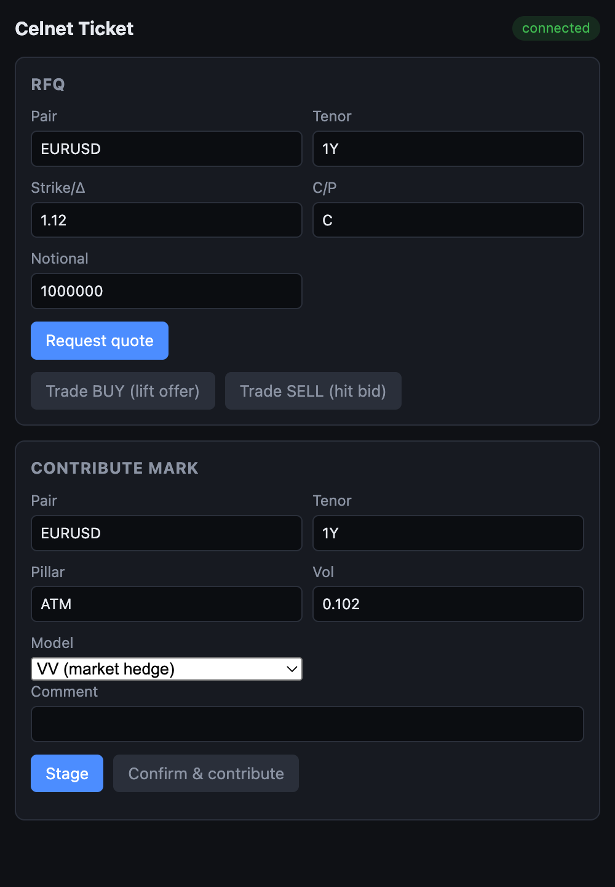

[← Prev: API & Wire Contract + API-First Client Parity](09-api-contract-parity.md) · [Index](../CELNET-CAPABILITIES.md) · [Next: The Trader GUI →](11-trader-gui.md) · [Showcase ↗](../celnet-capabilities.html)

# 10. Excel Integration

The spreadsheet is where structuring, marking, and ad-hoc risk actually happen on most desks — so Celnet meets the desk there, natively. An Office.js add-in exposes the platform's full pricing, surface, quoting, streaming, **and server-side risk** capability as worksheet functions under the **`CELNET.*`** namespace, speaking the *same* single, unversioned contract as the GUI, the Rust client SDK, and the CLI. Excel is a first-class Celnet client: every number a cell shows is the server's value, computed in the engine and bit-identical to what the trader sees in the GUI. There is no second pricing path hiding in a macro.

This is not a thin "price a vanilla in a cell" plug-in. The add-in ships **27** `CELNET.*` worksheet functions covering **every product on the wire** — vanilla, the full first-generation exotics (barriers, window barriers, digitals, touches), structured and path-dependent products (variance/volatility swaps, Asians, forward-start, cliquets, quantos, TARFs, accumulators, lookbacks), **American/Bermudan early-exercise** options, and **correlated multi-asset basket / best-of / worst-of** options — plus surface marking under five smile families, RFQ, live streaming, the firm's **server-side hierarchical risk roll-up**, and live server observability. The same breadth a desk stitches together from a pricing terminal, a risk system, and a vol-marking tool, delivered through one contract and rendered into native spilled dynamic arrays.

*The branded Excel surface: live two-way prices, spilled Greeks, a smile grid, and streaming observables — all served from the engine over the one contract.*

## 10.1 Design principles

Three rules make the add-in safe to trust on a live desk. (`excel/src/functions/functions.ts`, header doc-comment + per-function bodies.)

- **No pricing in the cell.** The add-in never approximates, never falls back to a local model, never reimplements a Greek. Each function marshals inputs to the engine and renders what comes back. The cell is a view, not a calculator — so a worksheet can never silently disagree with the firm's system-of-record. (Every function body shapes a request and awaits the server; there is no numerical code in the add-in.)
- **Read is zero-click; write is two-phase.** Read-and-spill functions evaluate the moment the cell does, with no confirmation friction. Anything that *mutates* shared state — contributing a mark — is two-phase: the cell stages the intent (`stageMark`, rendering a `PENDING` status), and the action is transmitted only after explicit confirmation in the task pane. Recalculating a sheet can never accidentally publish a price.
- **Convention and version transparency, per cell.** Every priced cell carries a spilled footer with the exact convention basis (delta convention, ATM rule, premium style, day-count, settlement) and the **surface version** it was marked against, plus a capture timestamp (`conventionFooter` → `conv: Δ … | ATM … | … | surface v… | t=…`). A trader auditing a workbook can see precisely which canonical inputs and which pinned surface produced any figure — no hidden state.

Failures are typed, not silent: the add-in surfaces structured **`#CELNET_*`** spreadsheet errors — a bad-argument error (`#CELNET_ARG!`, raised for any shaping/validation failure) is distinct from a generic transport error (`#CELNET_ERR!`), and the streaming cells flip to a visible `(stale)` / `(resync)` state on a heartbeat gap rather than freezing as live — so a mistyped tenor, a dropped connection, and a stale feed are visibly distinct rather than all collapsing to `#VALUE!`.

## 10.2 The complete `CELNET.*` function reference

All 27 functions, grouped by family. Signatures are the exact worksheet argument lists (`@customfunction` / `@param` metadata in `excel/src/functions/functions.ts`); optional arguments are shown in `[brackets]`. "Spill" describes the dynamic-array shape returned. Every priced spill ends in the **convention footer** described in §10.1. The **`std_error` row** is present **only** when the product is Monte-Carlo-priced *and* the server stamped a `price_std_error` — an analytic/PDE/closed-form price never carries one, so a cell never reads a precision claim its number does not have. (This is the §6 honest boundary applied per-cell: MC products carry a price standard error; they are never rendered as machine-precision.)

### Pricing & vanilla Greeks

| Function | Signature | Behaviour | Spill |
|----------|-----------|-----------|-------|
| `CELNET.PRICE` | `(pair, tenor, strikeOrDelta, callPut, notional)` | Prices a vanilla off the engine via `RequestQuote`; returns the **mid** of the two-way (the directional market is the `RFQ` spill). Strike may be absolute (`1.12`) or a delta (`25dP`, `ATM`). | Single value (mid premium) |
| `CELNET.GREEKS` | `(pair, tenor, strikeOrDelta, callPut, notional)` | The full **13-Greek** vector for the structure in one pass. | 14×2: 13 `[name, value]` rows + a convention footer row |
| `CELNET.RFQ` | `(pair, tenor, strikeOrDelta, callPut, notional)` | Requests a two-way quote; the `quoteId` binds the task-pane Trade ticket and carries a last-look validity. | 1×N: `[bid, offer, quoteId, validUntil]` + convention footer |

### Exotics & structured products

Each exotic spill is `["premium", PV]`, an optional `["std_error", σ̄]` row (only when MC-priced — see column), the 13 risk Greeks, and the convention footer. Every premium is the server's `celnet-exotics` value, bit-identical to the SDK/CLI.

| Function | Signature | Behaviour | Engine / std-error |
|----------|-----------|-----------|--------------------|
| `CELNET.BARRIER` | `(pair, tenor, strikeOrDelta, callPut, notional, barrier, [kind], [side], [upperBarrier], [rebate], [monitoring], [model])` | **Single OR double** barrier in one function: supplying `upperBarrier` selects a double (the `barrier` arg is then the lower; `side` omitted); omitting it selects a single with `side` UP/DOWN. `kind` = KNOCK_IN (default)/KNOCK_OUT; `monitoring` = CONTINUOUS/DISCRETE; **`model` = ANALYTIC (default, closed-form) or LSV** (local-stoch-vol ADI PDE; single-barrier only — a double under LSV is rejected). | ANALYTIC closed-form = exact, no std-error; LSV may carry one |
| `CELNET.WINDOWBARRIER` | `(pair, tenor, strikeOrDelta, callPut, notional, barrier, [side], [windowStart], [windowEnd], [mcPairs], [mcSteps], [mcSeed])` | Partial-time knock-out active only in `[windowStart, windowEnd] ⊆ [0, expiry]` (no closed form). `mcPairs > 0` selects the Monte-Carlo engine; `0` (default) selects the exact ADI-PDE engine. | ADI-PDE = exact, no std-error; MC route carries std-error |
| `CELNET.DIGITAL` | `(pair, tenor, strike, callPut, notional, [style], [payout])` | Binary option; `style` = CASH_OR_NOTHING (default)/ASSET_OR_NOTHING; `payout` fixed cash (omit ⇒ unit). | Exact closed-form, **no** std-error |
| `CELNET.TOUCH` | `(pair, tenor, kind, barrier, notional, [rebate], [upperBarrier], [monitoring])` | One-touch / no-touch / double-no-touch / double-one-touch (`kind` = OT/NT/DNT/DOT). DNT/DOT require a strictly-greater `upperBarrier`. | Exact closed-form, **no** std-error |
| `CELNET.VARSWAP` | `(pair, tenor, notional, [strikeVol])` | Variance swap; fair-variance strike by log-contract static replication. Omit `strikeVol` for the fair strike. | 2×N: `[fair_variance, K_var]` / `[fair_vol, √K_var]` + footer (closed-form) |
| `CELNET.VOLSWAP` | `(pair, tenor, notional, [strikeVol])` | Volatility swap; convexity-adjusted fair-vol strike `K_vol` (strictly `< √K_var`). | 1×N: `[fair_vol, K_vol]` + footer (closed-form) |
| `CELNET.ASIAN` | `(pair, tenor, strike, callPut, notional, [averaging], [observations], [method], [elapsedAvg], [elapsedWeight])` | Fixed-strike arithmetic-average-rate Asian; `averaging` = DISCRETE (default)/CONTINUOUS; `method` = CURRAN (default)/TW; the `(elapsedAvg, elapsedWeight)` pair prices an in-progress (seasoned) average. | Analytic estimator, **no** std-error |
| `CELNET.FORWARDSTART` | `(pair, tenor, callPut, moneyness, reset, notional)` | Forward-start vanilla; strike fixed at the future reset to `moneyness × S(reset)`; `reset ∈ [0, expiry]`. | Closed-form (dual-carry strike reset), **no** std-error |
| `CELNET.CLIQUET` | `(pair, tenor, callPut, moneyness, periods, notional, [localFloor], [localCap], [globalFloor], [globalCap], [mcPairs], [mcSeed])` | Ratchet. A **plain** ratchet (no clamp) is the exact closed-form sum of forward-start legs; supplying **any** local/global floor/cap makes it **MC-priced**. Clamps are presence-tracked (omitted ⇒ unconstrained, never zero). | Plain = closed-form, no std-error; clamped = MC, std-error |
| `CELNET.QUANTO` | `(pair, tenor, callPut, strike, notional, conversionVol, correlation, [payoff])` | Quanto: payoff on the foreign underlying, settled in the fixed currency, with the underlying↔settlement-FX correlation drift adjustment. `payoff` = VANILLA (default)/DIGITAL. | Closed-form quanto-adjusted, **no** std-error |
| `CELNET.TARF` | `(pair, tenor, callPut, strike, target, leverage, fixings, notional, [redemption], [fixingNotional], [mcPairs], [mcSeed])` | Target-Redemption Forward; **always Monte-Carlo** (breaching-fixing gap risk). `target > 0` redeems; `leverage ≥ 0` gears the adverse leg; `redemption` = FULL_GAIN (default)/CAPPED_GAIN. Premium is the bank's PV. | **Always** MC ⇒ std-error row present |
| `CELNET.ACCUMULATOR` | `(pair, tenor, pivot, barrier, leverage, fixings, notional, [monitoring], [fixingNotional], [mcPairs], [mcSeed])` | Accumulator (`barrier > pivot` up-and-out); **always Monte-Carlo**; `monitoring` = DISCRETE (default)/CONTINUOUS. Premium is the client's PV. | **Always** MC ⇒ std-error row present |
| `CELNET.LOOKBACK` | `(pair, tenor, callPut, notional, [style], [monitoring], [strike], [observations], [mcPairs], [mcSeed])` | Lookback; `style` = FLOATING (default, settles vs path extremum, no strike)/FIXED (requires strike); `monitoring` = CONTINUOUS (default, exact closed form)/DISCRETE (Monte-Carlo over `observations`). | CONTINUOUS = exact, no std-error; DISCRETE = MC, std-error |
| `CELNET.AMERICAN` | `(pair, tenor, strike, callPut, notional, [style], [bermudanSteps], [lsmPaths], [lsmExerciseDates], [lsmSeed])` | American / Bermudan early exercise. Default engine = exact **projected-SOR free-boundary finite difference** (no std-error); **`lsmPaths > 0`** selects the **Longstaff-Schwartz regression Monte-Carlo** engine. `style` = AMERICAN (default, continuous)/BERMUDAN; a positive `bermudanSteps` makes it Bermudan on `k/n·T` dates. | FD = exact, no std-error; LSM = MC, std-error |
| `CELNET.BASKET` | `(pair, tenor, callPut, strike, notional, legs, correlations, [kind], [mcPaths], [mcReplications], [mcSteps], [mcSeed])` | Correlated multi-asset basket / best-of / worst-of (`kind` = BASKET (default)/BEST_OF/WORST_OF). `legs` = a range, one row per leg `[pair, weight, spot, vol, rFor]`; `correlations` = the N×N matrix as a row-major range. The server validates the matrix is symmetric / unit-diagonal / positive-definite and **rejects** a non-PSD matrix (never regularised). **Always Monte-Carlo** over N correlated FX legs (scrambled Sobol). | **Always** MC ⇒ std-error row present; **see Greeks note below** |

> **Honest exception — `CELNET.BASKET` Greeks.** Multi-asset basket Greeks (a per-leg N×{spot,vol} Jacobian plus cross-gammas) are a distinct larger increment and are **not yet computed**: the server returns a **zeroed** Greek strip alongside the real, measured premium and MC std-error. The basket spill's Greek rows are therefore honestly `0` — the headline (premium + its std-error) is real; the sensitivities are deferred, not faked. (`functions.ts` `BASKET` doc-comment + `shaping.ts`.)

### Surface marking

| Function | Signature | Behaviour | Spill / phase |
|----------|-----------|-----------|---------------|
| `CELNET.SURFACE` | `(pair, tenor, [model])` | Pulls the **marked** smile for a (pair, tenor). The optional `model` records the family the trader expects to see; the read path returns whatever model the surface was last marked under, and the **typed `ArbReport.smile_model`** the server stamps is surfaced as authoritative provenance, with the requested model shown alongside so a mismatch is visible. To actually re-calibrate under a chosen family, use `MARKSURFACE`. | Spill: delta-pillar header, vol row, arb-status + convention footer |
| `CELNET.MARKSURFACE` | `(pair, tenor, model, atmVol, rr25, bf25, [rr10], [bf10])` | Calibrates and marks a surface under a chosen smile model and returns the calibrated smile + the assigned `surface_version` (in the footer) so a later `RFQ`/`PRICE` can pin it. Supply `(rr10, bf10)` for a 5-point smile. **Commits on evaluation** — it is the spreadsheet form of the desk "re-mark under model X" action (treat it as an explicit action cell, not a live formula). | Calibrated-smile spill + model/version footer |
| `CELNET.MARK` | `(pair, tenor, pillar, vol, [model], [comment])` | Contributes a single manual vol/mark back to the official surface. **Two-phase + idempotent**: stages the contribution (rendering `PENDING`); the write commits only on explicit task-pane confirmation — a recalc never silently publishes. Server-side arbitrage gates apply. | 1×3 status spill `[status, surfaceVersionAfter, detail]` |

**Five smile families on the wire — and in Excel.** `model` accepts **VV** (market hedge / Vanna-Volga), **SABR**, **SVI**, **SSVI**, and **eSSVI** (`ESSVI` / `EXTENDED` — proto `SMILE_MODEL_EXTENDED_SURFACE=4`). The Excel parser (`parseSmileModel`, `excel/src/functions/shaping.ts`) accepts all five case-insensitively, so the extended (eSSVI) surface is exposed through `MARKSURFACE`, `MARK`, and `SURFACE` exactly like the other four.

*The task pane is the control surface for connection, RFQ, and the confirmed contribute-mark — including the smile-model selector (VV / SABR / SVI / SSVI / eSSVI) that drives `MARKSURFACE` and `MARK`.*

### Streaming

| Function | Signature | Behaviour |
|----------|-----------|-----------|
| `CELNET.SUBSCRIBE` | `(pair, tenor, strikeOrDelta, callPut, notional)` | Pins a live two-way to a cell, multiplexed on the **single** session and coalesced with identical-argument cells (refcounted; torn down on cell delete/recalc, no orphans). Re-emits on every Update; flips to a visible `(stale)` / `(resync)` state on a heartbeat gap rather than freezing. *(`@streaming`.)* |
| `CELNET.SERIES` | `(pair, observable, [tenor], [delta])` | Pins a live market observable (trend series). Observables: **ATM** (ATM vol), **SPOT**, **RR** (risk reversal), **BF** (butterfly), **FWD** (forward). ATM/RR/BF/FWD need a `tenor`; RR/BF additionally need a `delta` wing (e.g. `0.25` or `25`). SPOT is tenor-independent. Same multiplex stream that drives the GUI's trend modes. *(`@streaming`.)* |

### Server-side risk & observability

These functions read the firm's **server-computed** aggregate — the API-first parity rule: a client never loops positions and sums. The roll-up, entitlement-pruning, and reporting-numeraire conversion all happen server-side in `celnet-risk-normalize`/`celnet-risk-cube`, so an Excel cell is bit-identical to the GUI Book/Risk views.

| Function | Signature | Behaviour | Spill |
|----------|-----------|-----------|-------|
| `CELNET.RISK` | `(dimension, numeraire, [rates], [scope])` | Hierarchical risk aggregate over the org cube. `dimension` = FIRM/TRADER/BOOK/DESK/PAIR/LOCATION/ENTITY; everything converted into the chosen reporting `numeraire` (supply `[ccy, rate]` rows for the conversions; a missing required rate fails **loudly**, never a silent leg drop). `scope` (`DIM:value`, e.g. `DESK:99`) narrows before the group-by. | Node grid: header, one row per rolled-up node, numeraire/dimension footer |
| `CELNET.POSITIONS` | `([scope])` | Lists the entitled open positions the cube aggregates (the drill-down behind a `RISK` node), each with org placement + attribution; honest empty-state row when the principal sees nothing. | Position grid: header, one row per position, count/empty footer |
| `CELNET.LIMITS` | `(scope, numeraire, [rates])` | The limit-tree utilization + RAG for a scope node — each limit's cap / exposure / ratio / RAG status / enforcement / headroom, computed server-side against the node's aggregated exposure. `scope` = `DIM:value` or `FIRM`. | Limit grid: header, one row per limit, worst-RAG / hard-breach footer |
| `CELNET.STATUS` | `()` | Live server observability: connection state plus the latest `Heartbeat`'s drain-side price latency (**p50 / p99 / p99.9**, HdrHistogram), the `celnet-fanout` ring's conflation-drop count (`received + skipped == produced` accounting), and the surface-version / correlation provenance echo. **Passive** — never sends a request; reads the most recent beat the shared connection already saw, so it is safe to leave live. | 2-row spill: header + a live server-health value row |

## 10.3 Desk workflows in the spreadsheet

Because the add-in rides the same contract as every other client, real desk work runs end-to-end inside Excel — and every result reconciles, to the last bit, with the GUI.

- **Live structuring sheet.** A trader wires `CELNET.PRICE` / `CELNET.GREEKS` into their own layout for vanillas, and the exotic functions (`CELNET.BARRIER`, `CELNET.ASIAN`, `CELNET.TARF`, `CELNET.ACCUMULATOR`, `CELNET.AMERICAN`, `CELNET.BASKET`, …) for structured trades, into a hand-built term sheet that prices off the firm engine rather than a parallel model. Premium and the full Greek vector spill live, each block stamped with its convention basis, and MC products carry their `std_error` row so an exporter's TARF or a worst-of basket is never mistaken for an exact price. The whole sheet stays correct as spot, vol, and dates move.
- **RFQ to trade ticket.** `CELNET.RFQ` returns a two-way with a quote id and a validity window straight into the grid. The trader works the quote in the sheet and carries it to a ticket with the quote's identity and last-look validity intact — the spreadsheet becomes a quoting front-end, not a detached calculator.
- **Re-mark under a model family.** A marking sheet stages an updated smile and re-marks it under any of **VV / SABR / SVI / SSVI / eSSVI** via the task-pane selector. `CELNET.MARKSURFACE` calibrates and deposits a model-tagged surface (returning the new `surface_version`); `CELNET.MARK` contributes a single pillar two-phase — the write leaves the cell only on explicit task-pane confirmation, server-side arbitrage gates apply, and a contributed surface is never published by an accidental recalculation.
- **Streaming cells.** `CELNET.SUBSCRIBE` pins a live two-way to a cell and `CELNET.SERIES` pins a live observable (ATM vol, spot, risk-reversal, butterfly, forward), so a monitoring sheet or a trend block updates itself off the multiplex stream — the same feed that drives the GUI's trend modes — flipping visibly to `(stale)`/`(resync)` on a gap.
- **Server-side risk and limits.** `CELNET.RISK`, `CELNET.POSITIONS`, and `CELNET.LIMITS` pull the **server's** hierarchical aggregate — entitlement-pruned, rolled up across the org dimension, and converted into a single reporting numeraire — directly into the grid, bit-identical to the GUI Book/Risk views. There is no client-composed Greek grid and no "native premium units" caveat: the firm number is the cell value. `CELNET.STATUS` keeps a live health/latency tile on the sheet from the same `Heartbeat` observability the rest of the platform reports.

Because there is exactly one contract and one pricing path, the spreadsheet is never a fork. A value computed in a cell, shown in the GUI, returned to the Rust SDK, or carried over FIX is the same value — Excel is simply another window onto the one engine.

**See also:** [§9 API & Client Parity](09-api-contract-parity.md) is the one contract these `CELNET.*` functions call; [§6 Risk Management](06-risk-management.md) is the server-side risk cube behind `CELNET.RISK`/`POSITIONS`/`LIMITS`.

---
[← Prev: API & Wire Contract + API-First Client Parity](09-api-contract-parity.md) · [Index](../CELNET-CAPABILITIES.md) · [Next: The Trader GUI →](11-trader-gui.md) · [Showcase ↗](../celnet-capabilities.html)
