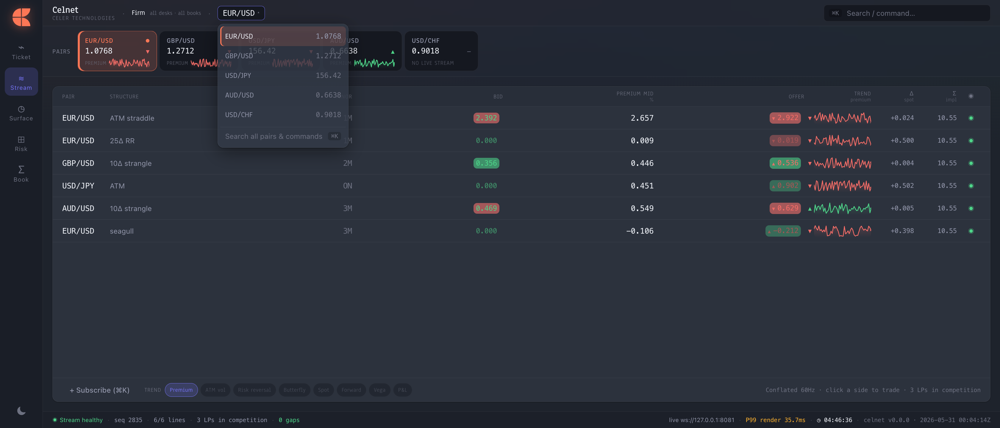
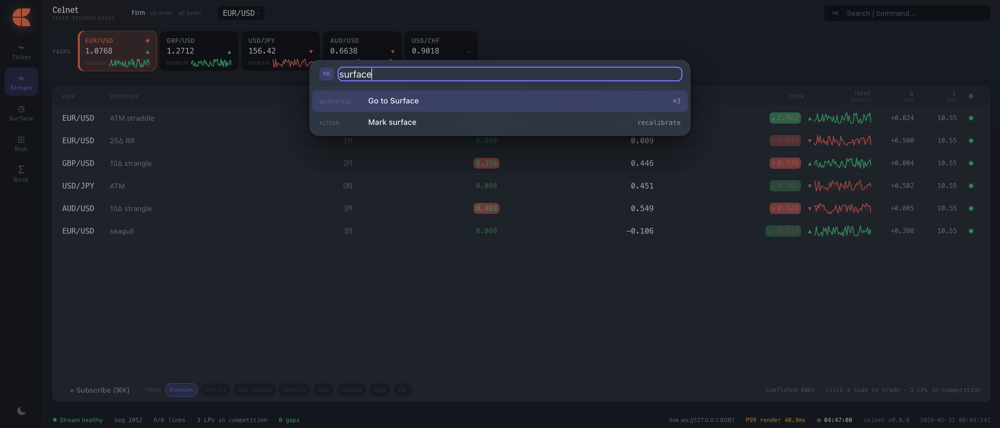
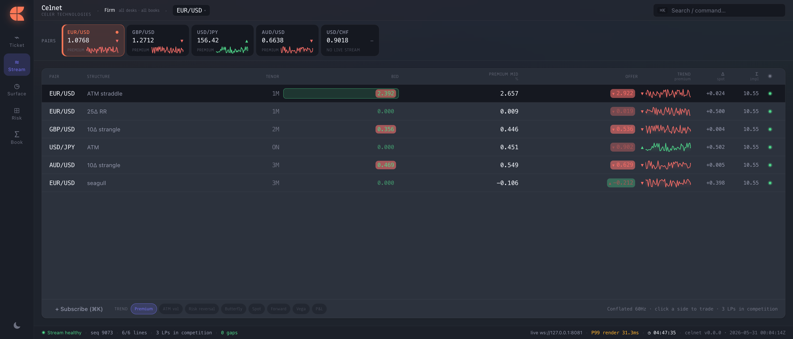
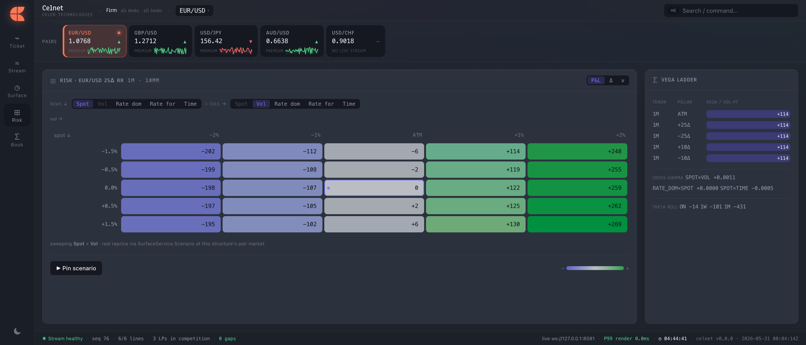
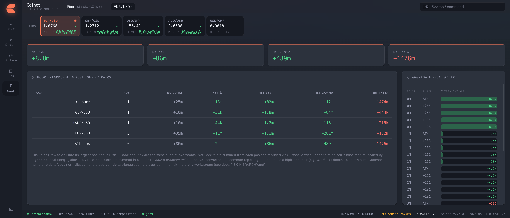

[← Prev: Excel Integration](10-excel-integration.md) · [Index](../CELNET-CAPABILITIES.md) · [Next: Celer Integration →](12-celer-integration.md) · [Showcase ↗](../celnet-capabilities.html)

# 11. The Trader GUI

The Celnet trader GUI is a single-window desk application built on React with a WebGPU rendering path, wearing the Celer Technologies brand. It is **live by default**: on launch it opens a streaming WebSocket session to the engine and stays connected, so every number on screen is the server's value — bit-identical to the same call made from the Rust SDK, the CLI, or the Excel add-in. There is no privileged front-end path; the GUI is simply the most expressive client of the one Celnet contract.

The whole desk lives behind **one window and five workspaces** — Ticket, Stream, Surface, Risk, Book — reachable from a persistent left rail or by keyboard (`⌘1`…`⌘5`). Workspaces never unmount as you switch: an in-progress scenario, a half-marked surface, or a pinned comparison survives every flip between lanes, and the active pane cross-fades in over the others. Everything else a trader needs to navigate — *what slice of the firm, which pair, and any action at all* — sits in the title bar and a global command palette.

*Figure 11-1 ([index](../CELNET-CAPABILITIES.md#figure-index)) — Stream (⌘2): the resting state of the desk. A living blotter of streaming two-way markets, click a side to trade.*

## 11.1 The shell — one window, five workspaces

Three fixtures frame every workspace:

| Region | What it carries |
|--------|-----------------|
| **Left rail** | The five workspace glyphs (Ticket `⌁`, Stream `≋`, Surface `◷`, Risk `⊞`, Book `Σ`), each labelled with its `⌘`-number; the Celer coral pinwheel mark anchors the top; a light/dark toggle sits at the foot. |
| **Title bar** | The mark-less **Celnet** wordmark, the **scope breadcrumb**, the **pair menu**, and the **`⌘K` search/command** affordance — left to right, identity → scope → instrument → action. |
| **Status ribbon** | A slim bottom strip: live stream health, sequence number, lines healthy, LPs in competition, gap count, the active transport seam, a measured render-frame budget, the desk clock, and the real **build stamp** (short SHA · UTC build time). |

Below the title bar runs the always-visible **pair watchlist strip**; below that, the active workspace canvas; below that, the ribbon. The brand is coral-on-indigo with the Anaheim display face — no traffic-light chrome, no function codes, no `<GO>`.

### The scope breadcrumb

The breadcrumb renders the current slice of the firm as a clickable path — **Firm · Desk · Book · …** — with each ancestor crumb a drill-back-up target and the tail crumb the live scope. At the firm root it spells out the implied span ("all desks · all books") rather than leaving the crumb bare. Scope is wired through every data path in the GUI, so what you see in Stream, Risk, and Book is exactly the slice the breadcrumb names: the same server-side, entitlement-aware pruning that the position-fact cube enforces, surfaced as a navigation control.

### The pair navigator

Two complementary affordances move the desk between currency pairs. The **watchlist strip** pins one tile per watched pair across the top of every workspace: the pair label, its live spot at the pair's pip precision, a tick-direction cue, and an inline sparkline of that pair's most-active streamed line. The active pair is raised onto a brighter material and marked in brand coral with a subtle live pulse; the rest stay quiet. Tiles are fully keyboard-navigable (arrow across, Enter/Space to select).

*Figure 11-2 ([index](../CELNET-CAPABILITIES.md#figure-index)) — the pair menu: a click-to-open popover of watched pairs with live spot, the active pair in coral, and a footer that escalates to the full-universe search.*

The **pair menu** in the title bar is a real anchored dropdown: clicking the `▾` caret opens a compact popover of the watched pairs (label + live spot, active in coral); selecting one re-targets the global pair everywhere. Its footer row escalates to the command palette for searching the entire universe when the watchlist is too long to eyeball — the right tool when a desk runs hundreds of pairs.

### The command palette (⌘K)

*Figure 11-3 ([index](../CELNET-CAPABILITIES.md#figure-index)) — `⌘K`: the keyboard-first spine. Type a pair, a workspace, or an action; arrow + Enter to run.*

`⌘K` (or `⌘P`) opens the palette — the universal escape hatch and the keyboard-first spine of the GUI. It fuzzy-matches across three families at once: **pairs** (jump to any currency pair, with its spot as a hint), **workspaces** (go to any of the five lanes), and **actions** (mark the surface, open a risk scenario, toggle light/dark or contrast, and *promote a structure straight into the live blotter* — e.g. "Stream EUR/USD 1M 25Δ RR", which subscribes the exact instrument and lands you on the blotter ticking). It is fully driven from the keyboard, honours Escape, and renders on a thick-blur material that owns focus while open. No function codes, no command syntax to memorise.

### The keyboard cheatsheet (?)

Because the GUI is keyboard-first, every chord is discoverable: pressing `?` (or selecting it from the command palette) opens a modal **shortcuts overlay** that enumerates the *same* binding grammar the shell and the overlays actually honour. It is read from one `src/lib/shortcuts.ts` source of truth and rendered as grouped definition lists, so the advertised bindings can never drift from the real ones. It is a focus-trapping dialog — focus moves into it on open, Escape and a scrim click close it — and carries an accessible name and grouped sections (`gui/src/components/ShortcutsOverlay.tsx`).

## 11.2 Ticket (⌘1) — the analytics surface that is also the executable

*Figure 11-4 ([index](../CELNET-CAPABILITIES.md#figure-index)) — Ticket (⌘1): one card that is both the analytics surface and the executable.*

The Ticket is one card that is simultaneously the analytics view and the order — build *any* product in the platform's catalogue, see its live two-way and full Greek vector and conventions on the face, and hit it without changing screens. The same card reaches the **entire on-wire instrument set** — not just vanilla strategies — selectable from one **structure selector** (`gui/src/workspaces/TicketWorkspace.tsx`, the `STRUCTURES` list):

- **Vanilla & multi-leg strategies** — Vanilla, Risk Reversal, Strangle, Straddle, Seagull (the leg-ladder family below).
- **First-generation exotics** — Single Barrier, Double Barrier, Digital, Touch, Window Barrier (each with its own typed input block: knock kind/side, barrier level(s), corridor, settlement style, payout, active window).
- **Structured & path-dependent** — Variance Swap, Volatility Swap, Asian (discrete/continuous averaging, Turnbull-Wakeman / Curran method), Forward Start, Cliquet, Quanto, Lookback.
- **Monte-Carlo structured** — TARF, Accumulator (geared fixing schedules), and the basket family below.
- **Early exercise** — **American / Bermudan** (continuous or a discrete exercise-date set), priced by the server's exact free-boundary FD engine or the Longstaff-Schwartz LSM path engine.
- **Correlated multi-asset** — **Basket / Best-of / Worst-of**, a 2–3-leg builder with per-leg weight/spot/vol/foreign-rate and a single off-diagonal correlation that the ticket validates as a symmetric-positive-definite (Cholesky-admissible) matrix before it ever reaches the pricer.

Walking the card top to bottom:

- **Header** — the active pair, the structure selector above, and a **notional** input in millions, labelled with the correct currency leg.
- **Tenor strip** — a row of tenor pills (overnight through one year, plus IMM and an arbitrary broken date via the date picker) that name each tenor identically to the Stream lane, from a single shared formatter.
- **Legs / product block** — for vanilla and the multi-leg strategies, one row per leg: side (buy/sell, colour-coded), call/put, the delta handle (e.g. `25Δ`), and the resolved strike at the active pair's *real* market (spot/vol/both rates) — never a stale constant. Multi-leg structures carry a **Solve: zero-cost** chip that calibrates the structure to a zero-premium strike inline. The exotic and path-dependent products replace the leg ladder with their own typed input block (barrier levels, schedules, leverage, exercise style, basket legs and ρ), with strikes and barriers defaulting sensibly off the active pair's live ATM-forward and spot.
- **Booking model** — where a product supports it, a model chip routes the choice into `Instrument.pricing_model`: **Default** (the per-product analytic/PDE engine) or **Local-Stoch-Vol** (the particle-calibrated LSV booking engine); the window barrier, which has no closed form, is locked to Local-Stoch-Vol. The selector appears only when there is a real choice, and an unsupported selection silently falls back to Default rather than sending a model the server would reject.
- **The two-way** — `Request quote` (or `⏎`) returns a live **BID / MID / OFFER** in the conventions' premium units, with a visible **depleting last-look ring** counting down the quote's validity. `Sell` / `Buy` buttons hit the bid or lift the offer (`⌘⏎` accepts the offered side); an expired quote refuses and prompts a re-request. Fills report the traded premium and an execution id. For the Monte-Carlo-priced products (TARF, accumulator, discrete lookback, basket/best-of/worst-of, American via LSM), the quote carries an honest **price standard error** alongside the premium — never dressed up as machine precision; the variance/volatility swaps quote a fair strike rather than a premium.
- **The Greek strip** — once quoted, the full FX desk Greek set for the structure renders beneath the two-way: every sensitivity in one pass.
- **Conventions on the face** — the delta convention, ATM rule, and premium currency are shown inline before quoting; the trading vol (the real smile vol the structure trades on at its strikes, vega-weighted across legs) is shown alongside the quote — not a flat ATM.
- **Promote, never re-key** — `Stream this ≋` drops the *exact same* instrument into the blotter; `Add to risk ⊞` drops it into the scenario grid. The same instrument object flows across lanes with no re-typing.

## 11.3 Stream (⌘2) — the RFS blotter

The Stream blotter is the desk's resting state: a living table of streaming two-ways, multiplexed over **one** StreamSession. Each row carries the pair, structure (with the quoting owner when the wire attributes it), tenor, **bid / premium-mid / offer**, a trend cell, spot delta, implied vol, and an honest **per-row stream-health badge** (healthy / resyncing / stale) driven by real sequence and resync state. Only changed numbers flash — calm under fire.

- **Click-to-trade** — when a row is healthy and its maker token is still valid, the bid and offer cells are live buttons: clicking hits the bid (sell) or lifts the offer (buy), sending an `Execute` against the row's short-lived, line-bound tradable token. Outcomes surface as typed toasts (executed, or a typed reject for a stale/forged/already-consumed token).

*Figure 11-5 ([index](../CELNET-CAPABILITIES.md#figure-index)) — the last-look response to a click-to-trade hit: a typed Executed/Reject outcome, never a silent failure.*

- **The trend selector** — a row of mode chips re-plots every row's trend column from a **real streamed observable**: Premium (the row's own streamed premium-mid history), ATM vol, 25Δ RR, 25Δ BF, Spot, and Forward — each served from the contract's market-series feed. The selected mode's label and unit annotate the column header and each tile; the sparkline tint and the up/down glyph share one direction truth.
- **Subscribe** — `+ Subscribe (⌘K)` opens the palette to add a line; the blotter footer notes the conflation cadence and the number of LPs in competition.

## 11.4 Surface (⌘3) — mark and recalibrate

*Figure 11-6 ([index](../CELNET-CAPABILITIES.md#figure-index)) — Surface (⌘3): three linked views of one marked surface, with live recalibration and an arbitrage gate.*

The Surface workspace is the "show me why" lane — three linked views of one marked surface:

- **The 3D mesh** (left, top) — a WebGPU-ready surface mesh; selecting a point cross-highlights the smile and the marking grid.
- **The smile chart** (left, bottom) — the selected tenor's smile over delta, on a stable surface-wide vol band so curves stay visually comparable across tenor switches; clicking a delta selects it and reads its vol in the inspector. A low→high colour legend anchors the ramp.
- **The marking grid** (right) — a row per tenor with the five broker handles: **ATM, 25RR, 25BF, 10RR, 10BF**. The selected tenor's row becomes editable; editing a handle recalibrates the surface **live** — butterfly per smile and calendar across tenors — through the same calibration the server runs, so the preview and the publish gate agree with what the engine will compute. Edited cells are flagged as unpublished.

Three controls govern the mark:

- **The arb gate** — an arb banner shows the selected smile's butterfly / calendar / vertical status; **Publish is disabled unless the *whole* surface is arbitrage-free** (every tenor's butterfly *and* the cross-tenor calendar check), not merely the selected smile.
- **The model selector** — **five** model chips — Market hedge, Stochastic vol, Parametric, Parametric-surface, and **eSSVI** (the extended whole-surface fit with a maturity-dependent skew) — route the choice into the contract's `MarkSurfaceRequest.smile_model` field (`SMILE_MODELS` in `gui/src/workspaces/SurfaceWorkspace.tsx`, the `EXTENDED_SURFACE` arm); selecting a family re-marks the live surface under it and bumps the surface version. The family the server *actually* calibrated under is read back from each smile's **typed** `arbitrage.model` provenance field and shown as "marked as …" — honest provenance, not the requested label.
- **Reset / Publish** — `Reset to live` discards unpublished edits; `Publish vN` transmits the edited marks through the *same* mark API the SDK and Excel use and deposits them under a fresh surface version (with the marking timestamp and handle count disclosed). Pricing, RFQ, and RFS paths then pin against that version.

## 11.5 Risk (⌘4) — the scenario grid

*Figure 11-7 ([index](../CELNET-CAPABILITIES.md#figure-index)) — Risk (⌘4): a real-reprice shock grid for the selected structure, with the book-shaped decomposition as a disclosure.*

The Risk workspace analyses one structure under a two-axis shock grid, every cell a **real reprice** via the surface scenario service — never a Taylor approximation:

- **The grid** — rows × columns sweep two distinct factors; each cell is the metric under that joint shock, tinted on a perceptual diverging ramp that reads magnitude honestly. The "today" cell (zero/zero) is anchored and marked.
- **Swappable axes** — an axis picker over the five shock factors (Spot, Vol, Rate-dom, Rate-for, Time) sets which factor sweeps on each axis; picking a factor already on the other axis swaps them. Each factor carries a sensible preset and a unit-correct header formatter (percent, vol points, basis points, days).
- **Metric tabs** — toggle the cell value between **P&L**, spot **delta**, and **vega**.
- **The vega ladder** (right panel) — the server's book-shaped decomposition for the structure: bucketed vega per (tenor, delta) pillar as a labelled bar ladder, the off-diagonal **cross-gamma** stencil, and the **theta-roll** over standard horizons. When a single-expiry structure carries vega only at its own tenor, that is stated honestly rather than padded with zeros.
- **Pin & compare** — `Pin scenario` snapshots the current grid for side-by-side comparison.

When you arrive here by drilling from the Book, a `‹ Book` affordance in the title returns you to the desk-wide cube — Book and Risk are two zooms of the same position-fact cube.

## 11.6 Book (⌘5) — desk-wide aggregated risk

*Figure 11-8 ([index](../CELNET-CAPABILITIES.md#figure-index)) — Book (⌘5): the desk-wide aggregated picture, one click from any position's scenario risk.*

The Book sums the **real** per-position risk across every open position across every pair into one desk-level picture — each position repriced at its own pair's market and scaled by its signed notional (long +, short −):

- **Summary cards** — net P&L mark, net vega, net gamma, net theta, sign-coloured.
- **The per-pair breakdown** — one row per pair: position count, notional, and net delta / vega / gamma / theta, with an "all pairs" footer. **Click any pair row to drill straight into Risk** for that pair's largest contributing position — the Book↔Risk drill, labelled honestly ("largest of N") so the aggregate and the single-structure view never quietly disagree.
- **The aggregate vega ladder** — book-summed vega per (tenor, delta) pillar, plus aggregate cross-gamma and theta-roll disclosures.

The Book is candid about its own numeraire: cross-pair totals are summed in each pair's native premium units, with common-numeraire normalisation noted as the firm-wide cube's job — the same OLAP position-fact cube described in the risk section, of which Book and Risk are two GUI zooms. Positions whose pair has no marked market are disclosed and excluded rather than priced against a fabricated market, and an empty book shows an explicit empty state.

## 11.7 One contract, every surface

Light and dark themes, a high-contrast mode, the keyboard cheatsheet, the trend modes, the scope breadcrumb, and the pair navigator are all conveniences layered over the *same* API that the Rust SDK, the CLI, and the Excel `CELNET.*` add-in consume. A value priced in the Ticket — across the full catalogue from vanilla through American/Bermudan and correlated baskets — streamed in the blotter, marked in the Surface under any of the five smile families, shocked in Risk, or aggregated in the Book is the engine's value — identical across every client. The GUI is the desk's richest window onto Celnet, not a parallel implementation of it. (Its keyboard-first behaviour and accessibility are themselves under test — see the Playwright end-to-end and axe accessibility suites covered in the *Engineering Rigor & Assurance* chapter.)

**See also:** [§9 API & Client Parity](09-api-contract-parity.md) is the contract the GUI consumes as a peer; [§6 Risk Management](06-risk-management.md) is the cube behind the Book↔Risk drill; [§4 Quant Coverage](04-quant-coverage.md) is the catalogue the Ticket prices.

---
[← Prev: Excel Integration](10-excel-integration.md) · [Index](../CELNET-CAPABILITIES.md) · [Next: Celer Integration →](12-celer-integration.md) · [Showcase ↗](../celnet-capabilities.html)
