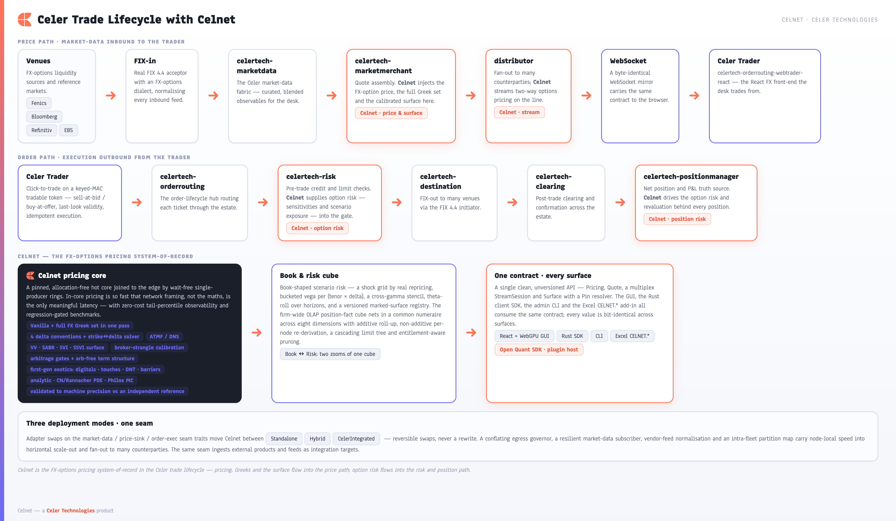
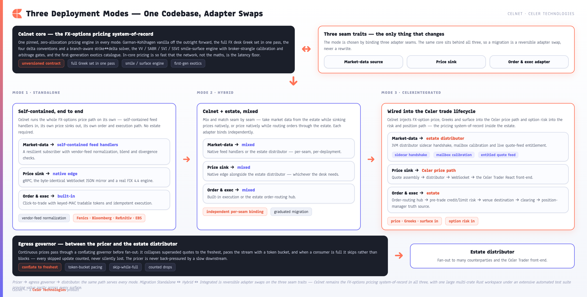

[← Prev: The Trader GUI](11-trader-gui.md) · [Index](../CELNET-CAPABILITIES.md) · [Next: Competitive Positioning →](13-competitive-positioning.md) · [Showcase ↗](../celnet-capabilities.html)

# 12. Celer Trader & Estate Integration

Celnet is the **FX-options pricing system-of-record** inside the Celer trade lifecycle. Where the broader Celer estate routes, risks, clears and books FX flow, Celnet owns the option mathematics — price plus the full Greek set, the marked surface across all five smile families (VV · SABR · SVI · SSVI · eSSVI), the full on-wire product catalogue, and server-side hierarchical option risk — and injects them into both the price path and the order path through a small set of clean seam traits. The result is a front-to-back FX-options capability that slots into a running Celer estate without a parallel pricing stack and without a rewrite, behind one unversioned contract reachable identically from GUI, SDK, CLI, Excel and the WebSocket mirror.

The integration is built as **traits and adapters, exercised in-repo against real loopback servers and sinks**; the live binding to the running JVM estate is a deployment gate, proven at deploy, never asserted as live in-repo (see §12.5).

*Figure 9 ([index](../CELNET-CAPABILITIES.md#figure-index)) — Celnet in the Celer trade lifecycle. Celnet supplies price, Greeks and surface into the price path and option risk into the risk/position path; the surrounding Celer services own routing, credit, execution, clearing and the net-position truth source. The estate hops shown are the designed integration map; in-repo the seams are exercised against loopback adapters.*

### 12.1 Where Celnet plugs in

The Celer estate runs two complementary flows, and Celnet contributes to each at exactly the point where option intelligence is needed.

**Price path.** Venue quotes arrive over FIX, are normalized by `celertech-marketdata`, assembled by `celertech-marketmerchant`, fanned out by the distributor over WebSocket, and rendered to the trader in **Celer Trader** — the `celertech-orderrouting-webtrader-react` FX front-end. Celnet enriches this path with FX-option price, the full desk Greek set (price + 13 Greeks), and the live calibrated surface, so every option line the trader sees carries Celnet's marks, surface-version pinned.

**Order path.** From Celer Trader an order flows through `celertech-orderrouting` (the order-lifecycle hub), `celertech-risk` (pre-trade credit and limit checks), `celertech-destination` (FIX-out to many venues), `celertech-clearing`, and into `celertech-positionmanager`, the net-position and P&L truth source. Celnet feeds option risk — sensitivities, FRTB-SA capital shape, and scenario surfaces — into the risk and position legs so credit checks and the position book reflect true option exposure rather than a notional approximation. Because aggregation is server-side and hierarchical (`celnet-risk-cube`, entitlement-pruned, numeraire-converted), the risk and position legs consume a firm roll-up rather than looping over Greek grids.

| Celer stage | Role | Celnet contribution |
|---|---|---|
| Market-data ingest & quote assembly | Normalize and merchant venue quotes | FX-option price, Greeks, calibrated surface into the quote |
| Distribution → Celer Trader | Stream prices to the React front-end | Option marks on every line, surface-version pinned |
| Order-routing hub | Order lifecycle | Option valuation and risk on the working order |
| Pre-trade risk | Credit & limit gate | Option risk sensitivities + FRTB-SA capital for accurate exposure |
| Position manager | Net position & P&L truth | Option Greeks and marked-surface valuation, server-aggregated |

### 12.2 The integration edge

Celnet meets the estate through a small, well-defined set of connectors, every one a real, shipping component (`crates/celnet-fix/`, `crates/celnet-integration/`).

**FIX 4.4 engine** (`celnet-fix`). A complete, hand-rolled, zero-copy FIX 4.4 implementation with the FIXT/4.4 session FSM (logon/heartbeat/test-request/resend/gap-fill), **both** session roles — an **acceptor** (quote publisher with QuoteID-validity last-look) and an **initiator** (price-taker/hedge) — and an FX-options **dialect** (FXVO/FXNO; PutOrCall / Strike / ExerciseStyle / cut, convention-mapped through `celnet-conventions`). It carries quotes inbound and orders/executions outbound over the same protocol the rest of the estate and its venues already speak, and is gate-tested over a real loopback socket (`crates/celnet-fix/src/{acceptor,initiator}.rs`).

**Conflating egress governor** (`celnet-integration/src/egress.rs`). Outbound price distribution passes through an egress governor that conflates to the latest value, paces with a token bucket, and **counts what it drops** — so a fast core never overwhelms a slower consumer (the distributor mailbox or a native socket), and the conflation is observable rather than silent. Under the edge this governor sits over a lock-free **SPMC broadcast fan-out ring** (`celnet-fanout`, wired at `celnet-server/src/services/pricefanout.rs`) that fans each pair's tick to all subscribers with zero-alloc publish and exact skip-accounting conflation.

**Resilient market-data subscriber** (`celnet-integration/src/subscriber.rs`). A resilient WebSocket subscriber consumes upstream prices with reconnect, resubscribe, and sequence-gap resynchronization built in (subscribe → snapshot → sequenced deltas → on-gap full resync), so a transient feed interruption heals automatically instead of stalling the desk or delivering out-of-order updates.

**Vendor-feed normalization, blend & divergence** (`celnet-integration/src/{normalize,vendor,aggregate,divergence}.rs`). A normalization layer maps heterogeneous upstream quotes into Celnet's canonical observables, blends multiple sources with staleness weighting, and surfaces divergence between them — gating out a stale or mispriced feed rather than silently averaging it. The blend/staleness/divergence **algorithm** is built and gated in-repo; live multi-vendor quote **values** are an integration/deploy target, not in-repo data.

### 12.3 Three deployment modes, one codebase

Integration depth is a configuration choice, not a fork. Three seam traits — the **market-data source** (`MarketDataSource`), the **price sink** (`PriceSink` / `DistributorEgress`), and the order/execution adapter — are swapped to move Celnet along a spectrum from fully self-contained to fully estate-native. The engine core never names a transport: it is handed an `impl MarketDataSource` and an `impl PriceSink`, and the `EdgeBuilder` picks the concrete adapters for the chosen `DeploymentMode` (`celnet-integration/src/deployment.rs`). Migration between modes is a reversible adapter swap, never a rewrite.

*Figure 10 ([index](../CELNET-CAPABILITIES.md#figure-index)) — Standalone, Hybrid and CelerIntegrated deployment modes. The same engine and the same contract sit behind three adapter configurations on the market-data / price-sink / order-and-execution seams. CelerIntegrated is the designed estate-native binding; the live JVM/WS wiring is the deployment gate.*

| Mode | Market-data source | Price & order seams | Use |
|---|---|---|---|
| **Standalone** | Self-contained (`StandaloneSource`) | Self-contained (`StandaloneSink`) | Celnet runs as an independent FX-options pricing and risk platform — fully real and testable in-crate; the default for a self-contained tenant |
| **Hybrid** | Estate **and** external vendor feeds (blended) | Governed egress | Estate market data blended with an external vendor feed, Celnet-owned pricing and distribution |
| **CelerIntegrated** | Celer distributor feed | Governed publish to the Celer distributor | Celnet as the estate's FX-options pricing system-of-record |

**What is built in-repo vs proven at deploy.** The **Standalone** mode is fully real and gate-tested in-crate (its `StandaloneSource`/`StandaloneSink` adapters record and replay every update). The **CelerIntegrated** and **Hybrid** modes are wired through the *same* `MarketDataSource`/`PriceSink` seam, exercised in-repo against a **real loopback server and sink** — proving the framing, the governed-egress conflation, and the resync contract. The **estate-native binding itself** — the JVM distributor sidecar handshake, mailbox calibration, and live quote-feed entitlement — is the **designed** estate integration: it slots in behind the already-built seam and is **proven at deploy against the running estate**, never claimed as a live in-repo capability. Because each mode is just a different binding of the same seam traits, a desk can start Standalone, prove the platform, and migrate deeper into the estate at its own pace as the deploy-gated binding is brought up.

### 12.4 Adaptable by design

The same market-data seam that ingests the Celer distributor ingests external products and feeds. Celnet's normalization layer is a vendor-neutral **data-shape adapter** built to adapt to the venues and terminals a desk already runs — for example **Fenics**, **Bloomberg**, **Refinitiv** and **EBS**, which are integration/adapter targets, not live connections. Each is brought in as an adapter behind the seam that maps its quotes into the canonical observable set driving quote assembly, surface marking and live trend series. New sources are added as adapters behind the seam, so onboarding a feed is an integration, not a re-engineering of the pricing core.

The throughline across all of this is the platform's single principle: one clean contract, consumed identically everywhere. Whether Celnet runs Standalone or wired into the full Celer lifecycle, the price the order path sees, the risk the position manager books, and the number on the trader's screen are the same value from the same source.

### 12.5 Honest boundary

The **entire live JVM Celer estate lifecycle** — the distributor sidecar / FX_OPTION mailbox / inferred estate hops / tenant overlays — is **deploy/live-gated; in-repo has the seams and adapters only.** What is proven in-repo is the seam contract itself: the `DeploymentMode` adapter swap, the FIX 4.4 acceptor/initiator over a loopback socket, the governed egress conflation, the resilient resync, and the vendor normalization/blend/divergence **algorithm**. The live estate binding (sidecar handshake, mailbox calibration, quote-feed entitlement) and **live multi-vendor quote values** are integration/deploy targets, proven against the running estate at deploy — never asserted as live in this repository.

**See also:** [§3 System Architecture](03-system-architecture.md) is the adapter-seam model that makes the three deployment modes a configuration choice; [§9 API & Client Parity](09-api-contract-parity.md) is the one contract every mode preserves.

---
[← Prev: The Trader GUI](11-trader-gui.md) · [Index](../CELNET-CAPABILITIES.md) · [Next: Competitive Positioning →](13-competitive-positioning.md) · [Showcase ↗](../celnet-capabilities.html)
