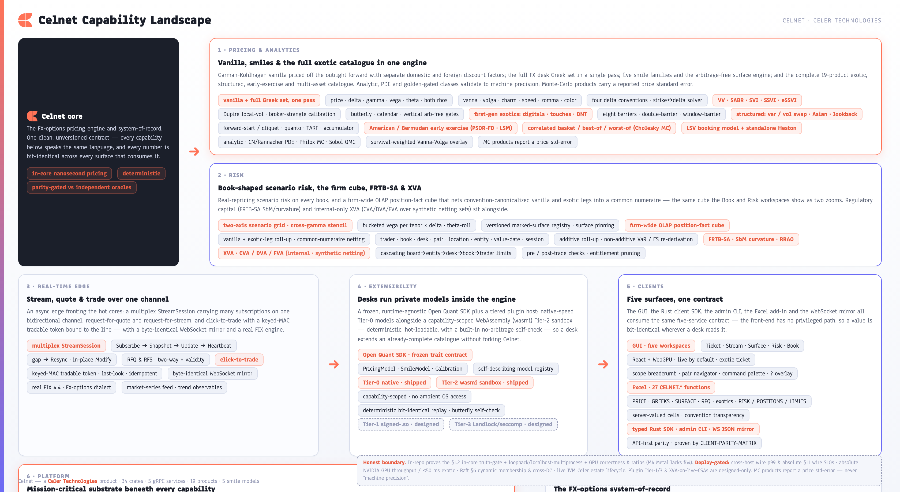
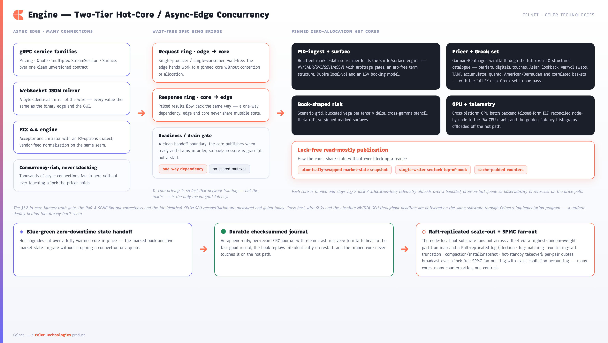

[← Prev: Competitive Positioning](13-competitive-positioning.md) · [Index](../CELNET-CAPABILITIES.md) · [Showcase ↗](../celnet-capabilities.html)

# 14. Engineering Rigor & Assurance

A pricing platform is only as trustworthy as the evidence behind its numbers. Celnet is engineered so that every headline claim — correctness, determinism, latency, resilience — is *earned and continuously re-proven*, not asserted. The differentiator is not a single clever gate; it is that the **whole 55-crate workspace ships behind a wall of independent, executable proofs that run on every change**, with each product class validated by the *strongest oracle that class admits* and labelled honestly when no exact oracle exists. Where an incumbent ships a number and a brochure, Celnet ships the number, the independent re-derivation that pins it, and the gate that fails the build if the two ever diverge.

*Fig 12 ([index](../CELNET-CAPABILITIES.md#figure-index)) — Celnet's assurance landscape — every capability is backed by an executable proof that runs on every change.*

## 14.1 Correctness, validated against the strongest oracle each class admits

Celnet does not make one blanket accuracy claim across the whole catalogue — different product classes admit different gold standards, and the doc states which applies where. This per-class honesty *is* the rigor.

**Class 1 — analytic products gated to frozen golden tables.** Vanilla prices and the full FX desk Greek set, both digital styles, all eight barrier variants, and one-touch values are validated to machine precision against **frozen QuantLib 1.42.1 reference tables** (`crates/celnet-golden/data/{vanilla,digital,barrier,double_barrier,touch}_gk.csv`) — independent maths, an independent implementation, agreeing to the last bits. The Heston (1993) stochastic-volatility European reference (`heston_fo.csv`) is gated identically but against **hand-pinned values from the published literature**, not in-sandbox QuantLib — stated as such in the file header so the provenance is never overclaimed. Beyond the golden tables, every Greek is **finite-difference cross-validated**: the analytic closed-form sensitivity and its numerical bump-and-revalue twin must agree, so each of price, spot- and forward-delta, gamma, vega, theta, both rhos, vanna, volga, charm, speed, zomma and color is proven, not presumed.

**Class 2 — closed-form structured products gated to exact limits and published constants.** The structured catalogue (variance/volatility swaps, arithmetic and geometric Asians, forward-start/cliquet, quanto, lookback) has no single golden table, so each is pinned by the *exact analytic limit it must collapse to* plus a code-disjoint independent re-derivation: a variance swap's log-contract replication is checked against an independently coded strike-space adaptive-Simpson quadrature and against the closed-form `K_var == σ²` flat-vol limit; a geometric Asian against Kemna-Vorst to ~1e-12; a forward-start against the t₁→0 vanilla limit. Regulatory capital is pinned the same way — the FRTB-SA low-correlation scenario transform is gated against **hand-computed BCBS constants** (`ρ_low = max(2ρ−1, 0.75ρ)`, MAR21.6(2)), a defence added precisely because a longhand oracle that re-derives the *same* formula is a circular self-check; the BCBS-pinned constant breaks the circle.

**Class 3 — Monte-Carlo and early-exercise products gated to honest std-error bands.** TARFs, accumulators, discrete-observation lookbacks, correlated baskets/best-of/worst-of (Cholesky MC), and American/Bermudan via Longstaff-Schwartz LSM are MC- or simulation-priced and therefore carry a **reported price standard error** — they are validated to converge *within their own stated stderr* of a code-disjoint independent MC, never claimed to "machine precision". The first-generation exotics retain an internal triangulation gate on top: the analytic reflection method, the Crank-Nicolson PDE with a Rannacher start-up, and the Philox Monte-Carlo path engine must agree, so three independent numerical routes converge on one price.

The smile and surface engine carries its own correctness gates across all five families (VV / SABR / SVI / SSVI / eSSVI) — butterfly density non-negativity (a pointwise Breeden-Litzenberger re-pricing), calendar total-variance monotonicity, and vertical no-arbitrage — enforced as the surface is calibrated, so a marked surface that violates no-arbitrage is rejected at the source rather than priced from.

| Product class | Strongest oracle applied | Bar |
|---|---|---|
| Vanilla, digital, barrier ×8, touch | Frozen QuantLib 1.42.1 golden tables | Machine precision (last bits) |
| Heston European | Hand-pinned published-literature golden table | Machine precision (last bits) |
| Every Greek (analytic) | Finite-difference bump-and-revalue twin | Analytic ≈ numerical |
| Var/vol swap, Asian, fwd-start/cliquet, quanto, lookback | Exact closed-form limit + code-disjoint quadrature/Kemna-Vorst | ~1e-6 … 1e-12 to the limit |
| FRTB-SA capital | Hand-computed BCBS constants (breaks circular oracle) | Exact to the standard |
| TARF, accumulator, discrete lookback, basket, American (LSM) | Code-disjoint independent Monte-Carlo | **Within reported price std-error** |
| First-gen exotics (additional) | Analytic ~ Crank-Nicolson-PDE ~ Philox-MC triangulation | Three routes converge |
| Surface (VV/SABR/SVI/SSVI/eSSVI) | Butterfly / calendar / vertical no-arbitrage gates | No arbitrage admitted |

## 14.2 Property, mutation and fuzz testing

Point checks confirm what an engineer thought to test; **property-based testing** confirms what they did not. Celnet asserts the invariants that must hold across whole input spaces — put-call parity, monotonicities, sign conventions, the branch behaviour of the strike↔delta solver across the premium-adjusted call-delta maximum — and the harness searches for counterexamples rather than waiting for one in production.

**Mutation testing** then audits the tests themselves: the suite deliberately perturbs the implementation and confirms the test suite catches the change. A test that survives a mutated price was never really guarding the price, and mutation analysis surfaces exactly those gaps. The gate is not a single crate's vanity metric — it spans the numerically load-bearing estate: the pricing core (`.config/mutants.toml`), the exotics catalogue (`mutants-exotics.toml`), the surface engine (`mutants-surface.toml`), the risk cube (`mutants-celnet-risk-cube.toml`), and counterparty-valuation adjustments (`mutants-xva.toml`). The gate **fails the build on any non-equivalent survivor**; the only exclusions are *provably semantically-equivalent* mutants — each justified inline with why it cannot change an observable result and, for the solver cluster, verified against a 200k-case differential oracle that reproduces the unmutated result bit-for-bit. The exclusion list is exhaustive and auditable, so any *new* survivor not on it fails the gate.

**Fuzz testing** hardens the byte-level boundaries against adversarial input. Six libFuzzer targets feed arbitrary bytes into the hand-rolled parsers and untrusted entry points — `vanilla_inputs` (pricing-input domain), `journal_recover` (crash-recovery log decode), `proto_convert` (wire-message conversion), and the three replicated-log decoders `replog_log_entry` / `replog_snapshot` / `replog_wire_message`. Each target's contract is the same discipline: **never panic** (no slice overrun, no `unwrap`/`expect` on an attacker-controlled length, no allocation driven unboundedly by a crafted count), and return `Ok(_)` or a *typed* error — with re-encode soundness asserted on the `Ok` path. Together, property, mutation and fuzz testing keep the extensive automated suite honest as the platform evolves.

## 14.3 An executable parity matrix

Capability claims are not prose in a brochure alone — they are codified as an **executable parity matrix** (`docs/CLIENT-PARITY-MATRIX.md`) backed by roughly twenty-six `celnet-parity` integration rows, each gating a "meets or beats" claim against an **independent oracle**: eSSVI density and calendar arbitrage, variance/vol swaps, analytic Asians, Heston (Carr-Madan ≈ Fang-Oosterlee COS), forward-start/cliquet, LSV, Sobol-QMC variance reduction, baskets, FRTB-SA, the conventions/pair universe, GPU pathwise and path Greeks, the Raft election/snapshot/compaction proofs, and XVA — among others. Every claim about coverage, conventions, surface behaviour, risk and streaming is exercised against the running system on every change, so the comparison against the vendor-neutral archetypes — a closed terminal, a front-to-back platform, a data-venue, a modern library — is *continuously proven rather than asserted*. If a capability regresses, the matrix fails the gate; the claim and the code never drift apart.

## 14.4 Deterministic, cross-platform behaviour

Determinism is a first-class guarantee. Celnet's counter-based random number generator is **bit-identical between CPU and GPU**, and GPU results are reconciled against a high-precision CPU oracle, so the same scenario produces the same number whether it runs on the accelerator or the CPU SIMD fallback. (Note the honest hardware boundary in §14.8: the M4 dev host's Metal backend lacks f64, so the in-repo GPU proofs establish *correctness and ratios* against the f64 CPU oracle — the absolute NVIDIA throughput headline is deploy-gated, never claimed here.) Plugin execution is equally deterministic: the WebAssembly sandbox supports **bit-identical replay** (`f64::to_bits` identity across runs), so a model's output can be reproduced exactly from its inputs — the foundation for reproducible risk, auditable pricing, and confident debugging across heterogeneous hardware. The distributed substrate inherits the same guarantee: a follower or recovered node replays the leader-replicated log to **bit-identical** state, with the workload deliberately containing a 1-ULP value so the bits must match.

*Fig 5 ([index](../CELNET-CAPABILITIES.md#figure-index)) — Bit-identical RNG across CPU and GPU and replayable plugins make every Celnet number reproducible by construction. The shipped tiers are Tier-0 native and Tier-2 wasmi; the signed-shared-object and OS-sandbox tiers are designed-and-seamed, proven at deploy (see Ch. 5).*

## 14.5 Zero-cost observability

The platform is fully instrumented without taxing the hot path. Latency is captured in **tail-percentile HdrHistograms** that are coordinated-omission aware, and telemetry is offloaded over a **bounded, drop-on-full ring** so the pinned hot core stays log-, lock- and allocation-free. Operators get the p50/p99/p99.9 picture they need for mission-critical running — surfaced on the stream as `server_price_p50/p99/p999_nanos` alongside `conflation_drops`, `surface_version` and `correlation_id` heartbeat fields — while the maths pays nothing for it. Performance itself is held by **regression-gated benchmarks**: the §1.2 in-core truth-gate asserts p50≤2µs / p99≤10µs / p99.9≤25µs **absolutely** (measured ~42ns / 125ns / ~1µs on the M4 dev host — a 24-80× margin, host-local and single-core), and an iai-callgrind instruction-count gate runs in Linux CI. A change that would quietly slow pricing fails the gate before it reaches a desk.

## 14.6 Supply-chain cleanliness

Celnet is built exclusively on **open-source, permissively-licensed** software — no commercial libraries, solvers, or proprietary runtime data dependencies. The dependency set is policy-enforced in the gate (`cargo-deny`): licences are checked against an approved set, advisories are scanned, and banned or duplicate dependencies are rejected automatically. The result is a platform a bank can vet, deploy, and own end-to-end without commercial entanglement.

## 14.7 A resilient core: zero-allocation, hot-upgradable, durable, replicated

The runtime is engineered to keep trading through faults and upgrades. A **zero-allocation hot core** — wait-free single-producer/single-consumer rings feeding pinned cores, lock-free read-mostly state publication via an atomically swapped market-state snapshot and a single-writer seqlock top-of-book — does no allocation, locking or logging on the pricing path. **Blue-green zero-downtime state handoff** lets a new build take over from a running one without dropping the book, so hot upgrades are a routine operation rather than an outage. Underneath, a **durable, checksummed, append-only journal** (with compaction/checkpoint now built) provides clean crash recovery: a torn final record heals to the last good entry on restart, and the book and its repricing come back bit-for-bit. Above the single node, a **leader-replicated event log with full Raft** (election + Pre-Vote, conflicting-tail truncation, snapshot compaction and InstallSnapshot reseed) commits only on quorum and replays to bit-identical state — proven on localhost multi-process (the honest boundary in §14.8 keeps cross-host wire SLOs, cross-DC transport and dynamic membership deploy-gated).

*Fig 13 ([index](../CELNET-CAPABILITIES.md#figure-index)) — A zero-allocation hot core, blue-green hot upgrade, a durable journal, and bit-identical Raft replay keep Celnet pricing through faults and deployments.*

## 14.8 The honest boundary

Rigor includes refusing to claim what has not been proven *in-repo*. Celnet's docs label every figure (in-core / M4 / loopback) and never convert a relative result into a deploy-gated absolute. The following are **deploy- or live-gated, never claimed as in-repo-proven**:

- **Cross-host wire p99 / kernel-bypass NIC latency / the §11 absolute wire-latency SLOs** — deploy-gated; in-repo proves the in-core §1.2 truth-gate + loopback benches only.
- **CUDA/NVIDIA absolute GPU throughput, ≤50ms exotic, Workload-A/B absolute numbers** — deploy-gated. M4 Metal lacks f64 ⇒ in-repo proves **correctness + ratios only** (M4/Lavapipe); never f64 on Metal.
- **The entire live JVM CelNet estate lifecycle** (distributor sidecar handshake, mailbox calibration, live quote-feed entitlement) — deploy/live-gated; in-repo has the seams + adapters (FIX 4.4 loopback, DeployMode swap) only.
- **Raft §6 dynamic membership / cross-DC transport / real network partitions** — deploy-gated; in-repo proves correctness/quorum/framing on localhost multi-process only.
- **Plugin Tier-1 signed-shared-object (stabby) + Tier-3 Landlock/seccomp OS-sandbox** — designed-only; only Tier-0 native + Tier-2 wasmi are shipped.
- **XVA (CVA/DVA/FVA)** — internal-only, **no client/wire surface, synthetic netting sets only**; live CSAs / collateral / wrong-way risk are deploy-gated.
- **MC-priced products** (TARF, accumulator, discrete lookback, basket/best-of/worst-of, American via LSM) carry a **price std-error** — never labelled "machine-precision"; that bar is reserved for analytic / PDE / golden-gated products.

## 14.9 How it all earns the claim

These mechanisms are not independent niceties — they compose into a single discipline. The per-class oracle and finite-difference gates earn *correctness*; property, mutation and fuzz testing earn *robustness*; the parity matrix earns *competitiveness*; bit-identical RNG, plugin replay and Raft replay earn *determinism*; zero-cost observability and the absolute in-core truth-gate earn *performance*; the zero-allocation core, blue-green handoff, durable journal and replicated log earn *resilience*; supply-chain policy earns *ownership*; and the honest boundary earns *trust*. Built as a 55-crate one-way-acyclic Rust workspace with an extensive automated test suite, Celnet is a platform whose every number a desk can trade on, a quant can reproduce, and an architect can deploy — because the proof runs every time the code does, and the docs claim nothing the proof does not cover.

**See also:** [`CLIENT-PARITY-MATRIX.md`](../clients/CLIENT-PARITY-MATRIX.md) is the executable parity matrix; [§4 Quant Coverage](04-quant-coverage.md) is the per-class validation regime; [§13 Competitive Positioning](13-competitive-positioning.md) is the claim these proofs earn.

---
[← Prev: Competitive Positioning](13-competitive-positioning.md) · [Index](../CELNET-CAPABILITIES.md) · [Showcase ↗](../celnet-capabilities.html)
